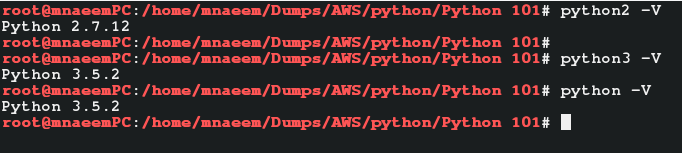

### What is Python and Why:
  * Open source programming language
  * Interpreted at run-time(unlike compiled Java, C#, like PHP, Perl)
  * Object oriented( like Java and C#)
  * Precise and interactive( very short and precise commands, thus easy to learn)
  * Yet it is one of the most powerful languages in Big Data ( roughly 55-60% Big data scripts and programs are written in Python followed by Java and others
  * It is portable (can be run on lot of hardware and software platforms)
  * Supports a very broad standard library, modules
  * Dynamic data types, garbage collection, interfaces to all major databases
  * Comes in 2 major versions – Python 2.x (e.g. Python 2.7) and Python 3 – till date most of the Python programs are written in Python 2.x so it is better to learn Python 2.7 first.)
  * One more big thing about Python 2.x is that it can import the features of Python 3 by using ( **from __future__ import <import_module>** syntax, e.g **from __future__ import division** imports division from Python 3. 
    * In Python 2.x if you divide 3/2 you will get answer as 1 as Python 2 performs basic division. 
    * In Python 3, it performs true division , if you divide 3/2 you get 1.5).

### Python Setup:
  * Since supported by multiple hardware and software platforms, it can be installed in multiples ways
  * Lets focus Installation on Linux - 
    * Method one – Install Python on Linux and use Python Shell(command line)
      * Install Python – 
        * Check if a previous version of Python is installed 
        ```
        yum -y install python3 #installs default/latest python3
        yum -y upgrade python3.5 #upgrades to default/latest python3
        
        python -V  # checks for default/latest python version 
        python3 -V # checks for default/latest python 3 version
        
        ```
        * Please see screen shot below
        
        
      * Setup an alias for Python3(open ~/.bashrc and update with line below) – 
        ```
        ls /usr/bin/python* # first check what versions of Python are installed
        
        nano ~/.bashrc #opens the bash script file in nano editor, now update the file with below line
        
        alias python=python3.x # make sure 3.x is the highest 3.x version you got from ls /usr/bin/python* command
        
        source ~/.bashrc #ensure the basj script is reloaded and the changes are affected without loging out
        
        python -V  # now checks for default/latest python 3 version 
        
        ```
      * Please see screen shot below
        
        
      * Create a python script file – 
        ```
        echo "print('HelloWorld')" > 001-HelloWorld.py
        ```
      * Execute the python script – 
        ```
        python 01-HelloWorld.py
        ```
      * Check Python version– 
        ```
        python --version
        python -V
        ```  
      * Please see screen shot below
        
        
      * Execute some basic Python commands– 
        ```
        print "Hello from Python"
        print 3/2
        print 3.0/2 
        ```  
    * Method two – Install Jupyter Notebooks – on your local system
      * Install Anaconda(Anaconda installs Python, Jupyter notebooka and required dependencies as a package) from [https://www.anaconda.com/download/](https://www.anaconda.com/download/)
      * It has links for Windows, Linux or Mac installations for Python 2.7 as well as 3.6
      * Lets install Python 3.6 using Windows Installer from [https://repo.anaconda.com/archive/Anaconda3-2018.12-Windows-x86_64.exe](https://repo.anaconda.com/archive/Anaconda3-2018.12-Windows-x86_64.exe). Download and install Anaconda.
      * Anaconda is installed now, verify it by opening Anaconda Navigator, from your Windows Start menu.
      * Click open the “Jupyter notebook“. It will open in the browser locally.
      * In the command box, type the python commands and execute
