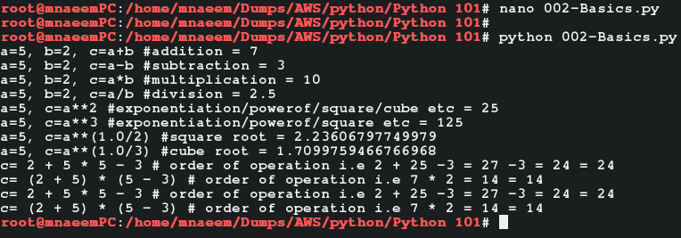

### Python - Numbers:
  * Python supports dynamic datatypes i.e. the type of a variable is decided by the values it holds.
  * If we assign a variable a="Naeem", then a is a string, if a = "9" then its a number and if a=3.0 then its a float.
  * Login to your Host machine(in my case a CentOS 7 machine)
  * Make a directory "mypython" and go to the directory and type and enter "python" to open python prompt– 
    ```
    mkdir 'Python 01' 
    cd 'Python 01'
    ```
  * Create a file - 01-Basics-Numbers.py - save and execute to check and verify the below basic number operations:
    * Python assigned variables dynamically. i.e. a=9 is integer whereas a=9.0 is float
    ```
    nano 01-Basics-Numbers.py # create the file
    
    # copy the content below and paste into the nano editor and save
    a=5 # assign variable a
    b=2 # assign variable b

    c=a+b #addition
    print ('a=5, b=2, c=a+b #addition = ' + str(c))

    c=a-b #subtraction
    print ('a=5, b=2, c=a-b #subtraction = ' + str(c))

    c=a*b #multiplication
    print ('a=5, b=2, c=a*b #multiplication = ' + str(c))

    c=a/b #division
    print ('a=5, b=2, c=a/b #division = ' + str(c))

    c=a**2 #exponentiation/powerof/cube etc
    print ('a=5, c=a**2 #exponentiation/powerof/square/cube etc = ' + str(c))

    c=a**3 #exponentiation/powerof/square etc
    print ('a=5, c=a**3 #exponentiation/powerof/square etc = ' + str(c))

    c=a**(1.0/2) #square root
    print ('a=5, c=a**(1.0/2) #square root = ' + str(c))

    c=a**(1.0/3) #cube root
    print ('a=5, c=a**(1.0/3) #cube root = ' + str(c))

    c= 2 + 5 * 5 - 3 # order of operation i.e 2 + 25 -3 = 27 -3 = 24

    print ('c= 2 + 5 * 5 - 3 # order of operation i.e 2 + 25 -3 = 27 -3 = 24 = ' + str(c))

    c= (2 + 5) * (5 - 3) # order of operation i.e 7 * 2 = 14
    print ('c= (2 + 5) * (5 - 3) # order of operation i.e 7 * 2 = 14 = ' + str(c))

    c= 2 + 5 * 5 - 3 # order of operation i.e 2 + 25 -3 = 27 -3 = 24
    print ('c= 2 + 5 * 5 - 3 # order of operation i.e 2 + 25 -3 = 27 -3 = 24 = ' + str(c))

    c= (2 + 5) * (5 - 3) # order of operation i.e 7 * 2 = 14
    print ('c= (2 + 5) * (5 - 3) # order of operation i.e 7 * 2 = 14 = ' + str(c))
    
    # now execute the file
    python 01-Basics-Numbers.py
    
    ```
  * Please see screen shot below
        
        
  * True Division(Python 3.x) vs Basic Division(Python 2.x):
    ```
    print 3/2     # 1
    print 3.0/2   # 1.5
    
    from __future__ import division
    print 3/2     # 1.5
    ```
