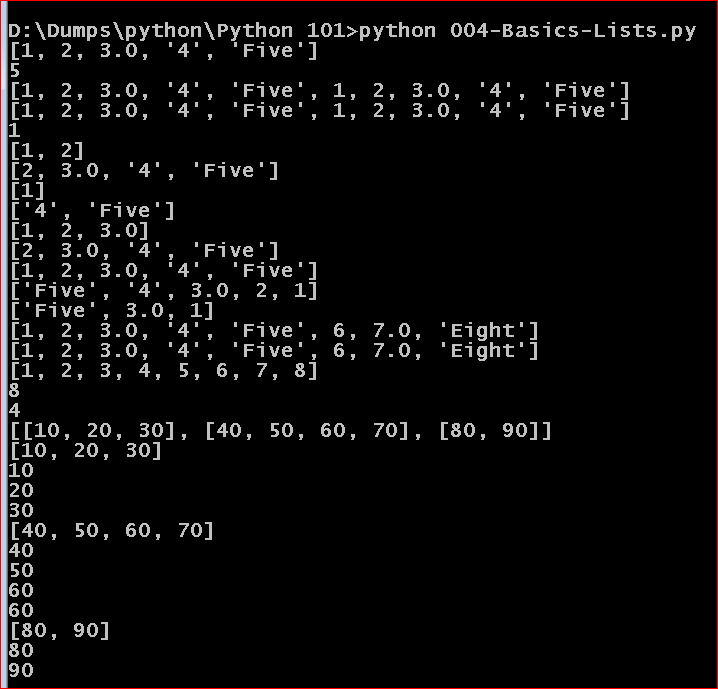

### Python - Lists:
    * Unlike the Strings which are immutable sequences, List is a mutabale sequence
    # Create a file - 004-Basics-Lists.py - 
    ```
    nano 004-Basics-Lists.py # create the file
    
    # Lists
    # Lists are mutable sequences(recall we said Strings were immutable sequences)

    lst = [1,2,3.0,'4','Five']

    # entire list 
    print(lst)
    # length of a list 
    print(len(lst))

    # list doubled by either lst + lst or lst *2 but you cant mumtiply entire list lst * lst
    print(lst + lst)
    print(lst * 2)


    # list indices - all except first only(not zeroth element)
    # one specific index of the list - #e.g first element
    print(lst[0])
    # range of indices/multiple indices of the list 
    print(lst[0:2])

    # all except the 0th element
    print(lst[1:]) 
    #all except the last element
    print(lst[:1]) 

    # list indices - all elements from 3rd index
    print(lst[3:]) 
    # list indices - all begining to upto 3rd
    print(lst[:3])  
    # list indices - all except first
    print(lst[1::]) 

    # list indices - all
    print(lst[::1]) 
    # list indices - reversed list
    print(lst[::-1]) 
    # reverse the list by steps of 2
    print(lst[::-2])

    # add more to list 
    print(lst + [6,7.0,'Eight'])
    # add more to list using append method
    lst.append(6)
    lst.append(7.0)
    lst.append('Eight')
    print(lst)


    # pop and sort methods
    lst = [5,2,8,3,1,6,4,7]
    # sort list
    lst.sort()
    print(lst)
    # pop out last item
    print(lst.pop())
    # pop out item at nth index
    print(lst.pop(3))

    #accessing non available index
    print(lst[100]) #  this line will give error IndexError
    
    # creating a nested list – a list inside the other – list can have any dynamic size
    matrixlist1=[10,20,30]
    matrixlist2=[40,50,60,70]
    matrixlist3=[80,90]

    # adding the lists in another list
    matrixlist = [matrixlist1,matrixlist2,matrixlist3]

    #accessing the list by their indices
    print(matrixlist) # [[10, 20, 30], [40, 50, 60, 70], [80, 90]]
    print(matrixlist[0]) # [10, 20, 30]
    print(matrixlist[0][0]) # 10 
    print(matrixlist[0][1]) # 20
    print(matrixlist[0][2]) # 30

    print(matrixlist[1]) # [40, 50, 60, 70]
    print(matrixlist[1][0]) # 40
    print(matrixlist[1][1]) # 50
    print(matrixlist[1][2]) # 60
    print(matrixlist[1][2]) # 70

    print(matrixlist[2]) # [80, 90]
    print(matrixlist[2][0]) # 80
    print(matrixlist[2][1]) # 90

    # now execute the file using python 003-Basics-Strings.py
    python 004-Basics-Lists.py
    
    # deleting lists
    del lst[0]  # deletes nth key from list
    del lst    # deletes entire list
    
    ```
  * Please see screen shot below
        
