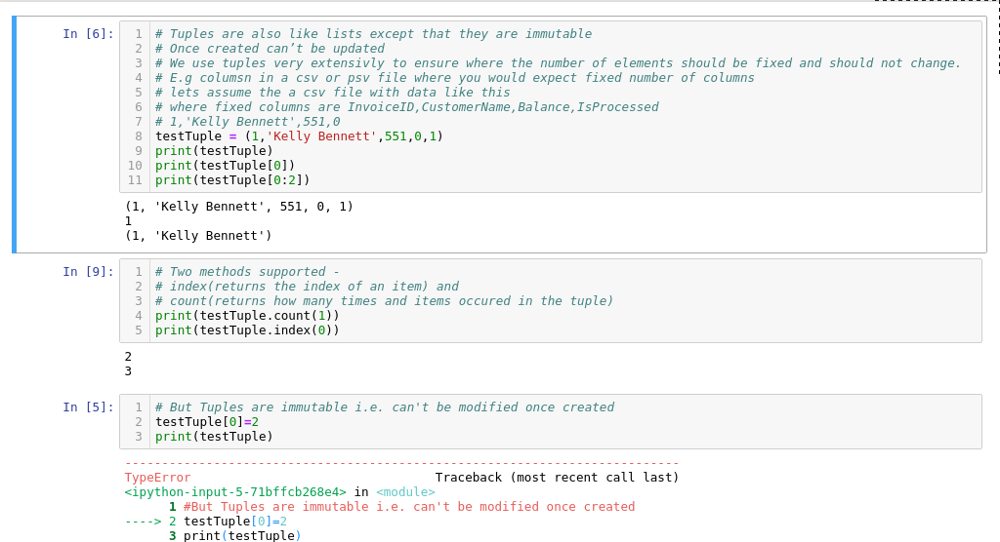

### Python - Tuples:
  * Create a file - 006-Basics-Tuples.py - Tuples are immutable lists:
    * Once created can’t be updated
    * We use tuples very extensivly to ensure where the number of elements should be fixed and should not change.
    * E.g columns of a csv  pr psv file
    
    ```
    nano 006-Basics-Tuples.py # create the file
    
    # Tuples are also like lists except that they are immutable
    # Once created can’t be updated
    # We use tuples very extensivly to ensure where the number of elements should be fixed and should not change.
    # E.g columsn in a csv or psv file where you would expect fixed number of columns
    # lets assume the a csv file with data like this 
    # where fixed columns are InvoiceID,CustomerName,Balance,IsProcessed
    # 1,'Kelly Bennett',551,0
    testTuple = (1,'Kelly Bennett',551,0,1)
    print(testTuple)
    print(testTuple[0])
    print(testTuple[0:2])

    # Two methods supported - 
    # index(returns the index of an item) and 
    # count(returns how many times and items occured in the tuple)
    print(testTuple.count(1))
    print(testTuple.index(0))

    # But Tuples are immutable i.e. can't be modified once created
    testTuple[0]=2
    print(testTuple)

    #delete a tuple item or whole tuple
    del mytuple[0] - deletes only nth member
    del mytuple - deletes entire tuple

    # now execute the file using python 006-Basics-Tuples.py
    python 006-Basics-Tuples.py
    
    ```
  * Please see screen shot below
        

