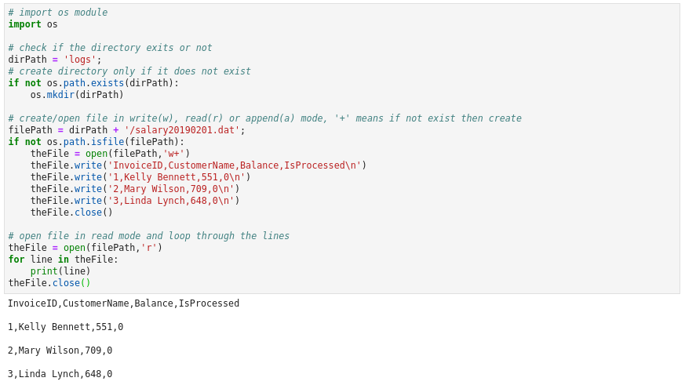

### Python - Files:
 # File Operations
    * Create a file - open(fileName,mode)
        - fileName - the name of file
        - mode - can be 'w' - to write, 'r' - to read, 'a' - to append, '+' - to create if not exists
    * Read files - fl = open(fileName,'r')
        - to seek to the begin - fl.seek(0)
        - to read one line at a time - fl.read()
        - to read all lines - f.readlines()
        - to close a file - fl.close()
    
 * Create a file - 01-Basics-Files.py - Files:
    
    ```
    nano 01-Basics-Files.py # create the file
    
    # import os module
    import os
    # check if the directory exits or not
    dirPath = 'logs';
    # create directory only if it does not exist
    if not os.path.exists(dirPath):
        os.mkdir(dirPath)

    # create/open file in write(w), read(r) or append(a) mode, '+' means if not exist then create
    filePath = dirPath + '/salary20190201.dat';
    if not os.path.isfile(filePath):
        theFile = open(filePath,'w+')
        theFile.write('InvoiceID,CustomerName,Balance,IsProcessed\n')
        theFile.write('1,Kelly Bennett,551,0\n')
        theFile.write('2,Mary Wilson,709,0\n')
        theFile.write('3,Linda Lynch,648,0\n')
        theFile.close()

    # open file in read mode and loop through the lines
    for line in open(filePath,'r'):
        print(line)

    # now execute the file 
    python 01-Basics-Files.py
    
    ```
  * Please see screen shot below
        