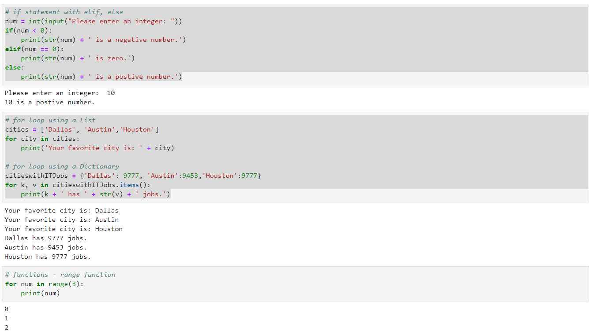
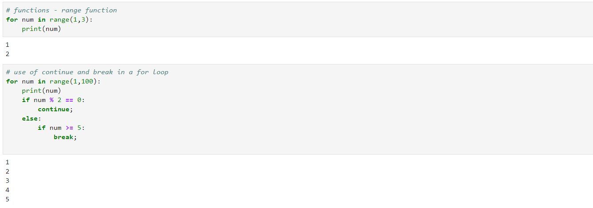

### Python - Functions:
  * Create a file - 01-Basics-ControlOfFlow.py - Control Of Flow:
    
    ```
    nano 01-Basics-ControlOfFlow.py # create the file
    
    # if statement with elif, else
    num = int(input("Please enter an integer: "))
    if(num < 0):
        print(str(num) + ' is a negative number.')
    elif(num == 0):
        print(str(num) + ' is zero.')
    else:
        print(str(num) + ' is a postive number.')

    # for loop using a List
    cities = ['Dallas', 'Austin','Houston']
    for city in cities:
        print('Your favorite city is: ' + city)

    # for loop using a Dictionary 
    citieswithITJobs = {'Dallas': 9777, 'Austin':9453,'Houston':9777}
    for k, v in citieswithITJobs.items():
        print(k + ' has ' + str(v) + ' jobs.')

    # functions - range function
    for num in range(3):
        print(num)
    for num in range(1,3):
        print(num)

    # use of continue and break in a for loop
    for num in range(1,100):
        print(num)
        if num % 2 == 0:
            continue;
        else:
            if num >= 10:
                break;
    
    # now execute the file 
    python 01-Basics-ControlOfFlow.py
    
    ```
  * Please see screen shot below
        
        