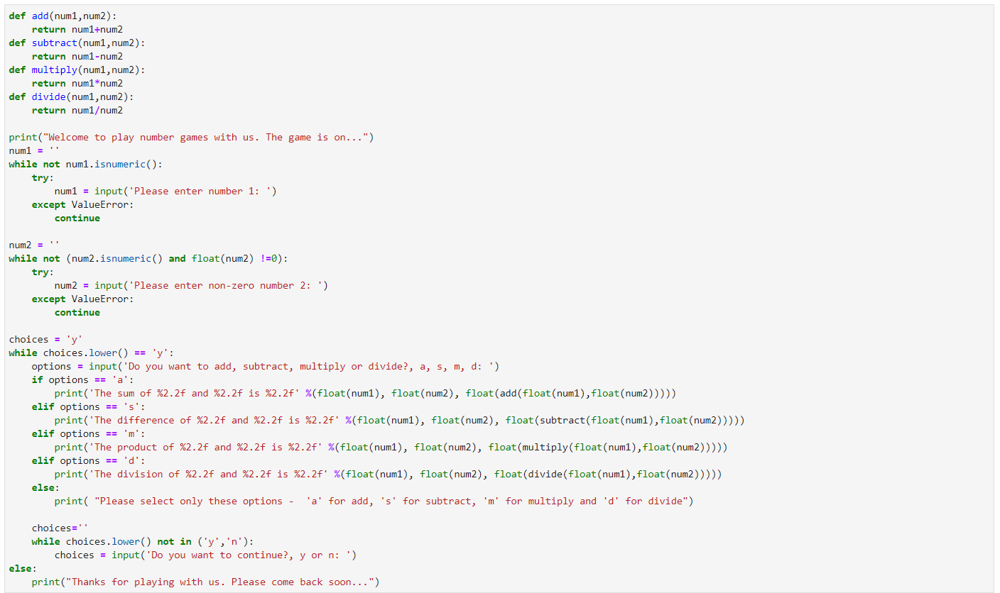

### Python - Functions:
  * Create a file - 01-Basics-ControlOfFlow.py - Control Of Flow:
    * To create the file - nano 01-Basics-ControlOfFlow.py # create the file
    * To execute the file - python 01-Basics-ControlOfFlow.py # execute the file
    
    * If statement with elif, else. For loops with Lists and Dictionaries, Range funtion
    ```
    num = int(input("Please enter an integer: "))
    if(num < 0):
        print(str(num) + ' is a negative number.')
    elif(num == 0):
        print(str(num) + ' is zero.')
    else:
        print(str(num) + ' is a postive number.')

    # for loop using a List
    cities = ['Dallas', 'Austin','Houston']
    for city in cities:
        print('Your favorite city is: ' + city)

    # for loop using a Dictionary 
    citieswithITJobs = {'Dallas': 9777, 'Austin':9453,'Houston':9777}
    for k, v in citieswithITJobs.items():
        print(k + ' has ' + str(v) + ' jobs.')

    # functions - range function
    for num in range(3):
        print(num)
    for num in range(1,3):
        print(num)
    ```
    
    
    * Use of continue and break in a for loop
    ```
    for num in range(1,100):
        print(num)
        if num % 2 == 0:
            continue;
        else:
            if num >= 10:
                break;
    ```
    
    
    * Use of while loop
    ```
    choice = 'y'
    while choice.lower() == 'y':
        print("Thanks for continuing to play with us. The game is on...")
        choice = input('Do you want to continue?, y or n: ')
    else:
        print("Thanks for playing with us. Please come back soon...")    
    ```
    
    
    * Use of while loop advanced
    ```
    def add(num1,num2):
        return num1+num2
    def subtract(num1,num2):
        return num1-num2
    def multiply(num1,num2):
        return num1*num2
    def divide(num1,num2):
        return num1/num2

    print("Welcome to play number games with us. The game is on...")
    num1 = ''
    while not num1.isnumeric():
        try:
            num1 = input('Please enter number 1: ')
        except ValueError:
            continue

    num2 = ''
    while not (num2.isnumeric() and float(num2) !=0):
        try:
            num2 = input('Please enter non-zero number 2: ')
        except ValueError:
            continue

    choices = 'y'
    while choices.lower() == 'y':
        options = input('Do you want to add, subtract, multiply or divide?, a, s, m, d: ')
        if options == 'a':
            print('The sum of %2.2f and %2.2f is %2.2f' %(float(num1), float(num2), float(add(float(num1),float(num2)))))
        elif options == 's':
            print('The difference of %2.2f and %2.2f is %2.2f' %(float(num1), float(num2), float(subtract(float(num1),float(num2)))))
        elif options == 'm':
            print('The product of %2.2f and %2.2f is %2.2f' %(float(num1), float(num2), float(multiply(float(num1),float(num2)))))
        elif options == 'd':
            print('The division of %2.2f and %2.2f is %2.2f' %(float(num1), float(num2), float(divide(float(num1),float(num2)))))
        else:
            print( "Please select only these options -  'a' for add, 's' for subtract, 'm' for multiply and 'd' for divide")

        choices=''
        while choices.lower() not in ('y','n'):
            choices = input('Do you want to continue?, y or n: ')
    else:
        print("Thanks for playing with us. Please come back soon...")

    ```
    
    
    
    * Use of error handling in loops
    ```
    name='0'
    while True:
        try:
            if (float(name)>=0.0 or int(name)>=0):
                name=input('What is your name?')
            else:
                break
        except ValueError:
            break

    age='0'
    while True:
        try:
            if (float(age)>0.0 or int(age)>0):
                break
            else:
                age=input('What is your age?')
        except ValueError:
            print('Please enter numeric age only')
            age=input('What is your age?')

    print('My name is %s and i am %2.2f years old' %(str(name),float(age)))
    ```
    
    
    * Use of control of flow
      * create a function to get a comma seperated list of favorite fruits loved by your famnily
      * return the list of all fruits loved by the family
      * ask the user to enter a fruit name, if it is available in the list of favorite fruits then return that its his/her favorite fruit too else otherwise
    ```
    print("Welcome to fruits game.")
    def getFavFruits():
            favfruits = input('Please enter a list of all favorite fruit names loved by the family: ')
            return [fruits.strip() for fruits in favfruits.split(',')] 
    def isMyFavFruit():
            myFavFruit = input('Please enter your favorite fruit name: ')
            if myFavFruit in allFavFruits:
                print('Wow, %s is also your fav fruit like your family.' %(myFavFruit))
            else:
                print('Sorry, %s is not a fav fruit like your family.' %(myFavFruit))

    allFavFruits = getFavFruits()
    while True:
        isMyFavFruit()
        choice = input('Do you want to continue?(y/n): ')
        if(choice.lower() == 'y'):
            continue
        else:
            print("Thanks for playing fruits game.")
            break
     ```
     
     