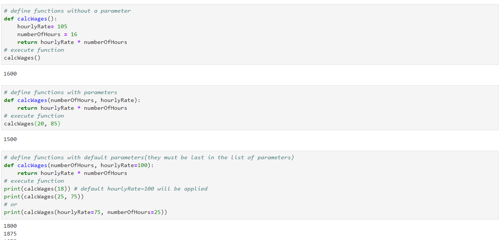

### Python - Functions:
  * Create a file - 01-Basics-Functions.py - Functions:
    
    ```
    nano 01-Basics-Functions.py # create the file
    
    # define functions without a parameter
    def calcWages():
        hourlyRate= 105
        numberOfHours = 16
        return hourlyRate * numberOfHourss
    # execute function
    calcWages()

    # define functions with parameters
    def calcWages(numberOfHours, hourlyRate):
        return hourlyRate * numberOfHours
    # execute function
    calcWages(20, 85)

    # define functions with default parameters(they must be last in the list of parameters)
    def calcWages(numberOfHours, hourlyRate=100):
        return hourlyRate * numberOfHours
    # execute function
    print(calcWages(18)) # default hourlyRate=100 will be applied
    print(calcWages(25, 75))
    # or 
    print(calcWages(hourlyRate=75, numberOfHours=25))
    
    # now execute the file 
    python 01-Basics-Functions.py
    
    ```
  * Please see screen shot below
        