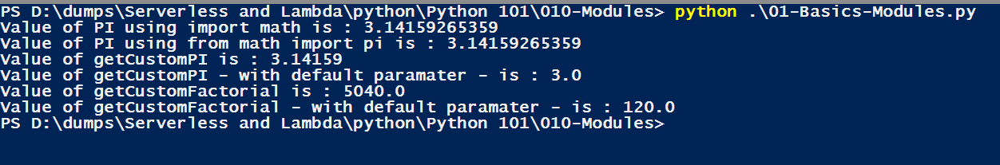

### Python - Modules:

* First Create a custom module file - MyCustomModule.py:
    
    ```
    nano MyCustomModule.py # create the file
    
    # creating a custom module

    from math import pi
    def getCustomPI(numberOfDecimals=0):
        return round(pi, numberOfDecimals)

    from math import factorial
    def getCustomFactorial(num, numberOfDecimals=0):
        return round(factorial(num), numberOfDecimals)
    
    ```
    
 * Create a file - 01-Basics-Modules.py - Modules:
    
    ```
    nano 01-Basics-Modules.py # create the file
    
    # using Modules by importing then either complete or obly by function name

    #imports whole math module - not a good practise if you dont was to use everything
    import math
    print('Value of PI using import math is : ' + str(math.pi))

    #imports only pi function from math module
    from math import pi
    print('Value of PI using from math import pi is : ' + str(pi))

    #create and import your own module
    from MyCustomModule import getCustomPI
    # calling custom PI
    print('Value of getCustomPI is : ' + str(getCustomPI(5)))
    print('Value of getCustomPI - with default paramater - is : ' + str(getCustomPI()))

    # calling custom Factorial
    from MyCustomModule import getCustomFactorial
    print('Value of getCustomFactorial is : ' + str(getCustomFactorial(7,2)))
    print('Value of getCustomFactorial - with default paramater - is : ' + str(getCustomFactorial(5)))

    # now execute the file 
    python 01-Basics-Modules.py
    
    ```
  * Please see screen shot below
        