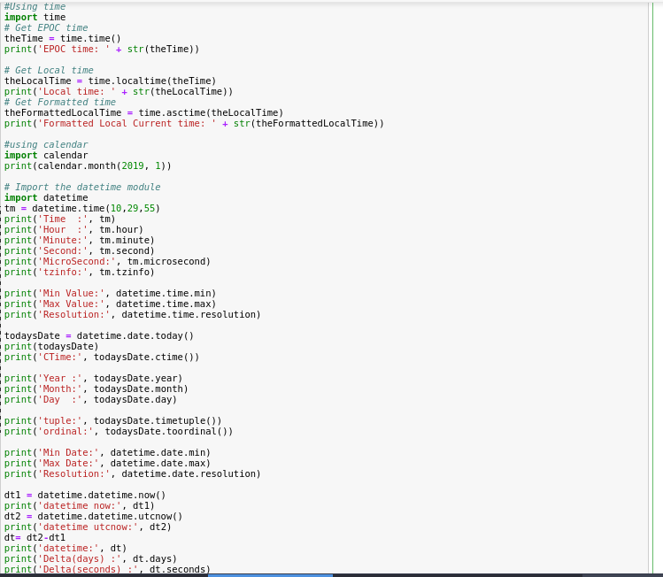
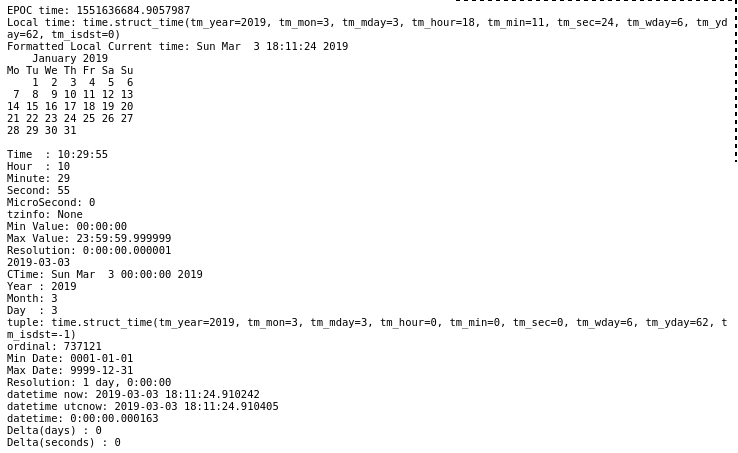

### Python - DateTime:
  * Create a file - 01-Basics-DateTime.py - DateTime:
    
    ```
    #Using time
    import time
    # Get EPOC time
    theTime = time.time()
    print('EPOC time: ' + str(theTime))

    # Get Local time
    theLocalTime = time.localtime(theTime)
    print('Local time: ' + str(theLocalTime))
    # Get Formatted time
    theFormattedLocalTime = time.asctime(theLocalTime)
    print('Formatted Local Current time: ' + str(theFormattedLocalTime))

    #using calendar
    import calendar
    print(calendar.month(2019, 1))

    # Import the datetime module
    import datetime
    tm = datetime.time(10,29,55)
    print('Time  :', tm)
    print('Hour  :', tm.hour)
    print('Minute:', tm.minute)
    print('Second:', tm.second)
    print('MicroSecond:', tm.microsecond)
    print('tzinfo:', tm.tzinfo)

    print('Min Value:', datetime.time.min)
    print('Max Value:', datetime.time.max)
    print('Resolution:', datetime.time.resolution)

    todaysDate = datetime.date.today()
    print(todaysDate)
    print('CTime:', todaysDate.ctime())

    print('Year :', todaysDate.year)
    print('Month:', todaysDate.month)
    print('Day  :', todaysDate.day)

    print('tuple:', todaysDate.timetuple())
    print('ordinal:', todaysDate.toordinal())

    print('Min Date:', datetime.date.min)
    print('Max Date:', datetime.date.max)
    print('Resolution:', datetime.date.resolution)

    dt1 = datetime.datetime.now()
    print('datetime now:', dt1)
    dt2 = datetime.datetime.utcnow()
    print('datetime utcnow:', dt2)
    dt= dt2-dt1
    print('datetime:', dt)
    print('Delta(days) :', dt.days)
    print('Delta(seconds) :', dt.seconds)
    
    # now execute the file 
    python 01-Basics-DateTime.py
    
    ```
  * Please see screen shot below
        
        