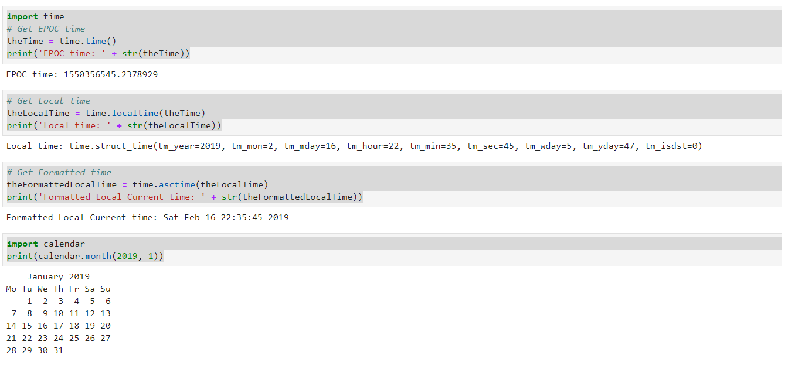

### Python - DateTime:
  * Create a file - 01-Basics-DateTime.py - File Operations:
    
    ```
    nano 01-Basics-DateTime.py # create the file
    
    import time
    # Get EPOC time
    theTime = time.time()
    print('EPOC time: ' + str(theTime))

    # Get Local time
    theLocalTime = time.localtime(theTime)
    print('Local time: ' + str(theLocalTime))

    # Get Formatted time
    theFormattedLocalTime = time.asctime(theLocalTime)
    print('Formatted Local Current time: ' + str(theFormattedLocalTime))

    import calendar
    print(calendar.month(2019, 1))

    
    # now execute the file 
    python 01-Basics-DateTime.py
    
    ```
  * Please see screen shot below
        