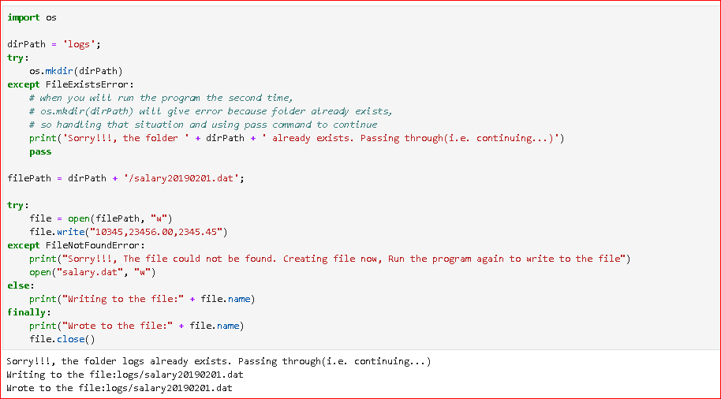

### Python - Exception Handling:
  * Create a file - 01-Basics-ExceptionHandling.py - File Operations:
    # Exception Hadling - 
    # It uses try ctach block to handle exceptions
    # If you have not handled an exception then the execution of a program ends at the point of exception
    # You will put the code lines) prone to exception in the try blow and then handle the exception in the except block(s)
    # One try block can have as many except block to handle all exceptional scenarios
    ```
    nano 01-Basics-ExceptionHandling.py # create the file
    
    import os

    dirPath = 'logs';
    try:
        os.mkdir(dirPath)
    except FileExistsError:
        # when you will run the program the second time, 
        # os.mkdir(dirPath) will give error because folder already exists, 
        # so handling that situation and using pass command to continue
        print('Sorry!!!, the folder ' + dirPath + ' already exists. Passing through(i.e. continuing...)')
        pass

    filePath = dirPath + '/salary20190201.dat';

    try:
        file = open(filePath, "w")
        file.write("10345,23456.00,2345.45")
    except FileNotFoundError:
        print("Sorry!!!, The file could not be found. Creating file now, Run the program again to write to the file")
        open("salary.dat", "w")
    else:
        print("Writing to the file:" + file.name)
    finally:
        print("Wrote to the file:" + file.name)
        file.close()

    # now execute the file 
    python 01-Basics-ExceptionHandling.py
    
    ```
  * Please see screen shot below
        