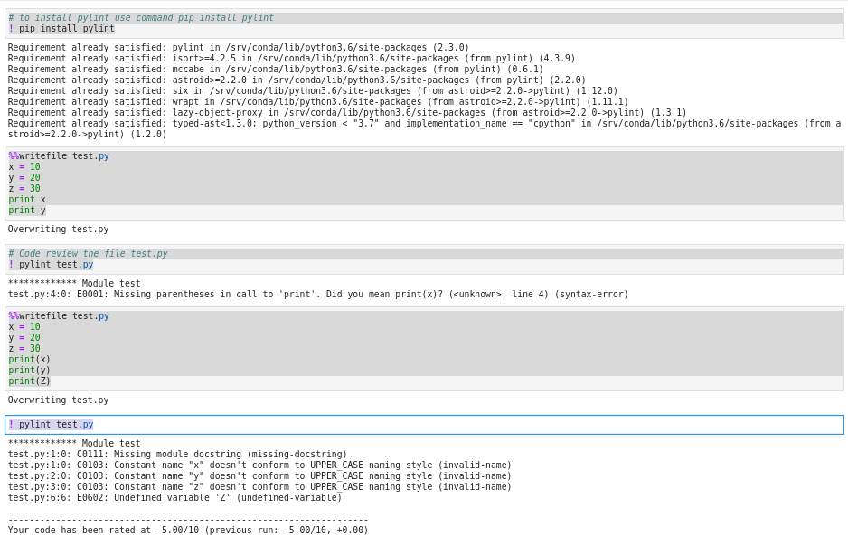
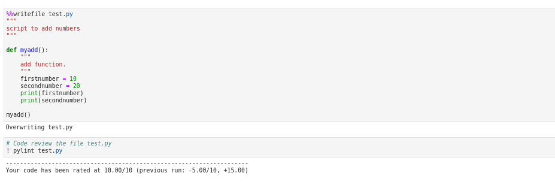

### Python - Code Review and Unit Testing:
  * good practise to use exception hadling but 
    * Also use tool for analysing your code and unit test your code
  * Python code review tools – pylint, piflakes etc
    * To Install pylint : **pip install pylint**
    * To test a file using  pylint : **pylint 01-Basics-CodeReviewandUnitTesting.py**
  * Python unit testing tools – punittest, doctest etc
  
    ```
    # To install pylint use command pip install pylint
    pip install pylint

    # create a file with code below
    nano test.py
    x = 10
    y = 20
    z = 30
    print x
    print y

    # Code review the file test.py
    ! pylint test.py

    #update with code as below
    nano test.py
    x = 10
    y = 20
    z = 30
    print(x)
    print(y)
    print(Z)

    # Code review the file test.py
    ! pylint test.py


    # Now again create/overwrite test.py with code below
    nano test.py
    """
    script to add numbers
    """

    def myadd():
        """
        add function.
        """
        firstnumber = 10
        secondnumber = 20
        print firstnumber
        print secondnumber

    myadd()

    # Code review the file test.py
    ! pylint test.py
    
    ```
  * Please see screen shot below
        
        
    