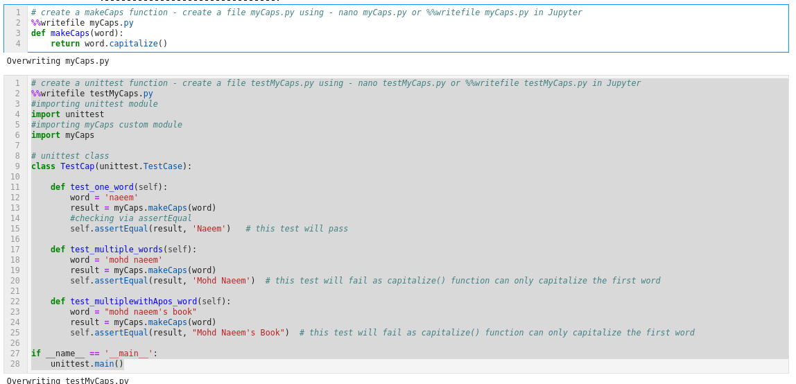
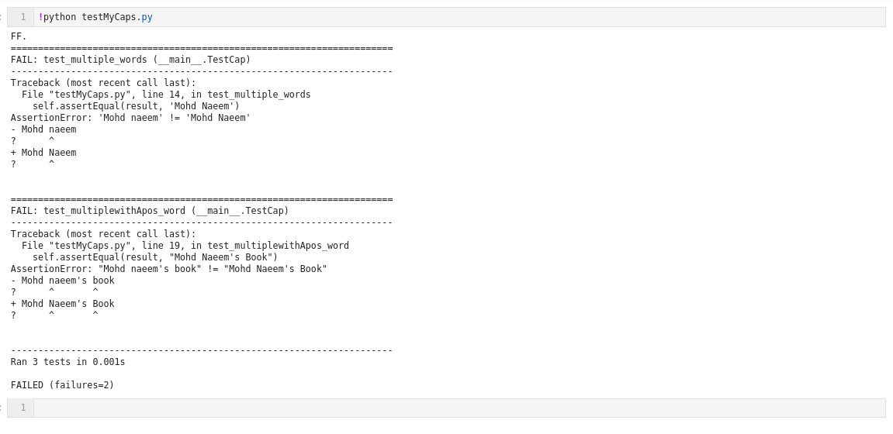
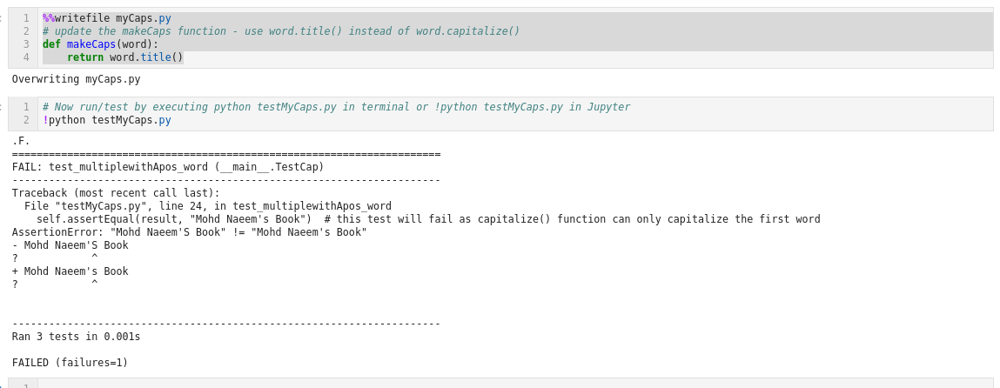
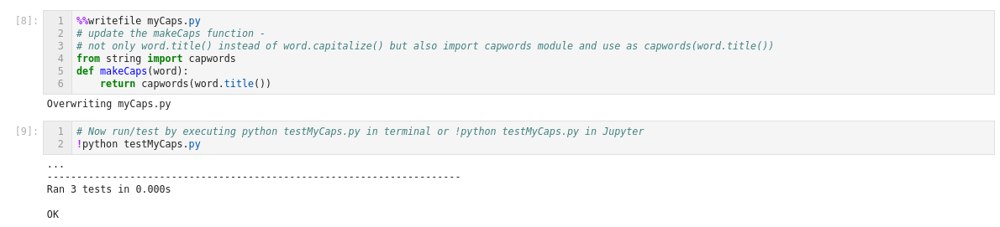

### Python - Code Review and Unit Testing:
  * good practise to use exception hadling but 
    * Also use tool for analysing your code and unit test your code
  * Python code review tools – pylint, piflakes etc
    * To Install pylint : **pip install pylint**
    * To test a file using  pylint : **pylint 01-Basics-CodeReviewandUnitTesting.py**
  * Python unit testing tools – punittest, doctest etc
  
  * **pylint** - example for code review tool
    ```
    # To install pylint use command pip install pylint
    pip install pylint

    # create a file with code below
    nano test.py
    x = 10
    y = 20
    z = 30
    print(x)
    print(y)

    # Code review the file test.py
    ! pylint test.py

    #update with code as below
    nano test.py
    x = 10
    y = 20
    z = 30
    print(x)
    print(y)
    print(Z)

    # Code review the file test.py
    ! pylint test.py


    # Now again create/overwrite test.py with code below
    nano test1.py
    """
    script to add numbers
    """

    def myadd():
        """
        add function.
        """
        firstnumber = 10
        secondnumber = 20
        print firstnumber
        print secondnumber

    myadd()

    # Code review the file test.py
    ! pylint test1.py
    
    ```
    * Please see screen shot below
        
        
        
  * **unittest** - example for unit testing tool etc
  
    ```
    %%writefile myCaps.py
    # create a makeCaps function - create a file myCaps.py using - nano myCaps.py or %%writefile myCaps.py in Jupyter
    def makeCaps(word):
        return word.title()
    
    %%writefile testMyCaps.py
    # create a unittest function - create a file testMyCaps.py using - nano testMyCaps.py or %%writefile testMyCaps.py in Jupyter
    #importing unittest module
    import unittest
    #importing myCaps custom module
    import myCaps

    # unittest class
    class TestCap(unittest.TestCase):

        def test_one_word(self):
            word = 'naeem'
            result = myCaps.makeCaps(word)
            #checking via assertEqual
            self.assertEqual(result, 'Naeem')   # this test will pass

        def test_multiple_words(self):
            word = 'mohd naeem'
            result = myCaps.makeCaps(word)
            self.assertEqual(result, 'Mohd Naeem')  # this test will fail as capitalize() function can only capitalize the first word

        def test_multiplewithApos_word(self):
            word = "mohd naeem's book"
            result = myCaps.makeCaps(word)
            self.assertEqual(result, "Mohd Naeem's Book")  # this test will fail as capitalize() function can only capitalize the first word also it will fail with title() function too as it will even capitalize the apos words

    if __name__ == '__main__':
        unittest.main()

    # Now run/test by executing python testMyCaps.py in terminal or !python testMyCaps.py in Jupyter
    !python testMyCaps.py
    ```
    * Please see screen shot below
        
        

    ```
    %%writefile myCaps.py
    # update the makeCaps function - use word.title() instead of word.capitalize()
    def makeCaps(word):
        return word.title()
        
    # Now run/test by executing python testMyCaps.py in terminal or !python testMyCaps.py in Jupyter
    !python testMyCaps.py
    
    ```
    * Please see screen shot below
        
        
    ```
    %%writefile myCaps.py
    # update the makeCaps function - 
    # not only word.title() instead of word.capitalize() but also import capwords module and use as capwords(word.title())
    from string import capwords
    def makeCaps(word):
        return capwords(word.title())
        
    # Now run/test by executing python testMyCaps.py in terminal or !python testMyCaps.py in Jupyter
    !python testMyCaps.py
    
    ```
    * Please see screen shot below
        