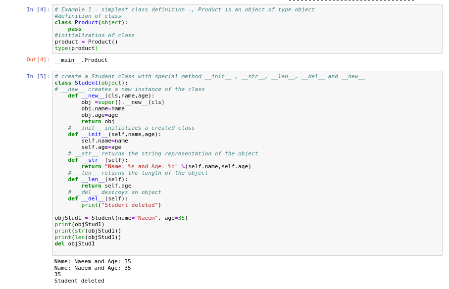
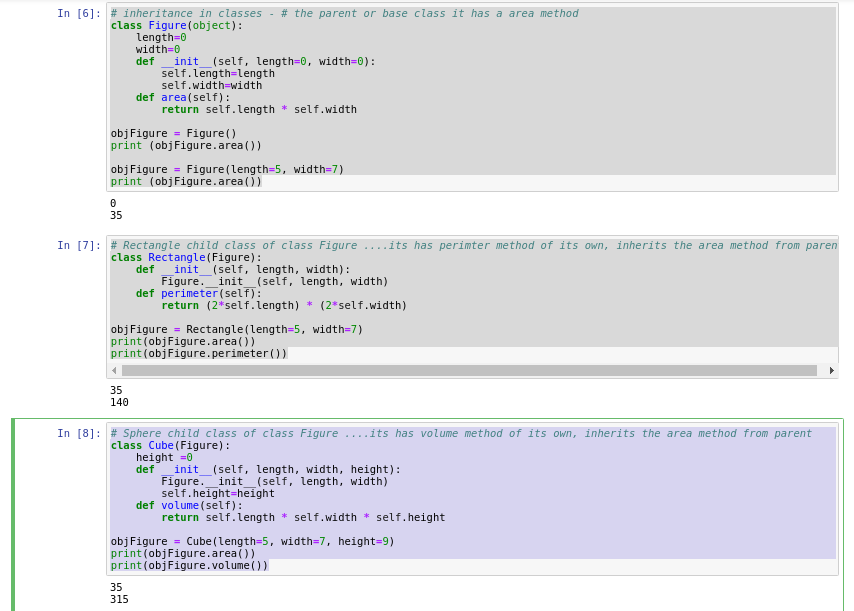
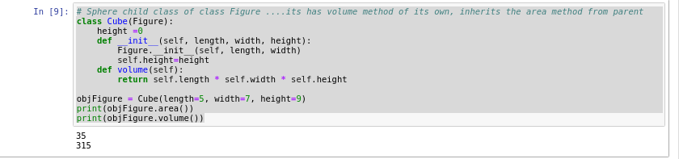
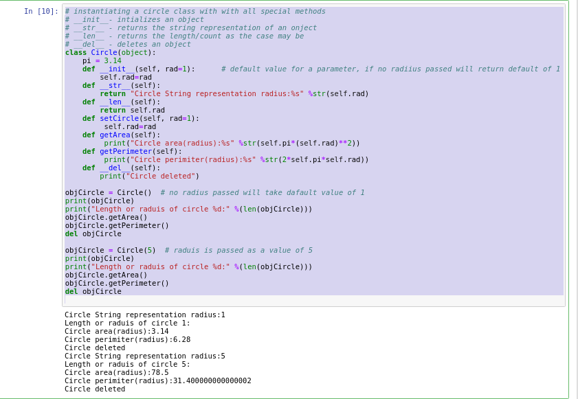
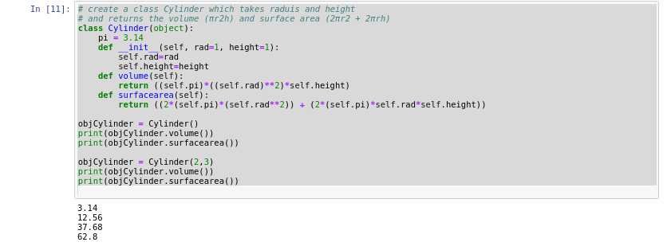
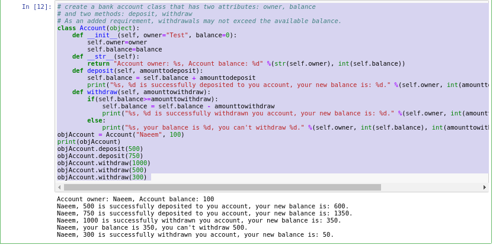

### Python - Classes and Objects:
  * class is blue print of a behavior
  * object is a instance of a class
  * a class has attributes and methods.
  * attributes are the characteristics of a class
  * methods are the operations performed by the classs

    ```
    nano 01-Basics-ClassesandObjects01.py # create the file
    
    # Example 1 - simplest class definition -, Product is an object of type object 
    #definition of class
    class Product(object):
        pass
    #initialization of class      
    product = Product()
    type(product)
    
    # create a Student class with special method __init__ , __str__, __len__, __del__ and __new__
    class Student(object):
    # __new__ creates a new instance of the class
        def __new__(cls,name,age):
            obj =super().__new__(cls)
            obj.name=name
            obj.age=age
            return obj
        # __init__ initializes a created class
        def __init__(self,name,age):
            self.name=name
            self.age=age
        # __str__ returns the string representation of the object
        def __str__(self):
            return "Name: %s and Age: %d" %(self.name,self.age)
        # __len__ returns the length of the object
        def __len__(self):
            return self.age
        # __del__ destroys an object
        def __del__(self):
            print("Student deleted")

    objStud1 = Student(name="Naeem", age=35)  
    print(objStud1)
    print(str(objStud1))
    print(len(objStud1))
    del objStud1
    
    # now execute the file 
    python 01-Basics-ClassesandObjects01.py
    
    ```
  * Please see screen shot below
        

    ```
    nano 01-Basics-ClassesandObjects02.py # create the file
    # inheritance in classes - # the parent or base class it has a area method
    class Figure(object):    
        length=0
        width=0
        def __init__(self, length=0, width=0):
            self.length=length
            self.width=width
        def area(self):
            return self.length * self.width

    objFigure = Figure()
    print (objFigure.area())

    objFigure = Figure(length=5, width=7)
    print (objFigure.area())

    # Rectangle child class of class Figure ....its has perimter method of its own, inherits the area method from parent
    class Rectangle(Figure):
        def __init__(self, length, width):
            Figure.__init__(self, length, width)
        def perimeter(self):
            return (2*self.length) * (2*self.width)

    objFigure = Rectangle(length=5, width=7)
    print(objFigure.area())
    print(objFigure.perimeter())
    
    # Sphere child class of class Figure ....its has volume method of its own, inherits the area method from parent
    class Cube(Figure):
        height =0
        def __init__(self, length, width, height):
            Figure.__init__(self, length, width)
            self.height=height
        def volume(self):
            return self.length * self.width * self.height

    objFigure = Cube(length=5, width=7, height=9)
    print(objFigure.area())
    print(objFigure.volume())
    
    # Cube child class of class Figure ....its has volume method of its own, inherits the area method from parent
    class Cube(Figure):
        height =0
        def __init__(self, length, width, height):
            Figure.__init__(self, length, width)
            self.height=height
        def volume(self):
            return self.length * self.width * self.height

    objFigure = Cube(length=5, width=7, height=9)
    print(objFigure.area())
    print(objFigure.volume())


    # now execute the file 
    python 01-Basics-ClassesandObjects02.py
    
    ```
  * Please see screen shot below
        
        
        

    ```
    nano 01-Basics-ClassesandObjects03.py # create the file
    # instantiating a circle class with with all special methods
    # __init__- intializes an object
    # __str__ - returns the string representation of an onject
    # __len__ - returns the length/count as the case may be
    # __del__ - deletes an object
    class Circle(object):
        pi = 3.14
        def __init__(self, rad=1):      # default value for a parameter, if no radiius passed will return default of 1
            self.rad=rad
        def __str__(self):
            return "Circle String representation radius:%s" %str(self.rad)
        def __len__(self):
            return self.rad
        def setCircle(self, rad=1):
             self.rad=rad
        def getArea(self):
             print("Circle area(radius):%s" %str(self.pi*(self.rad)**2))
        def getPerimeter(self):
             print("Circle perimiter(radius):%s" %str(2*self.pi*self.rad))
        def __del__(self):
            print("Circle deleted")

    objCircle = Circle()  # no radius passed will take dafault value of 1
    print(objCircle)
    print("Length or raduis of circle %d:" %(len(objCircle)))
    objCircle.getArea()
    objCircle.getPerimeter()
    del objCircle

    objCircle = Circle(5)  # raduis is passed as a value of 5
    print(objCircle)
    print("Length or raduis of circle %d:" %(len(objCircle)))
    objCircle.getArea()
    objCircle.getPerimeter()
    del objCircle
    
    # create a class Cylinder which takes raduis and height 
    # and returns the volume (πr2h) and surface area (2πr2 + 2πrh)
    class Cylinder(object):
        pi = 3.14
        def __init__(self, rad=1, height=1):
            self.rad=rad
            self.height=height
        def volume(self):
            return ((self.pi)*((self.rad)**2)*self.height)
        def surfacearea(self):
            return ((2*(self.pi)*(self.rad**2)) + (2*(self.pi)*self.rad*self.height))

    objCylinder = Cylinder()
    print(objCylinder.volume())
    print(objCylinder.surfacearea())

    objCylinder = Cylinder(2,3)
    print(objCylinder.volume())
    print(objCylinder.surfacearea())


    # now execute the file 
    python 01-Basics-ClassesandObjects03.py
    

    ```
  * Please see screen shot below
        
        


    ```
    nano 01-Basics-ClassesandObjects04.py # create the file
    
    # create a bank account class that has two attributes: owner, balance
    # and two methods: deposit, withdraw
    # As an added requirement, withdrawals may not exceed the available balance.
    class Account(object):
        def __init__(self, owner="Test", balance=0):
            self.owner=owner
            self.balance=balance
        def __str__(self):
            return "Account owner: %s, Account balance: %d" %(str(self.owner), int(self.balance))
        def deposit(self, amounttodeposit):
            self.balance = self.balance + amounttodeposit
            print("%s, %d is successfully deposited to you account, your new balance is: %d." %(self.owner, int(amounttodeposit), int(self.balance)))    
        def withdraw(self, amounttowithdraw):
            if(self.balance>=amounttowithdraw):
                self.balance = self.balance - amounttowithdraw
                print("%s, %d is successfully withdrawn you account, your new balance is: %d." %(self.owner, int(amounttowithdraw), int(self.balance)))    
            else:
                print("%s, your balance is %d, you can't withdraw %d." %(self.owner, int(self.balance), int(amounttowithdraw)))
    objAccount = Account("Naeem", 100)
    print(objAccount)
    objAccount.deposit(500)
    objAccount.deposit(750)
    objAccount.withdraw(1000)
    objAccount.withdraw(500)
    objAccount.withdraw(300) 
    
    # now execute the file 
    python 01-Basics-ClassesandObjects04.py

    ```
  * Please see screen shot below
        