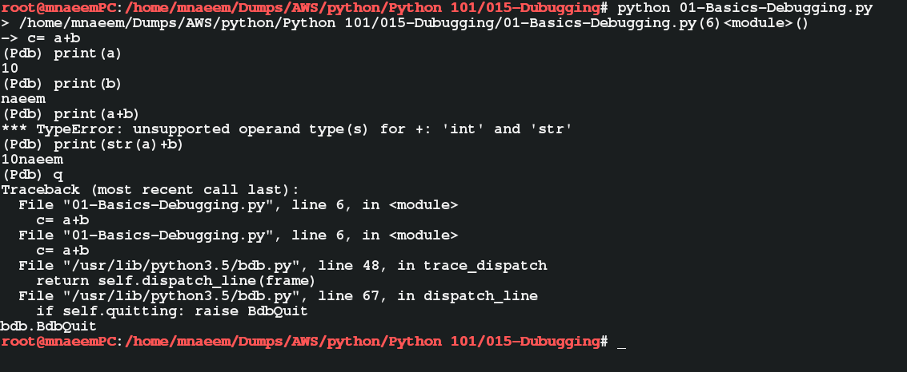

### Python - Debugging:
  * Create a file - 01-Basics-Debugging.py - Debugging:
    
    ```
    # create file 01-Basics-Debugging.py
    import pdb
    a=10
    b="naeem"
    pdb.set_trace()
    c= a+b
    print(c)    
    # now execute the file 
    python 01-Basics-Debugging.py
    #Once the program stops at trace point then print the values to debug and trace
    
    ```
  * Please see screen shot below
        