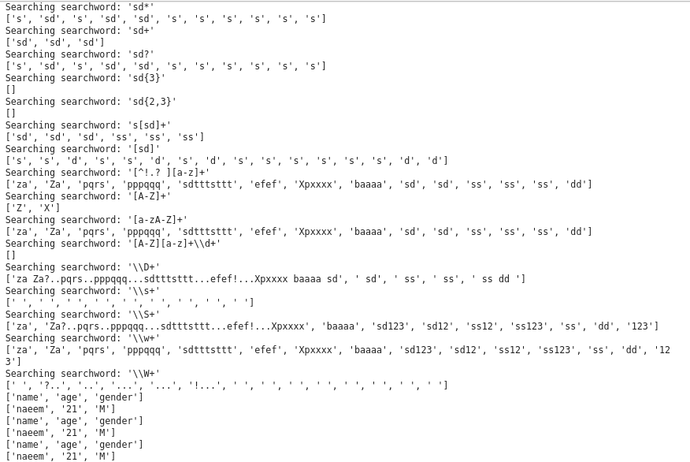
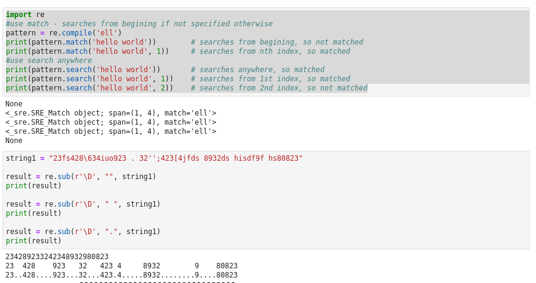
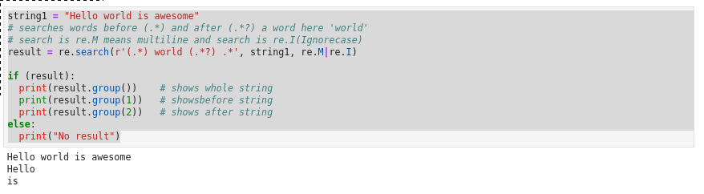

### Python - Debugging:
  * **Regular Expressions**:
    * used effectively in lot of tasks like data clean up, parsing data, pattern matching
    * Python uses a module ‘re’ for regular expressions
    * How to search : match = **re.match(searchword, searchsource)** returns a boolean
    * How to find location of search : **match.start()** and **match.end()** return the start and end locations of the search
    * How to find all instances of a search word : all = **re.findall(searchword, searchsource)**
    * are used to text matching or parsing
    
  * Create a file - 01-Basics-RegularExpressions01.py:

    
    ```
    import re
    searchwords =['Redis', 'port', 'server']
    logdata = 'Redis version=4.0.9, bits=64, pid=1, just started, Redis Running mode=standalone, port=6379.'
    for searchword in searchwords:
        print('Searching word: "%s" in log: "%s".' %(searchword, logdata))
        match = re.search(searchword, logdata)
        if(match):
            print('Successfully searched word: "%s", match start: %d, match end: %d' %(searchword, match.start(), match.end()))
        else:
            print('Could not search word: "%s"' %(searchword))
            
    # now execute the file 
    python 01-Basics-RegularExpressions01.py

    ```
  * Please see screen shot below
        
        
  * Create a file - 01-Basics-RegularExpressions02.py:

    
    ```
    import re
    searchword ='Redis'
    logdata = 'Redis version=4.0.9, bits=64, pid=1, just started, Redis Running mode=standalone, port=6379.'
    match = re.findall(searchword, logdata)
    print(match)
    if(match):
        print('Successfully searched word: "%s"' %(searchword))
    else:
        print('Could not search word: "%s"' %(searchword))
            
    # now execute the file 
    python 01-Basics-RegularExpressions02.py

    ```
  * Please see screen shot below
        
        
  * Create a file - 01-Basics-RegularExpressions03.py:

    
    ```
    import re
    searchdata =['Redis', 'port', 'server']
    logdata = 'Redis version=4.0.9, bits=64, pid=1, just started, Redis Running mode=standalone, port=6379.'

    def myfindall(searchwords,searchsource):
        '''
        This function searches the searcwords in search source
        and returns all the matches
        '''
        for searchword in searchwords:
            print('Searching searchword: %r' %(searchword))
            print(re.findall(searchword,searchsource))
            print('\n')
            print(re.search(searchword,searchsource))
            
    myfindall(searchdata, logdata)

            
    # now execute the file 
    python 01-Basics-RegularExpressions03.py

    ```
  * Please see screen shot below
        
        
  * **Meta Characters**:
    * meta-character * means pattern must appear zero or more times.
    * meta-character + means pattern must appear at least once.
    * meta-character ? means pattern must appears zero or one time.
    * meta-character {x} means pattern must appears x number of times
    * meta-character {x, y } means pattern must appears x to y number of times in a range
    
    * Create a file - 01-Basics-MetaCharacters01.py:

        ```
        import re
        searchsource = 'Za?..pqrs..pppqqq...stttsttt...efef!...Xpxxxx baaaa 123'
        searchpatterns = [ 'sd*',       # s followed by zero or more d's
                        'sd+',          # s followed by one or more d's
                        'sd?',          # s followed by zero or one d's
                        'sd{3}',        # s followed by three d's
                        'sd{2,3}',      # s followed by two to three d's
                        's[sd]+',       # s followed by one or more s or d
                        '[sd]',         # either s or d
                        '[^!.? ]'       # check for matches that are not a !,.,?, or space
                        '[a-z]+',       # sequences of lower case letters
                        '[A-Z]+',       # sequences of upper case letters
                        '[a-zA-Z]+',    # sequences of lower or upper case letters
                        '[A-Z][a-z]+'   # one upper case letter followed by lower case letters
                        r'\d+',         # sequence of digits
                        r'\D+',         # sequence of non-digits
                        r'\s+',         # sequence of whitespace
                        r'\S+',         # sequence of non-whitespace
                        r'\w+',         # alphanumeric characters
                        r'\W+',         # non-alphanumeric
                        ]
        def myfindall(searchwords,searchsource):
            for searchword in searchwords:
                print('Searching searchword: %r' %(searchword))
                print(re.findall(searchword,searchsource))
                
        myfindall(searchpatterns, searchsource) 
        
        # splitting using regular expressions
        print(re.split(',',"name,age,gender"))
        print(re.split(',',"naeem,21,M"))
        print(re.split('\t',"name\tage\tgender"))
        print(re.split('\t',"naeem\t21\tM"))
        print(re.split(',',"name,age,gender"))
        print(re.split(',',"naeem,21,M"))
        print(re.split('\|',"name|age|gender"))
        print(re.split('\|',"naeem|21|M"))
        
        # now execute the file 
        python 01-Basics-MetaCharacters01.py
        
        # create file 01-Basics-RegularExpressions04.py 
        # Use - nano 01-Basics-RegularExpressions04.py 

        #use match - searches from begining if not specified otherwise
        pattern = re.compile('ell')
        print(pattern.match('hello world'))        # searches from begining, so not matched
        print(pattern.match('hello world', 1))     # searches from nth index, so matched
        #use search anywhere
        print(pattern.search('hello world'))       # searches anywhere, so matched
        print(pattern.search('hello world', 1))    # searches from 1st index, so matched
        print(pattern.search('hello world', 2))    # searches from 2nd index, so not matched

        # searchh and replace using re.sub
        string1 = "23fs428\634iuo923 . 32'';423[4jfds 8932ds hisdf9f hs80823"

        result = re.sub(r'\D', "", string1)
        print(result)

        result = re.sub(r'\D', " ", string1)
        print(result)

        result = re.sub(r'\D', ".", string1)
        print(result)

        # Advanced searching 
        string1 = "Hello world is awesome"
        # searches words before (.*) and after (.*?) a word here 'world'
        # search is re.M means multiline and search is re.I(Ignorecase)
        result = re.search(r'(.*) world (.*?) .*', string1, re.M|re.I)

        if (result):
          print(result.group())    # shows whole string
          print(result.group(1))   # showsbefore string
          print(result.group(2))   # shows after string
        else:
          print("No result")

        # now execute the file 
        # python 01-Basics-RegularExpressions04.py

        ```
      * Please see screen shot below
            
            
            
            
            
