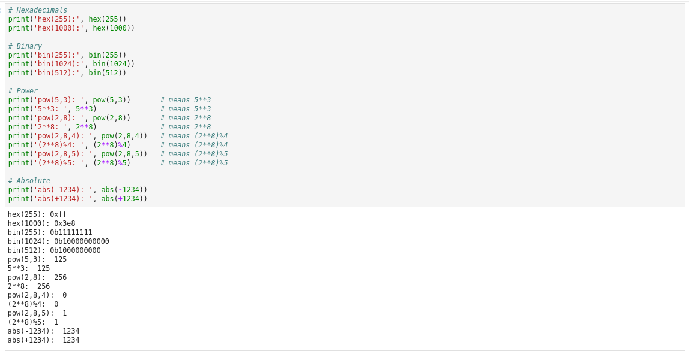
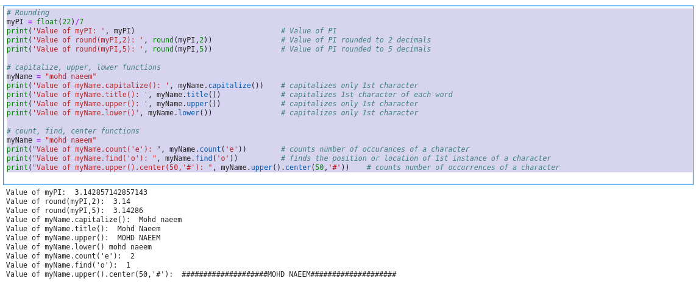
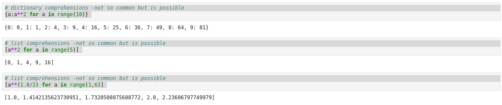
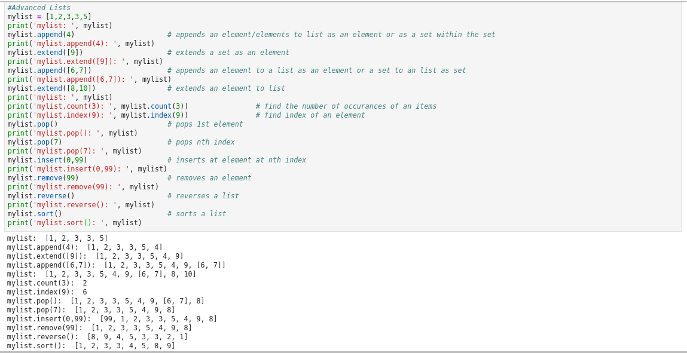
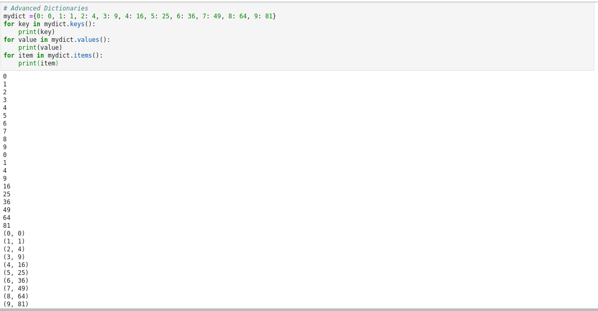

### Python - Misc. Functions:
  * Create a file - 01-Basics-MiscFunctions.py - Misc. Functions:
    
    ```
    # create file 01-Basics-MiscFunctions.py by using nano 01-Basics-MiscFunctions.py 

    # Hexadecimals
    print('hex(255):', hex(255))
    print('hex(1000):', hex(1000))

    # Binary
    print('bin(255):', bin(255))
    print('bin(1024):', bin(1024))
    print('bin(512):', bin(512)) 

    # Power
    print('pow(5,3): ', pow(5,3))       # means 5**3
    print('5**3: ', 5**3)               # means 5**3
    print('pow(2,8): ', pow(2,8))       # means 2**8
    print('2**8: ', 2**8)               # means 2**8
    print('pow(2,8,4): ', pow(2,8,4))   # means (2**8)%4
    print('(2**8)%4: ', (2**8)%4)       # means (2**8)%4
    print('pow(2,8,5): ', pow(2,8,5))   # means (2**8)%5
    print('(2**8)%5: ', (2**8)%5)       # means (2**8)%5

    # Absolute
    print('abs(-1234): ', abs(-1234))
    print('abs(+1234): ', abs(+1234))

    # Rounding 
    myPI = float(22)/7
    print('Value of myPI: ', myPI)                                  # Value of PI
    print('Value of round(myPI,2): ', round(myPI,2))                # Value of PI rounded to 2 decimals
    print('Value of round(myPI,5): ', round(myPI,5))                # Value of PI rounded to 5 decimals

    # capitalize, upper, lower functions
    myName = "mohd naeem"
    print('Value of myName.capitalize(): ', myName.capitalize())    # capitalizes only 1st character
    print('Value of myName.title(): ', myName.title())              # capitalizes 1st character of each word
    print('Value of myName.upper(): ', myName.upper())              # capitalizes only 1st character
    print('Value of myName.lower()', myName.lower())                # capitalizes only 1st character

    # count, find, center functions
    myName = "mohd naeem"
    print("Value of myName.count('e'): ", myName.count('e'))        # counts number of occurances of a character
    print("Value of myName.find('o'): ", myName.find('o'))          # finds the position or location of 1st instance of a character
    print("Value of myName.upper().center(50,'#'): ", myName.upper().center(50,'#'))    # counts number of occurrences of a character

    # Is checker functions
    print("naeem123".isalnum())    # checks alphanumeric
    print("naeem".isalnum())    # checks alphanumeric
    print("naeem".isalpha())    # checks alphabetic
    print("naeem".islower())    # checks is lower
    print("Naeem".islower())    # checks is lower
    print("Mohd Naeem".istitle())    # checks is title
    print("mohd naeem".istitle())    # checks is title
    print(" ".isspace())    # checks is space
    print("M".isspace())    # checks is space
    print("Mohd Naeem".endswith('m'))    # checks endswith
    print("Mohd Naeem".startswith('M'))    # checks endswith
    print("Mohd Naeem".endswith('t'))    # checks endswith
    print("Mohd Naeem".startswith('l'))    # checks endswith
    print("Mohd Naeem".split(' '))    # splits the word on split character and returns the tuple
    print("Mohd Naeem".split('N'))    # splits the word on split character and returns the tuple
    print("Mohd Naeem".partition('N'))    # partitions the word on partition character and returns the tuple
    print("Mohd Naeem".partition('d'))    # partitions the word on partition character and returns the tuple

    # sets
    myset =set()                                                                    # defines a blank set
    myset.add(1)                                                                    # add an element to a set
    myset.add(2)
    myset.add(1)
    myset.add(3)
    myset.add(4)
    newset=myset.copy()                                                             # copies a set ointo another
    newset.add(5)
    print('myset: ', myset)
    print('newset : ', newset)
    print('Diff of myset and myset: ', newset.difference(myset))                    # checks the difference between 2 sets
    print('Intersction of myset and newset: ', newset.intersection(myset))          # checks the intersection between 2 sets
    print('Union of myset and newset: ', newset.union(myset))                       # does a union
    print('myset issubset of newset: ', myset.issubset(newset))                     #  checks the 1 set is a subset of the other
    print('myset isdisjoint(nothing common) of newset: ', myset.isdisjoint(newset)) # checks if 2 sets don't have anything common
    print('newset is superset of myset: ', newset.issuperset(myset))                # checks the 1 set is a superset of the other 
    newset.discard(5)                                                               # discards an element in a set
    myset.clear()                                                                   # cleans up a set
    newset.clear()
    print('myset: ', myset)
    print('newset: ', newset)

    # dictionary comprehensions -not so common but is possible
    {a:a**2 for a in range(10)} 

    # list comprehensions -not so common but is possible
    [a**2 for a in range(5)] 

    # list comprehensions -not so common but is possible
    [a**(1.0/2) for a in range(1,6)] 

    #Advanced Lists
    mylist = [1,2,3,3,5]
    print('mylist: ', mylist)
    mylist.append(4)                      # appends an element/elements to list as an element or as a set within the set
    print('mylist.append(4): ', mylist)
    mylist.extend([9])                    # extends a set as an element
    print('mylist.extend([9]): ', mylist)
    mylist.append([6,7])                  # appends an element to a list as an element or a set to an list as set
    print('mylist.append([6,7]): ', mylist)
    mylist.extend([8,10])                 # extends an element to list
    print('mylist: ', mylist)
    print('mylist.count(3): ', mylist.count(3))                # find the number of occurances of an items
    print('mylist.index(9): ', mylist.index(9))                # find index of an element
    mylist.pop()                          # pops 1st element
    print('mylist.pop(): ', mylist)
    mylist.pop(7)                         # pops nth index 
    print('mylist.pop(7): ', mylist)
    mylist.insert(0,99)                   # inserts at element at nth index
    print('mylist.insert(0,99): ', mylist)
    mylist.remove(99)                     # removes an element
    print('mylist.remove(99): ', mylist)
    mylist.reverse()                      # reverses a list
    print('mylist.reverse(): ', mylist)
    mylist.sort()                         # sorts a list
    print('mylist.sort(: ', mylist)


    # Advanced Dictionaries
    mydict ={0: 0, 1: 1, 2: 4, 3: 9, 4: 16, 5: 25, 6: 36, 7: 49, 8: 64, 9: 81}
    for key in mydict.keys():
        print(key)
    for value in mydict.values():
        print(value)
    for item in mydict.items():
        print(item)
    
    
    # now execute the file 
    # python 01-Basics-MiscFunctions.py
    
    ```
  * Please see screen shot below
        
        
        
        
        