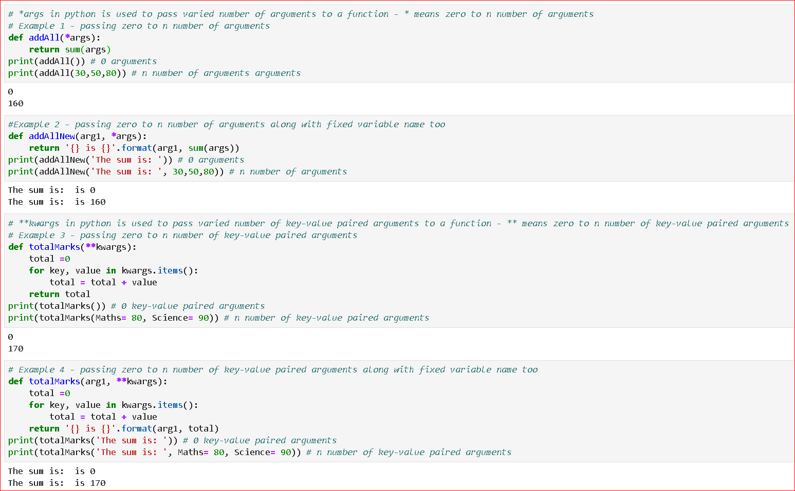

### Python - Misc. Functions:
  * *args in python is used to pass varied number of arguments to a function
  * **kwargs in python is used to pass varied number of key-value paired arguments to a function

  * Create a file - 01-Basics-VariedArgumentsToFunctions.py - Misc. Functions:
    
    ```
    # create file 01-Basics-VariedArgumentsToFunctions.py by using nano 01-Basics-VariedArgumentsToFunctions.py 

    # *args in python is used to pass varied number of arguments to a function
    # * means zero to n number of arguments
    # Example 1 - passing zero to n number of arguments
    def addAll(*args):
        return sum(args)
    print(addAll()) # 0 arguments
    print(addAll(30,50,80)) # n number of arguments arguments

    #Example 2 - passing zero to n number of arguments along with fixed variable name too
    def addAllNew(arg1, *args):
        return '{} is {}'.format(arg1, sum(args)) 
    print(addAllNew('The sum is: ')) # 0 arguments
    print(addAllNew('The sum is: ', 30,50,80)) # n number of arguments

    # **kwargs in python is used to pass varied number of key-value paired arguments to a function
    # ** means zero to n number of key-value paired arguments
    # Example 3 - passing zero to n number of key-value paired arguments
    def totalMarks(**kwargs):  
        total =0
        for key, value in kwargs.items():
            total = total + value
        return total
    print(totalMarks()) # 0 key-value paired arguments
    print(totalMarks(Maths= 80, Science= 90)) # n number of key-value paired arguments


    # Example 4 - passing zero to n number of key-value paired arguments along with fixed variable name too
    def totalMarks(arg1, **kwargs):  
        total =0
        for key, value in kwargs.items():
            total = total + value
        return '{} is {}'.format(arg1, total) 
    print(totalMarks('The sum is: ')) # 0 key-value paired arguments
    print(totalMarks('The sum is: ', Maths= 80, Science= 90)) # n number of key-value paired arguments

    # Example 5 -  use of *args and **kwargs in classes
    class Student:
        def __init__(self, name, school):
            self.name = name
            self.school = school
        # Add_Marks function can take any number of arguments as list
        def Add_Marks(self, *args):
            self.totalmarks = sum(args)
            self.totalsubjects = len(args)
        # Add_SubjectWithMarks function can take any number of arguments as a set of key-words
        def Add_SubjectWithMarks(self, **kwargs):
            totalmarks = 0
            totalsubjects = 0
            for key, value in kwargs.items():
                totalmarks = totalmarks + value
                totalsubjects = totalsubjects + 1
            self.totalmarks = totalmarks
            self.totalsubjects = totalsubjects
        def Get_Student_Info(self):
            return 'Name: {}, School: {}, Total: {}, Average: {}'.format(self.name, self.school, self.totalmarks, (self.totalmarks/self.totalsubjects))

    stud1 = Student('Naeem','School of Arts')
    stud1.Add_Marks(80,75,85) # any number of arguments as list
    print(stud1.Get_Student_Info())

    stud2 = Student('Nadeem','School of Architecture')
    stud2.Add_Marks(80,75,85,90,87) # any number of arguments as list
    print(stud2.Get_Student_Info())

    stud1.Add_SubjectWithMarks(Maths=80,Science=75,English=85)
    print(stud1.Get_Student_Info())

    stud2.Add_SubjectWithMarks(Maths=80,Science=75,English=85, Arts=90, PE=87)
    print(stud2.Get_Student_Info())
    
    # now execute the file 
    # python 01-Basics-VariedArgumentsToFunctions.py
    
    ```
  * Please see screen shot below
        
        