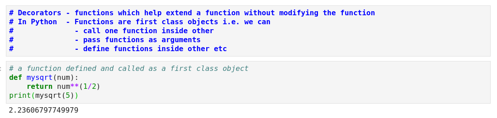
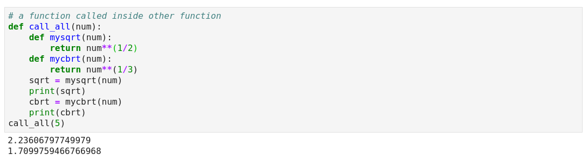
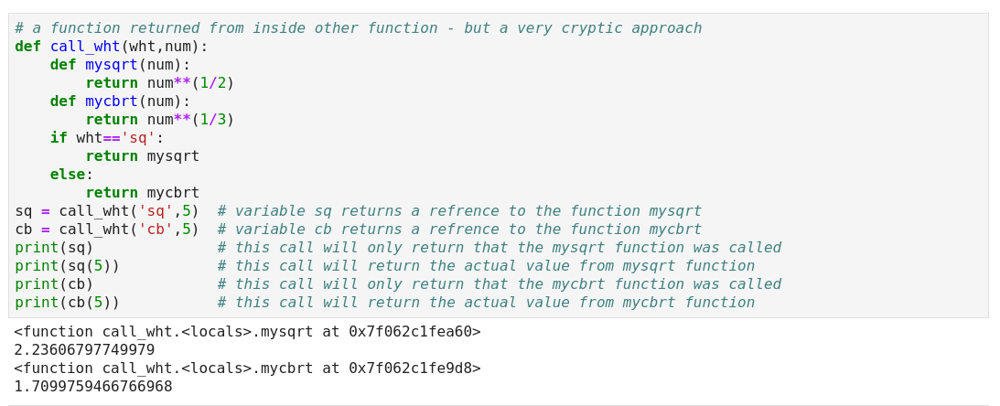
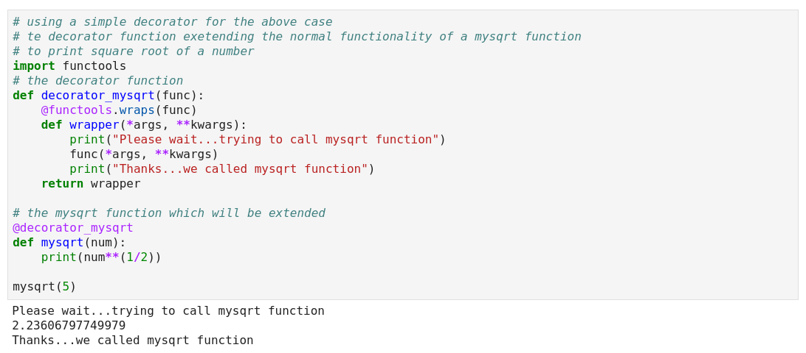
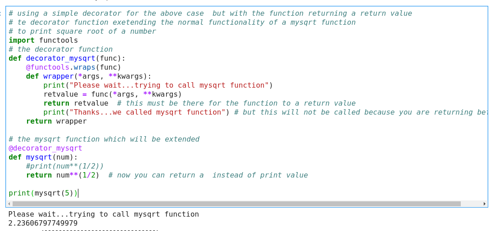
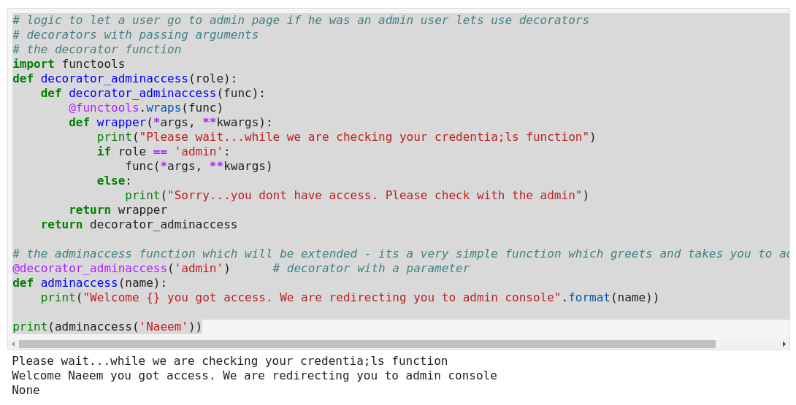
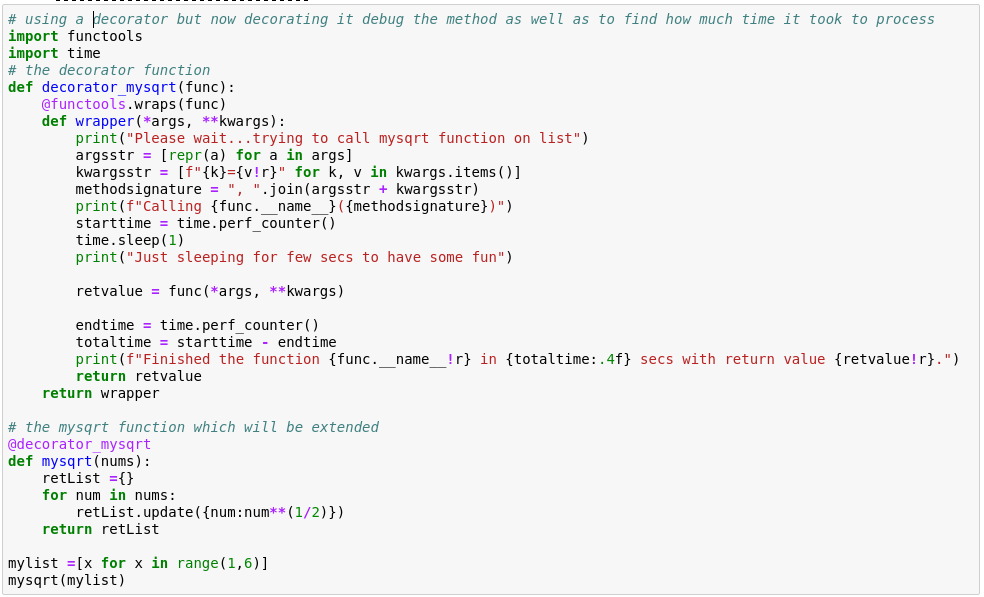
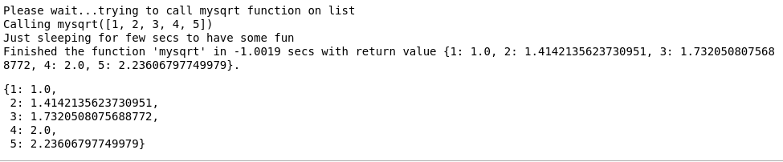

### Python - Decorators:
# Decorators - functions which help extend a function without modifying the function
# In Python  - Functions are first class objects i.e. we can 
#              - call one function inside other
#              - pass functions as arguments
#              - define functions inside other etc
###########################################################################################
  * Create a file - 01-Basics-Decorators01.py:
    
    ```
    # create file 01-Basics-Decorators01.py by using nano 01-Basics-Decorators01.py 

    # a function defined and called as a first class object
    def mysqrt(num):
        return num**(1/2)
    print(mysqrt(5))
    
    # now execute the file 
    # python 01-Basics-Decorators01.py
    
    ```
  * Please see screen shot below
        

###########################################################################################
  * Create a file - 01-Basics-Decorators02.py:
    
    ```
    # create file 01-Basics-Decorators02.py by using nano 01-Basics-Decorators02.py 

    # a function called inside other function
    def call_all(num):
        def mysqrt(num):
            return num**(1/2)
        def mycbrt(num):
            return num**(1/3)
        sqrt = mysqrt(num)
        print(sqrt)
        cbrt = mycbrt(num)
        print(cbrt)
    call_all(5)
    
    # now execute the file 
    # python 01-Basics-Decorators02.py
    
    ```
  * Please see screen shot below
        
        
###########################################################################################
  * Create a file - 01-Basics-Decorators03.py:
    
    ```
    # create file 01-Basics-Decorators03.py by using nano 01-Basics-Decorators03.py 

    # a function returned from inside other function - but a very cryptic approach
    def call_wht(wht,num):
        def mysqrt(num):
            return num**(1/2)
        def mycbrt(num):
            return num**(1/3)
        if wht=='sq':
            return mysqrt
        else:
            return mycbrt
    sq = call_wht('sq',5)  # variable sq returns a refrence to the function mysqrt
    cb = call_wht('cb',5)  # variable cb returns a refrence to the function mycbrt
    print(sq)              # this call will only return that the mysqrt function was called
    print(sq(5))           # this call will return the actual value from mysqrt function
    print(cb)              # this call will only return that the mycbrt function was called
    print(cb(5))           # this call will return the actual value from mycbrt function
    
    # now execute the file 
    # python 01-Basics-Decorators03.py
    
    ```
  * Please see screen shot below
        
        
###########################################################################################
  * Create a file - 01-Basics-Decorators04.py:
    
    ```
    # create file 01-Basics-Decorators04.py by using nano 01-Basics-Decorators04.py 

    # using a simple decorator for the above case 
    # te decorator function exetending the normal functionality of a mysqrt function 
    # to print square root of a number
    import functools
    # the decorator function
    def decorator_mysqrt(func):
        @functools.wraps(func)
        def wrapper(*args, **kwargs):
            print("Please wait...trying to call mysqrt function")
            func(*args, **kwargs)
            print("Thanks...we called mysqrt function")
        return wrapper

    # the mysqrt function which will be extended 
    @decorator_mysqrt
    def mysqrt(num):
        print(num**(1/2))

    mysqrt(5)

    # now execute the file 
    # python 01-Basics-Decorators04.py
    
    ```
  * Please see screen shot below
        
        
###########################################################################################      
  * Create a file - 01-Basics-Decorators05.py:
    
    ```
    # create file 01-Basics-Decorators05.py by using nano 01-Basics-Decorators05.py 

    # logic to let a user go to admin page if he was an admin user lets use decorators
    # decorators with passing arguments
    # the decorator function
    import functools
    def decorator_adminaccess(role):
        def decorator_adminaccess(func):
            @functools.wraps(func)
            def wrapper(*args, **kwargs):
                print("Please wait...while we are checking your credentia;ls function")
                if role == 'admin':
                    func(*args, **kwargs)
                else:
                    print("Sorry...you dont have access. Please check with the admin")
            return wrapper
        return decorator_adminaccess

    # the adminaccess function which will be extended - its a very simple function which greets and takes you to admin console
    @decorator_adminaccess('admin')      # decorator with a parameter
    def adminaccess(name):
        print("Welcome {} you got access. We are redirecting you to admin console".format(name))

    print(adminaccess('Naeem'))
    
    # now execute the file 
    # python 01-Basics-Decorators05.py
    
    ```
  * Please see screen shot below
        
        
###########################################################################################     
  * Create a file - 01-Basics-Decorators06.py:
    
    ```
    ## logic to let a user go to admin page if he was an admin user lets use decorators
    # decorators with passing arguments
    # the decorator function
    import functools
    def decorator_adminaccess(role):
        def decorator_adminaccess(func):
            @functools.wraps(func)
            def wrapper(*args, **kwargs):
                print("Please wait...while we are checking your credentia;ls function")
                if role == 'admin':
                    func(*args, **kwargs)
                else:
                    print("Sorry...you dont have access. Please check with the admin")
            return wrapper
        return decorator_adminaccess

    # the adminaccess function which will be extended - its a very simple function which greets and takes you to admin console
    @decorator_adminaccess('admin')      # decorator with a parameter
    def adminaccess(name):
        print("Welcome {} you got access. We are redirecting you to admin console".format(name))

    print(adminaccess('Naeem'))
    
    # now execute the file 
    # python 01-Basics-Decorators06.py
    
    ```
  * Please see screen shot below
        
        
###########################################################################################     
  * Create a file - 01-Basics-Decorators07.py:
    
    ```
    # create file 01-Basics-Decorators07.py by using nano 01-Basics-Decorators07.py 

    # using a simple decorator but now decorating it debug the method as well as to find how much time it took to process
    import functools
    import time
    # the decorator function
    def decorator_mysqrt(func):
        @functools.wraps(func)
        def wrapper(*args, **kwargs):
            print("Please wait...trying to call mysqrt function on list")
            argsstr = [repr(a) for a in args]                      
            kwargsstr = [f"{k}={v!r}" for k, v in kwargs.items()]  
            methodsignature = ", ".join(argsstr + kwargsstr)           
            print(f"Calling {func.__name__}({methodsignature})")
            starttime = time.perf_counter() 
            time.sleep(1)
            print("Just sleeping for few secs to have some fun")

            retvalue = func(*args, **kwargs)

            endtime = time.perf_counter() 
            totaltime = starttime - endtime
            print(f"Finished the function {func.__name__!r} in {totaltime:.4f} secs with return value {retvalue!r}.")
            return retvalue
        return wrapper

    # the mysqrt function which will be extended 
    @decorator_mysqrt
    def mysqrt(nums):
        retList ={}
        for num in nums:
            retList.update({num:num**(1/2)})
        return retList

    mylist =[x for x in range(1,6)]
    mysqrt(mylist)
    
    # now execute the file 
    # python 01-Basics-Decorators07.py
    
    ```
  * Please see screen shot below
        
        
