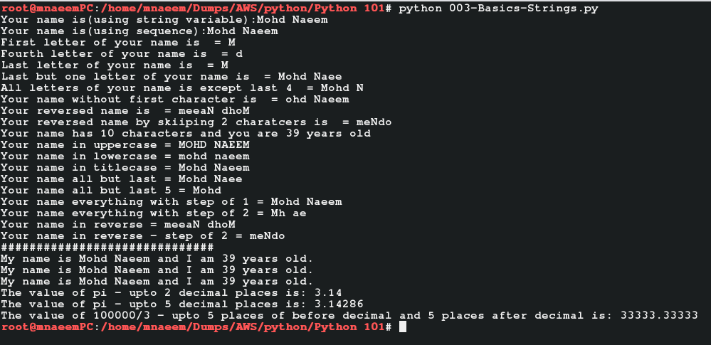

### What is Python and Why:
  * Open source programming language
  * Interpreted at run-time(unlike compiled Java, C#, like PHP, Perl)
  * Object oriented( like Java and C#)
  * Precise and interactive( very short and precise commands, thus easy to learn)
  * Yet it is one of the most powerful languages in Big Data ( roughly 55-60% Big data scripts and programs are written in Python followed by Java and others
  * It is portable (can be run on lot of hardware and software platforms)
  * Supports a very broad standard library, modules
  * Dynamic data types, garbage collection, interfaces to all major databases
  * Comes in 2 major versions – Python 2.x (e.g. Python 2.7) and Python 3 – till date most of the Python programs are written in Python 2.x so it is better to learn Python 2.7 first.)
  * One more big thing about Python 2.x is that it can import the features of Python 3 by using ( **from __future__ import <import_module>** syntax, e.g **from __future__ import division** imports division from Python 3. 
    * In Python 2.x if you divide 3/2 you will get answer as 1 as Python 2 performs basic division. 
    * In Python 3, it performs true division , if you divide 3/2 you get 1.5).
    
### Python Setup:
  * Since supported by multiple hardware and software platforms, it can be installed in multiples ways
  * Lets focus Installation on Linux - 
    * Method one – Install Python on Linux and use Python Shell(command line)
      * Install Python – 
        * Check if a previous version of Python is installed 
        ```
        yum -y install python3 #installs default/latest python3
        yum -y upgrade python3.5 #upgrades to default/latest python3
        
        python -V  # checks for default/latest python version 
        python3 -V # checks for default/latest python 3 version
        
        ```
        * Please see screen shot below
        
        
      * Setup an alias for Python3(open ~/.bashrc and update with line below) – 
        ```
        ls /usr/bin/python* # first check what versions of Python are installed
        
        nano ~/.bashrc #opens the bash script file in nano editor, now update the file with below line
        
        alias python=python3.x # make sure 3.x is the highest 3.x version you got from ls /usr/bin/python* command
        
        source ~/.bashrc #ensure the basj script is reloaded and the changes are affected without loging out
        
        python -V  # now checks for default/latest python 3 version 
        
        ```
      * Please see screen shot below
        
        
      * Create a python script file – 
        ```
        echo "print('HelloWorld')" > 001-HelloWorld.py
        ```
      * Execute the python script – 
        ```
        python 01-HelloWorld.py
        ```
      * Check Python version– 
        ```
        python --version
        python -V
        ```  
      * Please see screen shot below
        
        
      * Execute some basic Python commands– 
        ```
        print "Hello from Python"
        print 3/2
        print 3.0/2 
        ```  
    * Method two – Install Jupyter Notebooks – on your local system
      * Install Anaconda(Anaconda installs Python, Jupyter notebooka and required dependencies as a package) from [https://www.anaconda.com/download/](https://www.anaconda.com/download/)
      * It has links for Windows, Linux or Mac installations for Python 2.7 as well as 3.6
      * Lets install Python 3.6 using Windows Installer from [https://repo.anaconda.com/archive/Anaconda3-2018.12-Windows-x86_64.exe](https://repo.anaconda.com/archive/Anaconda3-2018.12-Windows-x86_64.exe). Download and install Anaconda.
      * Anaconda is installed now, verify it by opening Anaconda Navigator, from your Windows Start menu.
      * Click open the “Jupyter notebook“. It will open in the browser locally.
      * In the command box, type the python commands and execute
      
### Python - Numbers and Strings:
  * Python supports dynamic datatypes i.e. the type of a variable is decided by the values it holds.
  * If we assign a variable a="Naeem", then a is a string, if a = "9" then its a number and if a=3.0 then its a float.
  * Login to your Host machine(in my case a CentOS 7 machine)
  * Make a directory "mypython" and go to the directory and type and enter "python" to open python prompt– 
    ```
    mkdir 'Python 01' 
    cd 'Python 01'
    ```
  * Create a file - 002-Basics-Numbers.py - save and execute to check and verify the below basic number operations:
    * Python assigned variables dynamically. i.e. a=9 is integer whereas a=9.0 is float
    ```
    nano 002-Basics-Numbers.py # create the file
    
    # copy the content below and paste into the nano editor and save
    a=5 # assign variable a
    b=2 # assign variable b

    c=a+b #addition
    print ('a=5, b=2, c=a+b #addition = ' + str(c))

    c=a-b #subtraction
    print ('a=5, b=2, c=a-b #subtraction = ' + str(c))

    c=a*b #multiplication
    print ('a=5, b=2, c=a*b #multiplication = ' + str(c))

    c=a/b #division
    print ('a=5, b=2, c=a/b #division = ' + str(c))

    c=a**2 #exponentiation/powerof/cube etc
    print ('a=5, c=a**2 #exponentiation/powerof/square/cube etc = ' + str(c))

    c=a**3 #exponentiation/powerof/square etc
    print ('a=5, c=a**3 #exponentiation/powerof/square etc = ' + str(c))

    c=a**(1.0/2) #square root
    print ('a=5, c=a**(1.0/2) #square root = ' + str(c))

    c=a**(1.0/3) #cube root
    print ('a=5, c=a**(1.0/3) #cube root = ' + str(c))

    c= 2 + 5 * 5 - 3 # order of operation i.e 2 + 25 -3 = 27 -3 = 24

    print ('c= 2 + 5 * 5 - 3 # order of operation i.e 2 + 25 -3 = 27 -3 = 24 = ' + str(c))

    c= (2 + 5) * (5 - 3) # order of operation i.e 7 * 2 = 14
    print ('c= (2 + 5) * (5 - 3) # order of operation i.e 7 * 2 = 14 = ' + str(c))

    c= 2 + 5 * 5 - 3 # order of operation i.e 2 + 25 -3 = 27 -3 = 24
    print ('c= 2 + 5 * 5 - 3 # order of operation i.e 2 + 25 -3 = 27 -3 = 24 = ' + str(c))

    c= (2 + 5) * (5 - 3) # order of operation i.e 7 * 2 = 14
    print ('c= (2 + 5) * (5 - 3) # order of operation i.e 7 * 2 = 14 = ' + str(c))
    
    # now execute the file using python 002-Basics.py
    python 002-Basics-Numbers.py
    
    ```
  * Please see screen shot below
        
        
  * True Division(Python 3.x) vs Basic Division(Python 2.x):
    ```
    print 3/2     # 1
    print 3.0/2   # 1.5
    
    from __future__ import division
    print 3/2     # 1.5
    ```
 * Create a file - 003-Basics-Strings.py - save and execute to check and verify the below basic string operations:
    * Python treats a string as a sequence. i.e. name = "Mohd Naeem". So you can access name[0] with value 'M' as "Mohd Naeem" is a sequence but strings are immutable(cant be changes by index) i.e print name[0] will return 'M' but name[0]='N' will return error
    ```
    nano 003-Basics-Strings.py # create the file
    
    name="Mohd Naeem" # assign variable name with value 'Naeem'

    # using string variable
    print ('Your name is(using string variable):' +  name)
    print ('Your name is(using sequence):' +  name[:])

    # string variable is a sequence of characters
    print ('First letter of your name is  = ' + name[0])
    print ('Fourth letter of your name is  = ' + name[3])
    print ('Last letter of your name is  = ' + name[:1])
    print ('Last but one letter of your name is  = ' + name[:-1])
    print ('All letters of your name is except last 4  = ' + name[:-4])

    print ('Your name without first character is  = ' + name[1:])
    print ('Your reversed name is  = ' + name[::-1])
    print ('Your reversed name by skiiping 2 charatcers is  = ' + name[::-2])

    # **** IMp point - though string are sequences but they are immutable(cant be changes by index)
    # print name[0] will return 'M' but name[0]='N' will return error

    # using len method and also string formatting
    age="39"
    print ('Your name has %d characters and you are %d years old' %(len(name), int(age)))

    print('Your name in uppercase = ' + name.upper()) # to uppercase
    print('Your name in lowercase = ' + name.lower()) # to lowercase
    print('Your name in titlecase = ' + name.title()) # to titlecase

    print('Your name all but last = ' + name[:-1]) #get all but last — Mohd Naee
    print('Your name all but last 5 = ' + name[:-5]) #get all but last 5 — Mohd

    print('Your name everything with step of 1 = ' + name[::1]) #get everything with step of 1 — Mohd Naeem
    print('Your name everything with step of 2 = ' + name[::2]) #get everything with step of 2 — Mh ae

    print('Your name in reverse = ' + name[::-1]) #reverse a string — meeaN dhoM
    print('Your name in reverse - step of 2 = ' + name[::-2]) #reverse a string with step of 2 — meeaN dhoM

    print("#"*30) # repeat a charcter here repeating ‘#’ 30 times

    #print formatting – using {} placeholders – order of variable substituion is not needed
    strData = 'My name is {} and I am {} years old.'.format(name,age)
    print(strData)
    strData = 'My name is {thename} and I am {theage} years old.'.format(thename=name,theage=age)
    print(strData)
    strData = 'My name is %s and I am %d years old.' %(name,int(age))
    print(strData)

    mypi = 22.0/7
    strData = 'The value of pi - upto 2 decimal places is: %1.2f' %(mypi)
    print(strData)
    strData = 'The value of pi - upto 5 decimal places is: %1.5f' %(mypi)
    print(strData)
    strData = 'The value of 100000/3 - upto 5 places of before decimal and 5 places after decimal is: %5.5f' %(100000.0/3)
    print(strData)

    # now execute the file using python 003-Basics-Strings.py
    python 003-Basics-Strings.py
    
    ```
  * Please see screen shot below
        