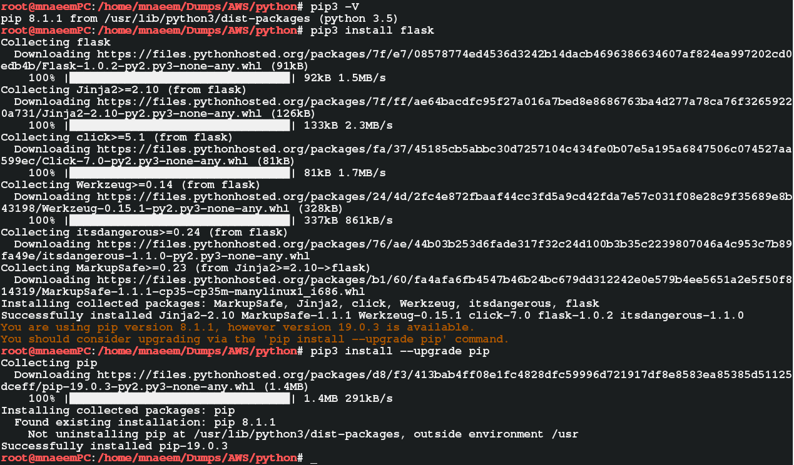
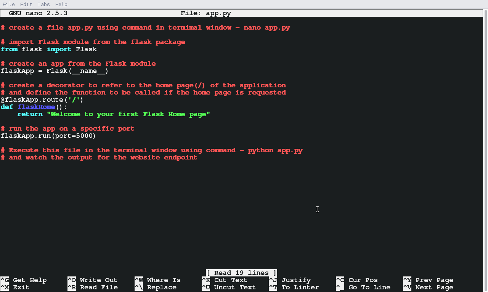
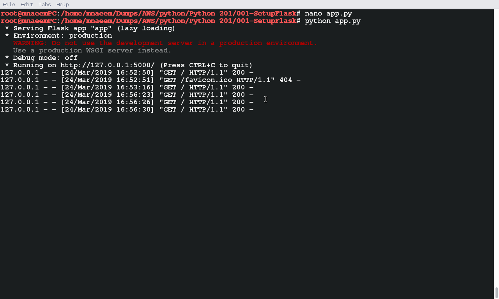
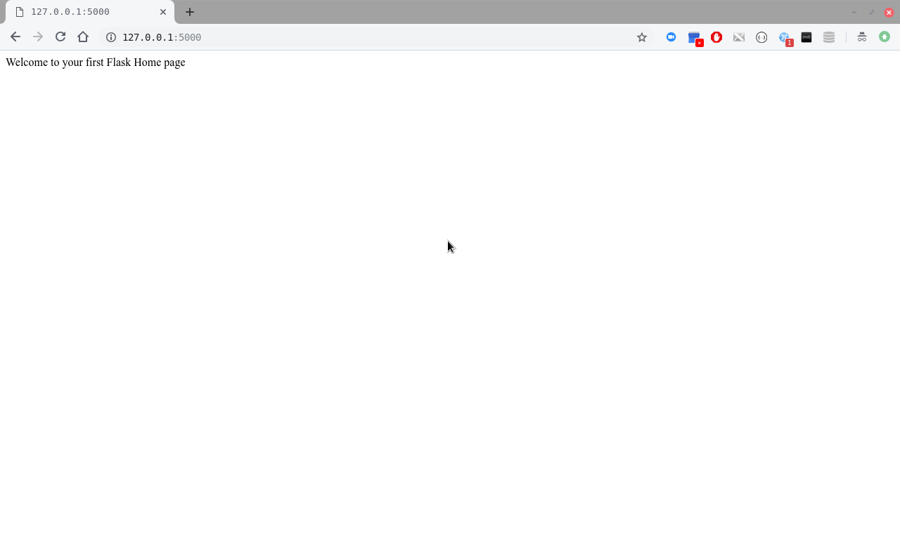

### What is Python Flask:
  * is a python module which helps in creating web application  
  * it is web application framework written in Python
  * it consists of modules like Werkzeug(a toolkit), Jinja2(a templating engine), MarkupSafe, click, itsdangerous etc
  
### Python Flask Setup:
  * Flask is installed using ***pip*** installer
  * First check if pip is installed or not by executing - ***pip --version***
  * If pip is not installed, install pip first using admin mode in a linux terminal
    ```
    # checking Python version 
    python -V
    # checking if pip installed or not 
    pip3 -V
    
    # install pip first in case it is not install
    sudo apt-get -y install python-pip
    
    # now install flask
    pip3 install flask
    
    # if needed upgrade pip
    pip3 install --upgrade pip
    ```
  * Please see screen shot below
    
    
### Your first Flask Application:
  * First import Flask module from the flask package
  * Then reate an app from the Flask module
  * Then reate a decorator to refer to the home page(/) of the application
  * Then define the function to be called if the home page is requested
  * Finally run the app and watch for the server end point generated
  * Copy the end point and run it in an app browser(Chrome/FF/IE etc) to see the output.
  * In my cause the URL is : ***http://127.0.0.1:5000***
  
    ```
    # create a file app.py using command in termimal window - nano app.py

    # import Flask module from the flask package
    from flask import Flask

    # create an app from the Flask module
    flaskApp = Flask(__name__)

    # create a decorator to refer to the home page(/) of the application
    # and define the function to be called if the home page is requested
    @flaskApp.route('/')
    def flaskHome():
        return "Welcome to your first Flask Home page"

    # run the app on a specific port
    flaskApp.run(port=5000)

    # Execute this file in the terminal window using command - ***python app.py*** 
    # and watch the output for the website endpoint
    ```
  * Please see screen shot below
    * The app.py server application:
      
    * The app.py server application executed:
      
    * The browser output when application home page is requested
      
    
      
    

