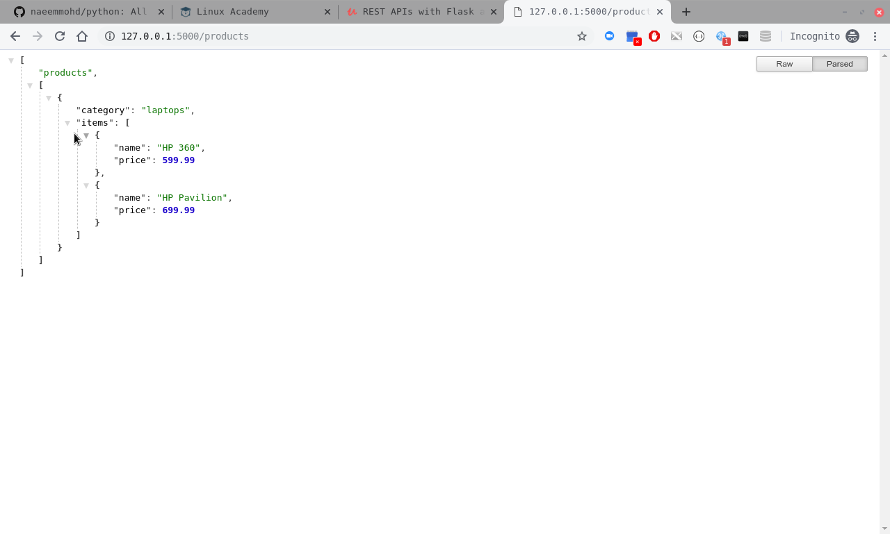

### How do servers work:
  * Servers - are applications which return information when request by a HTTP client application.
  * Browsers - Browsers are HTTP client applications which send request to servers to retrieve information
  * Request - a browser sends a Request with requested information to server
  * Response - a server responds to a request via a response
  * Types of response - HTML, JSON, Text, Error, Nothing

### HTTP verbs:
  * are commands through which a request is sent to server and response is retrieved
  * HTTP verb | Action | Example 
    ------------ | ------------- | -------------
    GET | Read | E.g. http://127.0.0.1:5000/products - retieves list of products
    PUT | Update/Replace | E.g. http://127.0.0.1:5000/product/1 - updates/replaces product 1
    POST | Create | E.g. http://127.0.0.1:5000/product/1 - creates product 1
    DELETE | Delete | E.g. http://127.0.0.1:5000/product/1 - deletes product 1, 
    PATCH | Update/Modify | E.g. http://127.0.0.1:5000/products - updates/modifies product 1, 

### JSON:
  * it is a kind of dictionary(key-pair values) but it is a string
  * open-standard for communication between clients and servers
  * E.g of a products JSON string - 
    [
      {
        "category" : "laptops",
        "items" : [
          {
            "name" : "HP 360",
            "price" : 599.99
          },
          {
            "name" : "HP Pavilion",
            "price" : 699.99
          }
        ]
      }
    ]

### REST API:
  * an architecture/mechanism of defining and API exploting the power of HTTP verbs using HTTP protocol
  * Stateless - 
    * Each request/response (E.g GET, PUT etc)  is completely unaware of state of the other 
    * GET is not aware what PUT is doing 
  * Resource - and API is made up of resources and methods
    * E.g. In http://127.0.0.1:5000/product/1, http://127.0.0.1:5000/products
    * Product and Products are two resources 
    * When a clinet/brower requests a resource, the server response by executing a method(E.g GET, PUT)
  * Method - are the HTTP verbs which are executed to return the response to the client
    * E.g In http://127.0.0.1:5000/product/1 - GET will return product 1
    * E.g In http://127.0.0.1:5000/products - GET will return all products

### First REST API Version 1:
  * We will extend our previous app.py server application to add routes for the above verbs.
  * First of all we import class/module Flask and then jsonify method -  from flask import Flask, jsonify
  * Then we create a flask application with __name__ to give a dynamic name to the application - flaskApp = Flask(__name__)
  * Then we start writing decorators and their methods for '/'(home/root) GET request and '/products' GET request
  * For the root resource here are the details - Resource: / Method : GET - e.g http://127.0.0.1:5000/
  * For the products resource here are the details - Resource: /products Method : GET - e.g http://127.0.0.1:5000/products
  * Finally we run the server application on a specific port. The server is ready and listening for any requests
  
    ```
    # create a file app_v1.py using command in termimal window - nano app_v1.py
    # from package flask, import class/module Flask and jsonify
    from flask import Flask, jsonify
    flaskApp = Flask(__name__)

    # currently storing products in this dictionary(in actual scenario, you may save it to database)
    products = [
          {
            "category" : "laptops",
            "items" : [
              {
                "name" : "HP 360",
                "price" : 599.99
              },
              {
                "name" : "HP Pavilion",
                "price" : 699.99
              }
            ]
          }
        ]
    # the root resource - Resource: / Method : GET - e.g http://127.0.0.1:5000/
    @flaskApp.route('/')
    def GetHome():
        return "Welcome to Products REST API Flask Home page"

    # the products resource - Resource: /products Method : GET - e.g http://127.0.0.1:5000/products
    @flaskApp.route('/products')
    def GetAllProducts():
        return jsonify({"products", products})

    # run the app on a specific port
    flaskApp.run(port=5000)

    # Execute this file in the terminal window using command - python app_v1.py
    # and watch the output for the website endpoint

    
    ```
  * Please see screen shot below
    * The app_v1.py code:
    
    ---------------------------------------------------------------------------------
    * The browser output:
    
    ---------------------------------------------------------------------------------

### First REST API Version 2:
  * We will extend our previous app.py server application to add routes for adding categories and products.
  * First of all we import class/module Flask and then jsonify method -  from flask import Flask, jsonify
  * Then we create a flask application with __name__ to give a dynamic name to the application - flaskApp = Flask(__name__)
  * Then we start writing decorators and their methods for '/'(home/root) GET request and '/products' GET request
  * For the root resource here are the details - Resource: / Method : GET - e.g http://127.0.0.1:5000/
  * For the products resource here are the details - Resource: /products Method : GET - e.g http://127.0.0.1:5000/products
  * For the category resource here are the details for GET - Resource: /category/<string:category> Method : GET - e.g http://127.0.0.1:5000/category/desktops
  * For the category resource here are the details for POST - Resource: /category Method : POST - e.g http://127.0.0.1:5000/category
  * For the product resource are the details for GET - Resource: /category/<string:category>/product Method : GET - e.g http://127.0.0.1:5000/category/desktops/product
  * For the product resource are the details for POST - Resource: /category/product Method : POST - e.g http://127.0.0.1:5000/category/desktops
  * Finally we run the server application on a specific port. The server is ready and listening for any requests
    ```
    # create a file app_v2.py using command in termimal window - nano app_v2.py
    # from package flask, import class/module Flask, jsonify method and request method
    from flask import Flask, jsonify, request
    flaskApp = Flask(__name__)

    # currently storing products in this dictionary(in actual scenario, you may save it to database)
    products = [
          {
            "category" : "laptops",
            "items" : [
              {
                "name" : "HP 360",
                "price" : 599.99
              },
              {
                "name" : "HP Pavilion",
                "price" : 699.99
              }
            ]
          }
        ]

    # the root resource - Resource: / Method : GET - e.g http://127.0.0.1:5000/
    @flaskApp.route('/')
    def GetHome():
      return "Welcome to Products REST API Flask Home page"

    # the products resource - Resource: /products Method : GET - e.g http://127.0.0.1:5000/products
    @flaskApp.route('/products')
    def GetProducts():
      return jsonify("products", products)

    # the category resource - Resource: /category Method : GET - e.g http://127.0.0.1:5000/category/desktops
    @flaskApp.route('/category/<string:category>')
    def GetCategory(category):
      for categ in products:
        if categ['category'] == category:
          return jsonify(categ)
      return jsonify({"message" : "category does not exist"})

    # the category resource - Resource: /category Method : POST - e.g http://127.0.0.1:5000/category
    @flaskApp.route('/category', methods=['POST'])
    def CreateCategory():
        data = request.get_json()
        new_category = {
          "category" : data["category"],
          "items" : []
        }
        products.append(new_category)
        return jsonify(new_category)

    # the product resource - Resource: /category/product Method : GET - e.g http://127.0.0.1:5000/category/desktops/product
    @flaskApp.route('/category/<string:category>/product')
    def GetProductFromCategory(category):
      for categ in products:
        if categ['category'] == category:
            return jsonify( {'items':categ['items'] } )
      return jsonify ({'message':'category/product not found'})
      
    # the product resource - Resource: /category/product Method : POST - e.g http://127.0.0.1:5000/category/desktops
    @flaskApp.route('/category/<string:category>' , methods=['POST'])
    def CreateProductInCategory(category):
      data = request.get_json()
      for categ in products:
        if categ['category'] == category:
          new_item = {
              'name': data['name'],
              'price': data['price']
          }
          categ['items'].append(new_item)
          return jsonify(new_item)
      return jsonify ({'message' :'category/product not found'})

    # run the app on a specific port
    flaskApp.run(port=5000)


    # Execute this file in the terminal window using command - python app_v2.py
    # and watch the output for the website endpoint

    
    ```
  * Please see screen shot below:
    * The app_v2.py code (for adding and getting category):
    
    ---------------------------------------------------------------------------------
    * The browser output:
    
    ---------------------------------------------------------------------------------
    
    ---------------------------------------------------------------------------------
    * The app_v2.py code (for adding and getting products inside a category):
    
    ---------------------------------------------------------------------------------
    * The browser output:
    
    ---------------------------------------------------------------------------------
    
    ---------------------------------------------------------------------------------
    * The browser output(final output):
    
    ---------------------------------------------------------------------------------
    