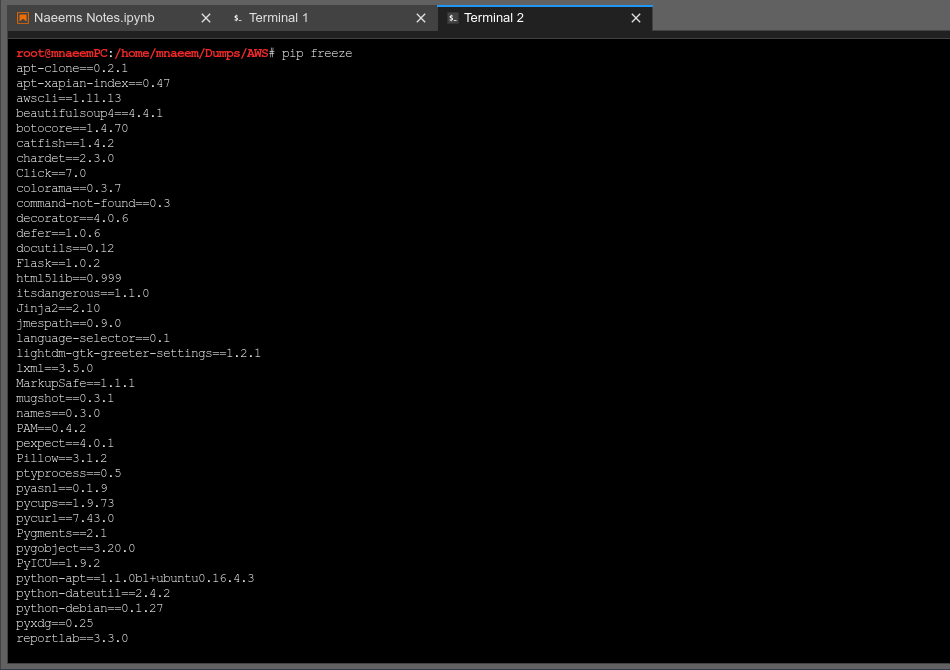
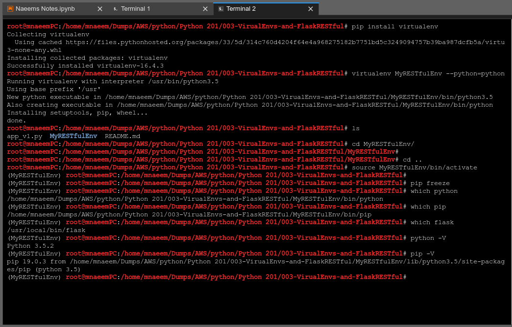
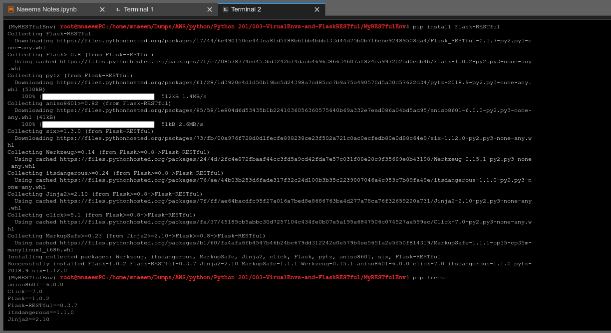
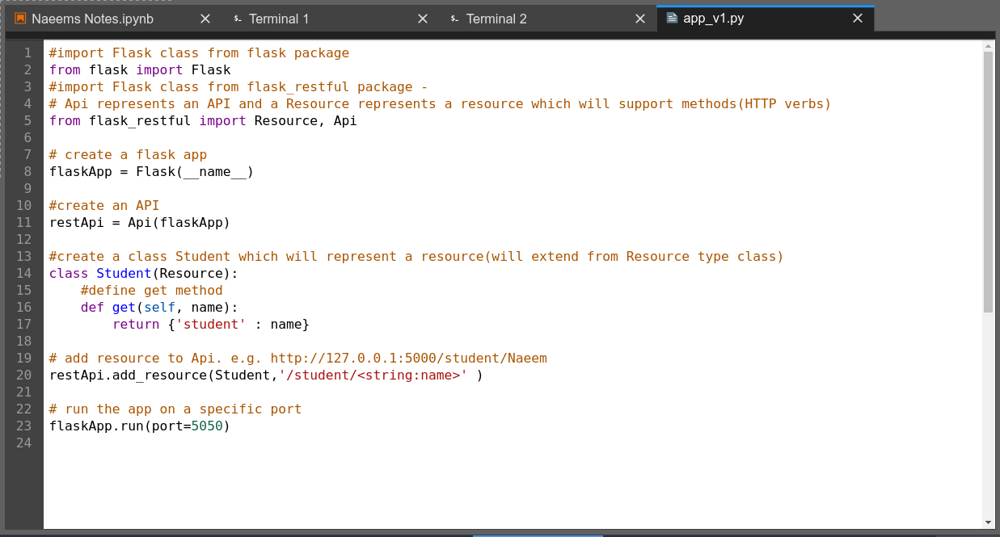
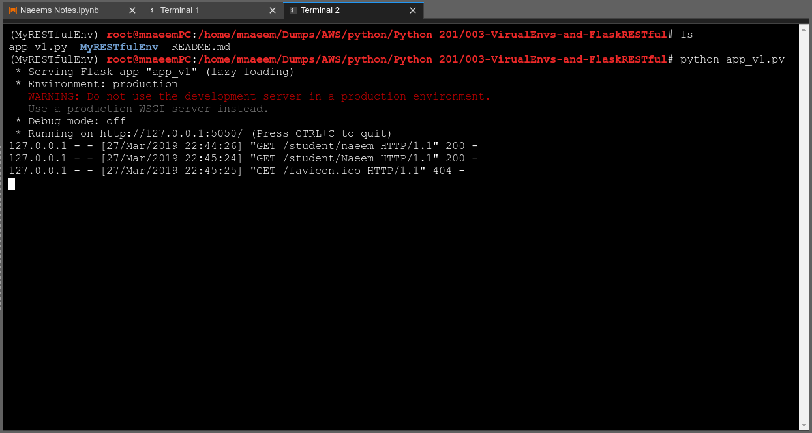
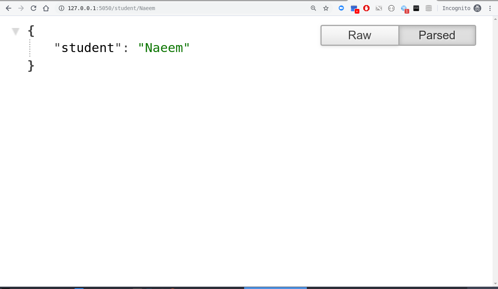
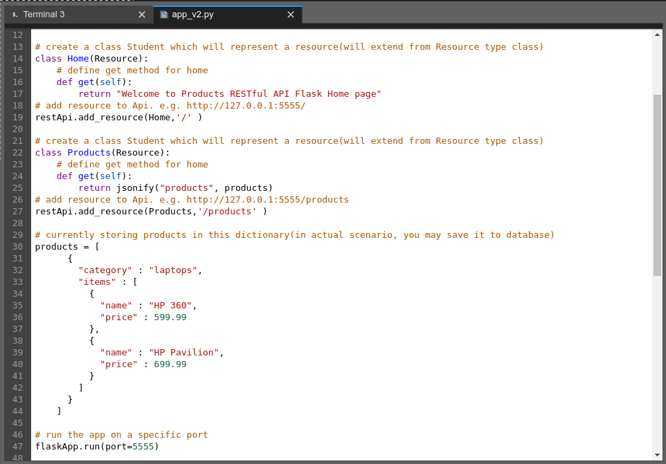
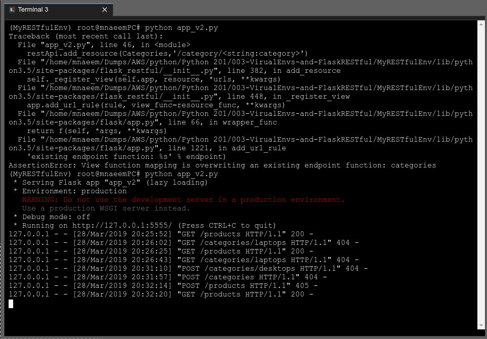
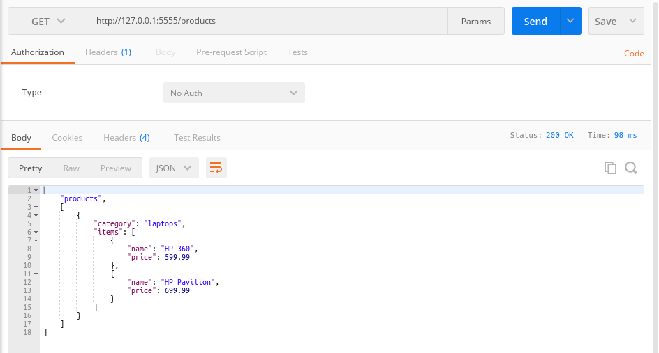

### How to setup Virtual Environments:
  * Virtual environments provise a clean and separate environment for python
  * Very helpful when you have multiple versions and projects to handle 
  * Blindly updating a python and its modules may break an existing  code
  * But by using Virtual environments we can create a clean seperate environment 
  * To check what modules installed in python environment - ***pip freeze***
    
  * To create a new environment - 
    * To ***install*** Virtual Environment - ***pip install virtualenv***
     * If you are installing on windows then use this command if you get SSL error - ***pip install --trusted-host pypi.org --trusted-host files.pythonhosted.org virtualenv***
    * To ***create*** the new environment - ***virtualenv MyRESTfulEnv --python=python3.5***
     * If  you are installing on windows then use this command - ***virtualenv MyRESTfulEnv***
    * To ***activate*** an environment - ***source MyRESTfulEnv/bin/activate***
     * If ypou are using windows then use this command - ***MyRESTfulEnv/Scripts/activate.ps1 (in PowerShell) or MyRESTfulEnv/Scripts/activate.bat (in Command Prompt) ***
    * Now move to the new folder MyRESTfulEnv and check version of python - ***cd MyRESTfulEnv && python -V***
  * To ***deactivate*** an environment(from the environment) - ***deactivate***
    

### How to setup Flask RESTful:
  * Flask-RESTful is extended and restricted version of Flask 
  * It helps creating RESTful API following the RESTful standards
  * To install Flask RESTful(from the new virtual environment) - pip install pip install Flask-RESTful Flask-JWT Flask-SQLAlchemy
   * If you are installing on windows then use this command if you get SSL error - pip install pip install --trusted-host pypi.org --trusted-host files.pythonhosted.org Flask-RESTful  Flask-JWT Flask-SQLAlchemy
  * To check if Flask RESTful and related module been installed  - pip freeze
    

### First RESTful API Version 1:
  * We will do the following here in our first RESTfil Api
    * Import Flask class from flask package - from flask import Flask
    * Import Resource, Api from flask_restful package - from flask_restful import Resource, Api
    * Api represents an API 
    * and a Resource represents a resource which will support methods(HTTP verbs)
    * create a Flask App - flaskApp = Flask(__name__)
    * create an API - restApi = Api(flaskApp)
    ^ Create a resource extending from Resource type and defined the get method - class Student
    * Add a resource to the Api - restApi.add_resource(Student,'/student/<string:name>' )
    * Finally run the app 
    ```
    #import Flask class from flask package
    from flask import Flask
    #import Flask class from flask_restful package - 
    # Api represents an API and a Resource represents a resource which will support methods(HTTP verbs)
    from flask_restful import Resource, Api

    # create a flask app
    flaskApp = Flask(__name__)

    #create an API 
    restApi = Api(flaskApp)

    #create a class Student which will represent a resource(will extend from Resource type class)
    class Student(Resource):
        #define get method
        def get(self, name):
            return {'student' : name}

    # add resource to Api. e.g. http://127.0.0.1:5050/student/Naeem 
    restApi.add_resource(Student,'/student/<string:name>' )

    # run the app on a specific port
    flaskApp.run(port=5050)

    ```
  * Please see screen shot below
    * The app_v1.py code for first RESTful Api:
    
    ---------------------------------------------------------------------------------
    * The first RESTful Server API running:
    
    ---------------------------------------------------------------------------------
    * The browser output for first RESTful Api:
    
    ---------------------------------------------------------------------------------


### First RESTful API Version 2:
  * We will extended the above API to add one more resource Products

    ```
    # import Flask class from flask package
    from flask import Flask, request, jsonify
    # import Flask class from flask_restful package - 
    # Api represents an API and a Resource represents a resource which will support methods(HTTP verbs)
    from flask_restful import Resource, Api

    # create a flask app
    flaskApp = Flask(__name__)

    #create an API 
    restApi = Api(flaskApp)

    # create a class Student which will represent a resource(will extend from Resource type class)
    class Home(Resource):
        # define get method for home
        def get(self):
            return "Welcome to Products RESTful API Flask Home page"
    # add resource to Api. e.g. http://127.0.0.1:5555/ 
    restApi.add_resource(Home,'/' )

    # create a class Student which will represent a resource(will extend from Resource type class)
    class Products(Resource):
        # define get method for home
        def get(self):
            return jsonify("products", products)
    # add resource to Api. e.g. http://127.0.0.1:5555/products
    restApi.add_resource(Products,'/products' )

    # currently storing products in this dictionary(in actual scenario, you may save it to database)
    products = [
          {
            "category" : "laptops",
            "items" : [
              {
                "name" : "HP 360",
                "price" : 599.99
              },
              {
                "name" : "HP Pavilion",
                "price" : 699.99
              }
            ]
          }
        ]

    # run the app on a specific port
    flaskApp.run(port=5555)

    ```
  * Please see screen shot below
    * The app_v1.py code for first RESTful Api:
    
    ---------------------------------------------------------------------------------
    * The first RESTful Server API running:
    
    ---------------------------------------------------------------------------------
    * The browser output for first RESTful Api:
    
    ---------------------------------------------------------------------------------


