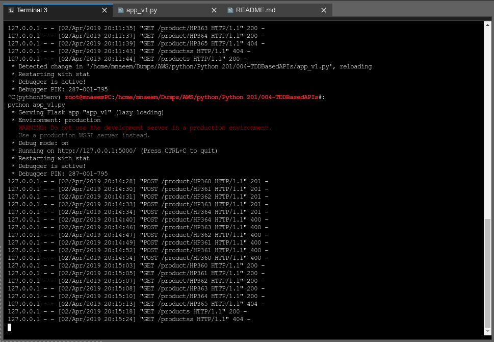

### Test Driven Development of RESTfulAPIs:
  * Test Driven Development sia development depending on test cases
  * You develop code based on satisying a test case
  * A proper test case should handle good, bad and ugly data
  * Lets re-visit Products API- it should have following features:
  * Feature | HTTP Verb | Resource | Test Example 
    ------------ | ------------- | ------------- | -------------
    * add new products | POST | /product/<productname>  | http://127.0.0.1:5000/product/HP360
    * get a list of products | GET | /products | http://127.0.0.1:5000/products
    * get a specific product by name | GET | /product/<productname> | http://127.0.0.1:5000/product/HP360
    * update a product | PUT | /product/<productname> | http://127.0.0.1:5000/product/HP360
    * delete a product | DELETE | /product/<productname> | http://127.0.0.1:5000/product/HP360
  * Lets create these endpoints in postman so that we can test the APIs as we develop

### First TDD based RESTful API Version 1:
  * Here is the code for the TDD based RESTful API:
  * Please notice a few new things we are doing here
    * See this statement : ***return {'product': None}, 404***
    * We are not only retuning a valid JSON but also a 404 status code when a product is not found
    * Similarly -
    * See this statement : ***return product, 201***  
    * Also
    * See this statement : ***data = request.get_json()***  
    * See how we are using the request object to retrive data from request body
    * We are not only retuning a valid JSON but also a 201 status code when a product is created
    
    ```
    #import Flask class from flask package
    from flask import Flask, request
    #import Flask class from flask_restful package - 
    # Api represents an API and a Resource represents a resource which will support methods(HTTP verbs)
    from flask_restful import Resource, Api

    # create a flask app
    flaskApp = Flask(__name__)

    #create an API 
    restApi = Api(flaskApp)

    # currently using in memory list
    products = []

    #create a class Product which will represent a resource(will extend from Resource type class)
    class Product(Resource):
        #define get method
        def get(self, name):
            for product in products:
                if product['name'] == name:
                    return product
            # See this statement : ***return {'product': None}, 404***
            # We are not only retuning a valid JSON but also a 404 status code when a product is not found
            return {'product': None}, 404
        #define post method
        def post(self, name):
            # See this statement : ***data = request.get_json()***  
            # See how we are using the request object to retrive data from request body
            product = {'name' : name, 'price' : 10.00}
            products.append(product)
            # See this statement : ***return product, 201***  
            # We are not only retuning a valid JSON but also a 201 status code when a product is created
            return product

    # add resource to Api
    restApi.add_resource(Product,'/product/<string:name>' )

    # for getting list of items
    class Products(Resource):
        #define get method
        def get(self):
            return products

    # add resource to Api
    restApi.add_resource(Products,'/products')
    
    # run the app on a specific port
    # See this statement : ***flaskApp.run(port=5000, debug=True***  
    # If something goes wrong, flask will return a nice error message if debug=True
    flaskApp.run(port=5000, debug=True)


    ```
  * Please see screen shot below
    * The app_v1.py code for first TDD based RESTful Api:
    
    ---------------------------------------------------------------------------------
    
    * The server running for first TDD based RESTful Api:
    * Please see different status codes when an API resource is requested
    
    ---------------------------------------------------------------------------------
    
    * The Post(Creating a new product) output for first TDD based RESTful Api:
    
       ---------------------------------------------------------------------------------
    
    * The Get(Get a Single product) output for first TDD based RESTful Api:
    
       ---------------------------------------------------------------------------------
    
    * The Get All(get all  products) output for first TDD based RESTful Api:
    
       ---------------------------------------------------------------------------------
    
    * The Not Found 404 - (if a product is not found) output for first TDD based RESTful Api:
    
       ---------------------------------------------------------------------------------
    
    * The No End Point(if an API endpoint does not exist) output for first TDD based RESTful Api:
    
    ---------------------------------------------------------------------------------
    
    