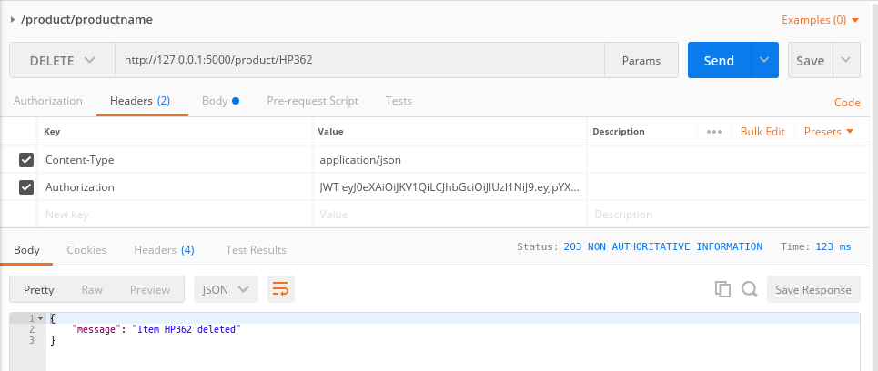

### Security/Authentication and Logging in  RESTful APIs:
  * Security/Authentication is enforce through JWT is flask applications
  * JWT stands for JSON Web Token.
  * Its helps in authenticating the identity of the requesting client 
  * ***@jwt_required()*** decorator is used to enforce a method requiring JWT authentication
  * flask_jwt module/package has class JWT and methods like jwt_required, current_identity to authenticate user
  * ***flaskApp.secret_key = "%!!#@#^*&^%$^#%@" *** is used to add a secret key to a server
  * Clients must pass the secret key in the payload to get authenticated
  * ***jwt = JWT(flaskApp, checkAuthenticity, checkIdentity)*** is used to create a JSON Web Token
  * To install Flask JWT use command - ***pip install Flask-JWT***
  * Creating a JWT creates a ***/auth** endpoint for the user to pass username and password
  * If authenticated , it returns the JSON Web Token
  * Now while calling any of the methods where we have defined a ***@jwt_required*** decorator, we have to pass this token in the Authorization Header.
  
### Security based RESTful API Version 1:
  * Here is the code for the security based RESTful API:
    ```
    # code for app_v1.py
    from flask import Flask, request
    from flask_restful import Resource, Api, reqparse
    from flask_jwt  import JWT, jwt_required, current_identity
    from securityfunctions import checkIdentity, checkAuthenticity

    flaskApp = Flask(__name__)

    # add a secret key 
    flaskApp.config['PROPAGATE_EXCEPTIONS'] = True # to force propagate an exception even if debug is set to false
    flaskApp.secret_key = "%!!#@#^*&^%$^#%@"
    restApi = Api(flaskApp)

    # create a JWT 
    jwt = JWT(flaskApp, checkAuthenticity, checkIdentity)

    products = []

    class Product(Resource):
        # add a parser
        parser = reqparse.RequestParser()
        # add argument to the parser by defining the type, if required and any help messages
        parser.add_argument('price', type=float, required=True, help= "Price can not be blank." )

        @jwt_required() # means JWT is required for this method
        def get(self, name):
            return {'product': next(filter(lambda x: x['name'] == name, products), None)}, 200 if product else 404
        #define post method
        def post(self, name):
            if next(filter(lambda x: x['name'] == name, products), None):
                return {'maessage' : 'Item with {} name already exists.'.format(name)}, 400 # 400 for bad request

            # request.get_json() is replaced by Product.parser.parse_args()
            # data = request.get_json()
            data = Product.parser.parse_args()
            product = {'name' : name, 'price' : data['price']}
            products.append(product)
            return product, 201 

        @jwt_required() 
        def delete(self, name):
            global products
            products = list(filter(lambda x: x['name'] != name, products))
            return {'message': 'Item {} deleted'.format(name)}, 2
        
        @jwt_required() 
        def put(self, name):
            data = Product.parser.parse_args()
            product = next(filter(lambda x: x['name']==name, products), None)
            if product:
                product.update(data)
                return product, 200
            else:
                product = {'name' : name, 'price' : data['price']}
                products.append(product)
                return product, 201 

    # add resource to Api
    restApi.add_resource(Product,'/product/<string:name>')

    # for getting list of products
    class Products(Resource):
        #define get method
        def get(self):
            return products
    # add resource to Api

    restApi.add_resource(Products,'/products')

    flaskApp.run(port=5000, debug=True)

    ```
    * The app_v1.py app code screenshot
    
    

  * Here is the code for the security functions for JWT:
    * The below code imports the User class from usermodel and safe_str_cmp method from werkzeug.security modele/package
    * a couple of users are added in memory rather then saving in a databases( we will do it in an upcoming session)
    * the identity of user is verified using checkIdentity method to return a user id based on the user id from the payload
    * The username and password of the user is validated by method checkAuthenticity
    ```
    # code for securityfunctions.py
    # import custom module to use the User model to create users
    from usermodel import User

    # import safe_str_cmp to safe compare ascii or unicode based strings
    from werkzeug.security import safe_str_cmp

    # create users
    users = [
        User(1,"Naeem", "PassNaeem"),
        User(2, "Test02", "PassTest02"),
        User(3, "Test03", "PassTest03")
    ]

    # a dictionary for user names
    userNames = {user.username : user for user in users}
    # a dictionary for user ids
    userIds = {user.id : user for user in users}

    # check identity based on payload
    def checkIdentity(payload):
        userid= payload['identity']
        return userIds.get(userid, None)

    # check/authenticate user 
    def checkAuthenticity(username, password):
        user = userNames.get(username, None)
        if user and safe_str_cmp(user.password, password):
            return user
    ```
    * The securityfunctions.py app code screenshot
    
  * Here is the code for user Model:
    * The code is simple with a User class defined reperesent a User
    ```
    # code for usermodel.py
    #create a User model class to represent a user and its credentials
    class User(object):
        def __init__(self, _id, username, password):
            self.id= _id
            self.username= username
            self.password= password
    ```
    * The usermodel.py app code screenshot
      
    ---------------------------------------------------------------------------------

  * Please see screen shot below
    * The server running for Security based RESTful Api:
    * Please see different status codes when an API resource is requested
    
    ---------------------------------------------------------------------------------
    
    * Please see ***how to call the auth end point first to get the JWT***
    ![Security based RESTful calling auth endpoint(../images/002-05-SecurityBasedRestfulAPI-callingauthendpoint.png)
    ---------------------------------------------------------------------------------
    
    * The Post(Creating a new product) output for Security based RESTful Api: ( No JWT needed)
    
       ---------------------------------------------------------------------------------
    
    * The Post(Creating a new product but its exists) output for Security based RESTful Api:(No JWT needed)
    
       ---------------------------------------------------------------------------------

    * The Get(Get a Single product) output for Security based RESTful Api:(JWT needed) - if JWT not passed
    
       ---------------------------------------------------------------------------------
    
    * The Get(Get a Single product) output for Security based RESTful Api:(JWT needed) - if JWT gets expired
    
       ---------------------------------------------------------------------------------
    
    * The Get(Get a Single product) output for Security based RESTful Api:(JWT needed)
    
       ---------------------------------------------------------------------------------
    
    * The Get All(get all  products) output for Security based RESTful Api:(No JWT needed)
    
       ---------------------------------------------------------------------------------
    
    * The Not Found 404 - (if a product is not found) output for Security based RESTful Api:(JWT needed)
    
       ---------------------------------------------------------------------------------
    
    * The Delete - output for Security based RESTful Api:(JWT needed)
    
       ---------------------------------------------------------------------------------
    
    * The Put Update - output for Security based RESTful Api:(JWT needed)
    
       ---------------------------------------------------------------------------------

    * The Put Add New - output for Security based RESTful Api:(JWT needed)
    
       ---------------------------------------------------------------------------------
    
    * The No End Point(if an API endpoint does not exist) output for Security based RESTful Api:
    
    ---------------------------------------------------------------------------------
    
    