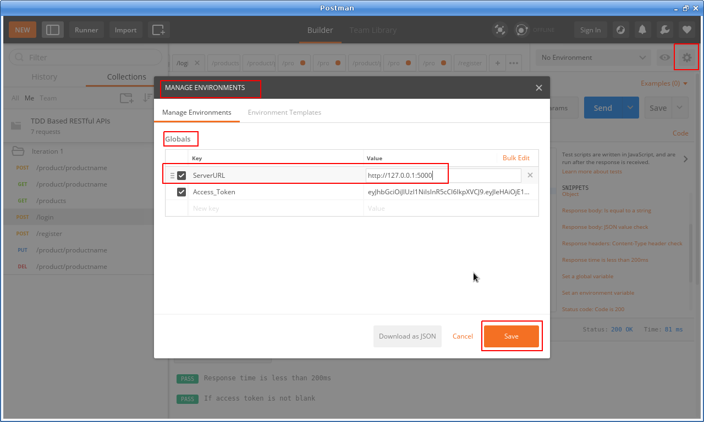
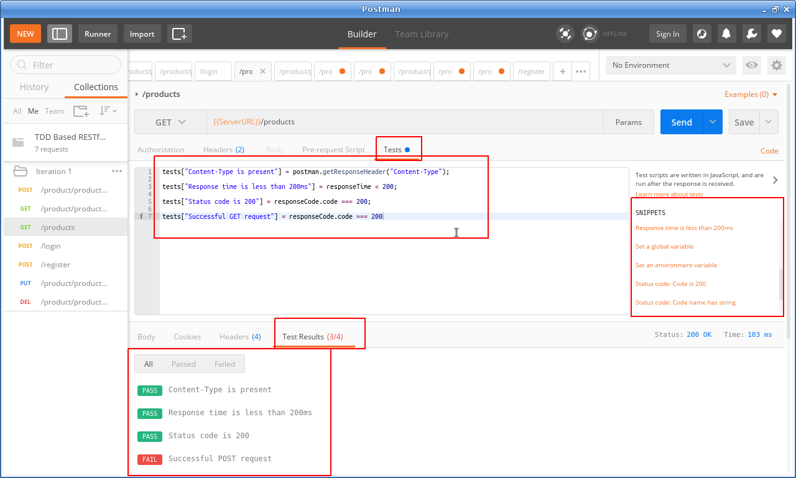

### How to use advanced Postman features for RESTful APIs:
  * We will cover the following advanced Postman features?
    * Adding environmental variables through manage environments
    * Setting up and environment variable by intercepting server response
    * Using Test cases to test the RESTful APIs in Postman
  
### Adding environmental variables through manage environments:
  * Example - replacing - e.g. http://127.0.0.1:5000/login with {{ServerURL}}/login
  * We can add a ebvironment variable by adding a gloval or envrionment based variable by clicking on 'Envrionemt options' button and adding a variable as below:
    
    ---------------------------------------------------------------------------------
  * Once the variable is added , you can use teh variable as {{ServerURL}}/login instead of http://127.0.0.1:5000/login
    
    ---------------------------------------------------------------------------------
### Setting up and environment variable by intercepting server response:
  * In the 'Tests' Tab of the login method, write the below using the templates on the right:
    
    ---------------------------------------------------------------------------------
    ```
    tests["Response time is less than 200ms"] = responseTime < 200;

    // code for setting up a global variable "Access_Token" 
    // we can then use {{Access_Token}} in place of harcoded JWR token
    //first retrieve the JSON parsed response
    var jsonData = JSON.parse(responseBody);
    //test if acess token is not empty
    tests["If access token is not blank"] = jsonData.access_token !== undefined;
    //assign the global variable - Access_Token with the value from response
    postman.setGlobalVariable("Access_Token", jsonData.access_token);
    //See below for test results passed or failed

    ```
    
    ---------------------------------------------------------------------------------

### Using Test cases to test the RESTful APIs in Postman:
  * In the 'Tests' Tab of the 'Get' method, write the below using the templates on the right: 
    ```
    tests["Content-Type is present"] = postman.getResponseHeader("Content-Type");

    tests["Response time is less than 200ms"] = responseTime < 200;

    tests["Status code is 200"] = responseCode.code === 200;

    tests["Successful GET request"] = responseCode.code === 200

    ```
    
    ---------------------------------------------------------------------------------