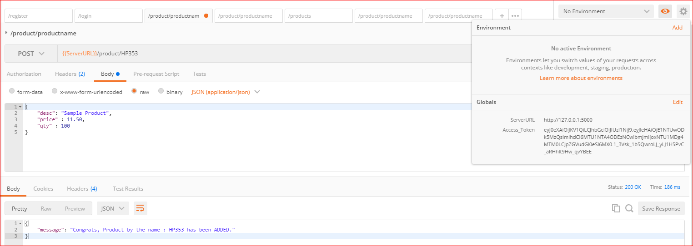

### Using SQLAlchemy in RESTful APIs:
  * Python supports connecting to all renowned databases through ir ORM based library/module called as ***Flask-SQLAlchemy***
  * SQLAlchemy is used a ***Object Relation Mapper(ORM)*** tool which eases the way objects can directly be saved in the database
  * How to install Flask-SQLAlchemy 
    * If you are using a virtual environment, then activate is by using command 
      * <virtualenvnamefolder>/bin/activate (in Linux)
      * <virtualenvnamefolder>/Scripts/activate.ps1 (in Windows PowerShell)
      * <virtualenvnamefolder>/Scripts/activate.bat (in Windows Command Prompt)
    * If you are not using a virtual environment then no need to activate it. YOu can directly execute the below command   
    * Command to install Flask SQLAlchemy in Linux - ***pip install pip install Flask-SQLAlchemy***
      * If you are installing on windows then use this command if you get SSL error - ***pip install pip install --trusted-host pypi.org --trusted-host files.pythonhosted.org Flask-SQLAlchemy***

### How does SQLAlchemy works
  * Step 1 : ***Create a 'SQLAlchemy' object*** - 
    * Please see code below - in file SQLAlchemyDB.py
      ```
      # import SQLAlchemy from flask_sqlalchemy
      from flask_sqlalchemy import SQLAlchemy

      # create a SQLAlchemy object in my case db variable incorporates a SQLAlchemy object
      db = SQLAlchemy()
      ```

  * Step 2 : ***In the main app import the db SQLAlchemy object*** - 
    * and initialize it using init_app(flaskApp) and configure the SQLAlchemy 
    * Please see code below - in file app_v1.py
      ```
      flaskApp.config['SQLALCHEMY_DATABASE_URI'] = 'sqlite:///dbProducts.db' # path of the database - root of project
      flaskApp.config['SQLALCHEMY_TRACK_MODIFICATIONS'] = False # enforce using SQLAlchemy session tracking rather than Flask-SQLAlchemy

      # @flaskApp.before_first_request is used to execute a command before the first request to the app is called(E.g. in our app the login request)
      @flaskApp.before_first_request
      def setupDatabase():
          # it creates the required database form config setting flaskApp.config['SQLALCHEMY_DATABASE_URI'] = 'sqlite:///dbProducts.db'
          # also creates the tables based on the db.Model objects in the app
          db.create_all()

      if __name__ == '__main__':
          # in the main app import the db SQLAlchemy object and initialize it using init_app(flaskApp)
          from SQLAlchemyDB import db
          db.init_app(flaskApp)
          flaskApp.run(port=5000, debug=True)
      ```
      * The full app code for  - app_v1.py
      ```
      from flask import Flask, jsonify
      from flask_restful import Api
      from flask_jwt  import JWT, current_identity
      from datetime import timedelta

      from securityutils import checkIdentity, checkAuthenticity
      from resources.users import UserSignOn
      from resources.products import Product, Products

      flaskApp = Flask(__name__)

      # add a secret key 
      flaskApp.config['PROPAGATE_EXCEPTIONS'] = True # to enforce propagate an exception even if debug is set to false
      flaskApp.config['JWT_AUTH_URL_RULE'] = '/login'  # to enforce /login as the auth page rather then /auth
      flaskApp.config['JWT_EXPIRATION_DELTA'] = timedelta(seconds=1800) # to enforce JSON web token expiration to a custom value in seconds. Defaults to 300 seconds(5 minutes)
      flaskApp.config['JWT_AUTH_USERNAME_KEY'] = 'email' # to enforce AUTH key as email rather than default username

      flaskApp.config['SQLALCHEMY_DATABASE_URI'] = 'sqlite:///dbProducts.db' # path of the databse - root of project
      flaskApp.config['SQLALCHEMY_TRACK_MODIFICATIONS'] = False # enforce using SQLAlchemy session tracking rather than Flask-SQLAlchemy

      flaskApp.secret_key = "%!!#@#^*&^%$^#%@"

      restApi = Api(flaskApp)

      @flaskApp.before_first_request
      def setupDatabase():
          db.create_all()


      # create a JWT 
      jwt = JWT(flaskApp, checkAuthenticity, checkIdentity)

      # to return custom resposne in addition to just the token(here user id also)
      @jwt.auth_response_handler
      def custom_response_handler(access_token, identity):
          return jsonify({
                              'access_token': access_token.decode('utf-8'),
                              'user_id': identity.id
                        })

      # add resource to Api
      restApi.add_resource(Product,'/product/<string:name>')
      restApi.add_resource(Products,'/products')
      restApi.add_resource(UserSignOn,'/register')

      if __name__ == '__main__':
          # in the main app import the db SQLAlchemy object and initialize it using init_app(flaskApp)
          from SQLAlchemyDB import db
          db.init_app(flaskApp)
          flaskApp.run(port=5000, debug=True)

      ```
      * The screenshot of the appcode for main app:
      
    ---------------------------------------------------------------------------------
  * Step 3 : ***Create/Update the Model classes*** - 
    * Please see code below - for UserModel class in file user.py
    * Code line - from SQLAlchemyDB import db - imports the db SQLAlchemy object 
    * Code line - class UserModel(db.Model) - UserModel extends db.Model 
    * Code line - __tablename__= 'tblUsers' - defines the ORM table
    * Code Snippet  - defines the table schema for the OR mapping
      ```
      id = db.Column(db.Integer, primary_key=True)
      email = db.Column(db.String(100))
      username = db.Column(db.String(100))
      password = db.Column(db.String(100))
      ```
    * Code Snippet to return/select data - defines the table schema for the OR mapping
      ```
      # cls.query returns all rows like Select * from tblUsers
      # cls.query.filter_by(id=_id) retuns the filtered rows like Select * from tblUsers where id = _id
      # cls.query.filter_by(id=_id).first() returns the top 1 row like Select * from tblUsers where id = _id LIMIT 1
      return cls.query.filter_by(id=_id).first()
      ```
    * Code to save or delete data to/from database
      ```
      def Save(self):
        db.session.add(self)  # adds the Product Object to DB
        db.session.commit()   # commits change

      def Delete(self):
        db.session.delete(self) # deletes the Product Object from DB
        db.session.commit()     # commits change
      ```
    * Complete code for UserModel class in file user.py
      ```
      # import the db SQLAlchemy object
      from SQLAlchemyDB import db

      # UserModel class will extend/inherit from db.Model class
      class UserModel(db.Model):

          # define the table name for OR mapping
          __tablename__= 'tblUsers'

          # define the table schema for the OR mapping
          id = db.Column(db.Integer, primary_key=True)
          email = db.Column(db.String(100))
          username = db.Column(db.String(100))
          password = db.Column(db.String(100))

          def __init__(self, email, username, password):
              self.email= email
              self.username= username
              self.password= password
              
          @classmethod
          def getUserById(cls, _id):
              # cls.query returns all rows like Select * from tblUsers
              # cls.query.filter_by(id=_id) retuns the filtered rows like Select * from tblUsers where id = _id
              # cls.query.filter_by(id=_id).first() returns the top 1 row like Select * from tblUsers where id = _id LIMIT 1
              return cls.query.filter_by(id=_id).first()

          @classmethod
          def getUserByEmail(cls, email):
              return cls.query.filter_by(email=email).first()

          def Save(self):
              db.session.add(self)
              db.session.commit()
          
          def Delete(self):
              db.session.delete(self)
              db.session.commit()
      ```
      * The screenshot of the appcode below:
      
    ---------------------------------------------------------------------------------
    * Please see code below - for ProductModel class in file product.py
    * Code line - from SQLAlchemyDB import db - imports the db SQLAlchemy object 
    * Code line - class ProductModel(db.Model) - UserModel extends db.Model 
    * Code line - __tablename__= 'tblProducts' - defines the ORM table
    * Code Snippet  - defines the table schema for the OR mapping
      ```
      id = db.Column(db.Integer, primary_key=True)
      name = db.Column(db.String(100))
      desc = db.Column(db.String(100))
      price = db.Column(db.Float(precision=2))
      qty = db.Column(db.Integer)
      ```
    * Code Snippet to return/select data - defines the table schema for the OR mapping
      ```
      # cls.query returns all rows like Select * from tblUsers
      # cls.query.filter_by(id=_id) retuns the filtered rows like Select * from tblUsers where id = _id
      # cls.query.filter_by(id=_id).first() returns the top 1 row like Select * from tblUsers where id = _id LIMIT 1
      @classmethod
      def getProductByName(cls, name):
        return cls.query.filter_by(name=name).first()
      ```
    * Code to save or delete data to/from database
      ```
      def Save(self):
        db.session.add(self)  # adds the User Object to DB
        db.session.commit()   # commits change

      def Delete(self):
        db.session.delete(self) # deletes the User Object from DB
        db.session.commit()     # commits change
      ```
    * Complete code for ProductModel class in file product.py
      ```
      from SQLAlchemyDB import db

      class ProductModel(db.Model):

          __tablename__= 'tblProducts'

          id = db.Column(db.Integer, primary_key=True)
          name = db.Column(db.String(100))
          desc = db.Column(db.String(100))
          price = db.Column(db.Float(precision=2))
          qty = db.Column(db.Integer)

          def __init__(self, name, desc, price, qty):
              self.name= name
              self.desc= desc
              self.price= price
              self.qty= qty
          
          def json(self):
              return {'name' : self.name, 'desc' : self.desc, 'price' : self.price, 'qty' : self.qty}

          @classmethod
          def getProductByName(cls, name):
              return cls.query.filter_by(name=name).first()

          def Save(self):
              db.session.add(self)
              db.session.commit()

          def Delete(self):
              db.session.delete(self)
              db.session.commit()
      ```
      * The screenshot of the appcode below:
      
    ---------------------------------------------------------------------------------
  * Step 4 : ***Create/Update the Resource classes*** - 
    * Please see code below - for UserSignOn class in file users.py
    * Simple code to save User Object to database
      * user = UserModel(emailId, userName, passWord)
      * user.Save()
      ```
      from flask_restful import Resource, reqparse
      from models.user import UserModel

      class UserSignOn(Resource):

          # define parser
          parser = reqparse.RequestParser()
          parser.add_argument("email", type=str, required=True, help="Email can not be blank.")
          parser.add_argument("username", type=str, required=True, help="UserName can not be blank.")
          parser.add_argument("password", type=str, required=True, help="Password can not be blank.")

          def post(self):
              data = UserSignOn.parser.parse_args()
              emailId = data['email']
              userName = data['username']
              passWord = data['password']
              
              # check if the user already exists
              if UserModel.getUserByEmail(emailId):
                  returnMessage = "User with email: {email} already exists, please select a new email.".format(email=emailId)
                  return {"message" : returnMessage }, 400
              
              # otherwise sign on the new user
              user = UserModel(emailId, userName, passWord) # creates a new User Object and saves to database
              user.Save()

              returnMessage = "Congrats {usernm} !!!, Your have been successful registerted with email: {email}.".format(usernm=userName, email=emailId)
              return {"message" : returnMessage }, 201
      ```
      * The screenshot of the appcode below:
      
    ---------------------------------------------------------------------------------

    * Please see code below - for Product, Products class in file products.py
    * To save new object to the database
      ```
      data = Product.parser.parse_args()
      new_product = ProductModel(name, **data)
      new_product.Save()
      ```
    * To update existing object to the database
      ```
      product.desc= data['desc']
      product.price= data['price']
      product.qty= data['qty']
      product.Save()
      ```
    * To delete data from database
      ```
      tobedeleted_product = ProductModel.getProductByName(name) # find the object to be deleted
      if tobedeleted_product:
          tobedeleted_product.Delete()  # excute the delete method of the object if it exists
      ```
    * Please see complete code below 
      ```
      from flask_restful import Resource, reqparse
      from flask_jwt import jwt_required
      from models.product import ProductModel

      #create a Product model class to represent a Product and its operations
      class Product(Resource):

          # define parser
          parser = reqparse.RequestParser()
          parser.add_argument("desc", type=str, required=True, help="Product Description can not be blank.")
          parser.add_argument("price", type=float, required=True, help="Product Price can not be blank.")
          parser.add_argument("qty", type=float, required=True, help="Product Quantity can not be blank.")

          @jwt_required()
          def get(self, name):
              product = ProductModel.getProductByName(name)
              if product:
                  return product.json()
              else:
                  return {"message" : "Product by the name {pname} not found!!!".format(pname=name)}, 404

          @jwt_required()
          def post(self, name):
              # check if the product exists
              if ProductModel.getProductByName(name):
                  return {"message" : "Product by the name {pname} already exists, select a new name!!!".format(pname=name)}, 400

              # otherwise insert the new product
              data = Product.parser.parse_args()
              
              new_product = ProductModel(name, **data)
              try:
                  new_product.Save()
                  returnMessage = "Congrats, Product by the name : {pname} has been ADDED.".format(pname=name)
                  return {"message" : returnMessage }
              except:
                  return {"message" : "Sorry!!!, The product by the name {pname} could not be sucessfully ADDED!!!".format(pname=name)}, 500 
              # return new_product.json(), 201

          @jwt_required()
          def put(self, name):
              product = ProductModel.getProductByName(name)

              data = Product.parser.parse_args()
            
              if product:
                  try:
                      product.desc= data['desc']
                      product.price= data['price']
                      product.qty= data['qty']
                      product.Save()
                      returnMessage = "Congrats, Product by the name : {pname} has been UPDATED.".format(pname=name)
                      return {"message" : returnMessage }
                  except:
                      return {"message" : "Sorry!!!, The product by the name {pname} could not be sucessfully UPDATED!!!".format(pname=name)}, 500 
              else:
                  try:
                      product = ProductModel(name, **data)
                      product.Save()
                      returnMessage = "Congrats, Product by the name : {pname} has been ADDED.".format(pname=name)
                      return {"message" : returnMessage }
                  except:
                      return {"message" : "Sorry!!!, The product by the name {pname} could not be sucessfully ADDED!!!".format(pname=name)}, 500 
              
              # return product.json()
              
          @jwt_required()
          def delete(self, name):
              tobedeleted_product = ProductModel.getProductByName(name)
              if tobedeleted_product:
                  tobedeleted_product.Delete()
                  return {"message" : "Product by the name {pname} DELETED!!!".format(pname=name)}
              else:
                  return {"message" : "Product by the name {pname} can not be found!!!".format(pname=name)}, 404


      #create a Products model class to represent list of Products and its operations
      class Products(Resource):
          @jwt_required()
          def get(self):
              # using a map function with lambda
              products = list(map(lambda product: product.json(), ProductModel.query.all()))
              # OR using a list comprehensions 
              # products = [product.json() for product in ProductModel.query.all()]
              return {"products" : products}, 200

      ```
      * The screenshot of the appcode below:
      
      
    ---------------------------------------------------------------------------------

### Testing the project:
  * Now the project is ready for testing, you can repeat all the operations you tested in previous exercise like register, login, add a product, update a product, delete a product, get one product, get all products. 
  * Since we did not change the existing functionality and just injected the ORM functionality to the app, it should work.
  * The screenshot for register user below:
  
  ---------------------------------------------------------------------------------
  * The screenshot for login user below:
  
  ---------------------------------------------------------------------------------
  * The screenshot for POST product below:
  
  ---------------------------------------------------------------------------------
  * The screenshot for PUT Product below:
  
  ---------------------------------------------------------------------------------
  * The screenshot for DELETE Product below:
  
  ---------------------------------------------------------------------------------
  * The screenshot for GETProduct below:
  
  ---------------------------------------------------------------------------------
  * The screenshot for GET All Products below:
  
  ---------------------------------------------------------------------------------