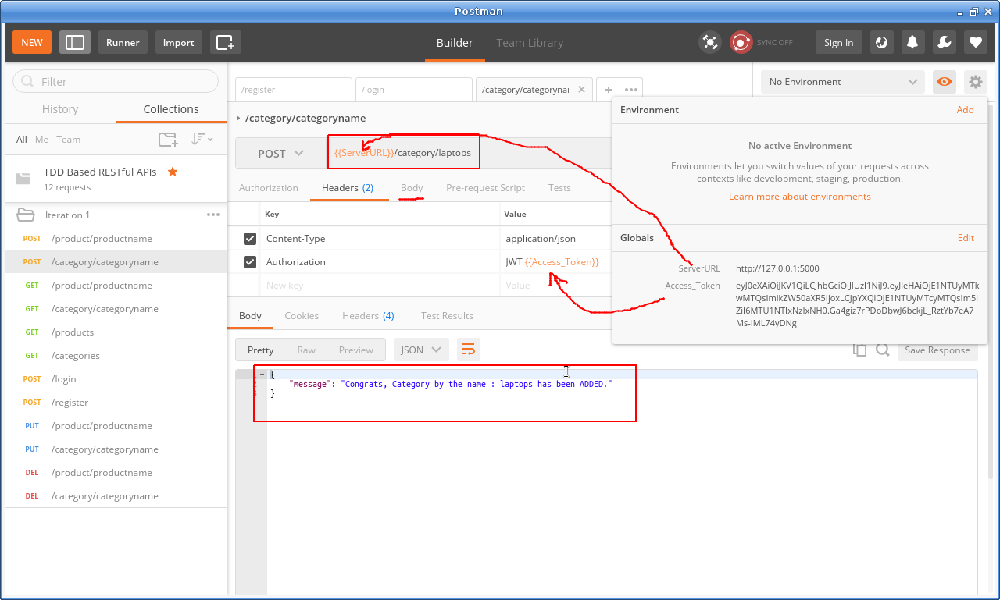

### Using SQLAlchemy with relationships in RESTful APIs:
  * SQLAlchemy allows us to define relationships between tables
  * Relationsship can be - one to one, one to many or many to many
  * In One to One relationship - one row of parent table has one matching row in child
    * E.g. - One row in Employee table will have one matching row in Company table 
  * In One to Many relationship - one row of parent table has many matching row in child
    * E.g. - One row in Employee table will have many matching row in Benefits table like 401, LongTerm, ShortTerm disabilities as one employee can get many benefits
  * In Many to Many relationship - one row of parent table has many matching row in child and vice versa
    * E.g. - One row in Employee table will have many matching row in Projects table and one row in Projects table will have many matching rows in Employee table as an employee can work on many projects and a project can have many employees working on it
  * The example below has a 'category' as parent and 'product' as child entities

### Creating the Parent Model, Parent Resource and updating child model:
  * Step 1 : ***Create new Parent Model - CategoryModel*** - 
    * The parent model Category model defines the ORM tablename, the schema, methods to save, delete and search and json representation
    * One import feature in the schema section is the line - 
      * ***products = db.relationship("ProductModel", cascade="all, delete-orphan", lazy="dynamic")***
      * The above line defines the ***relationship*** of the parent(***CategoryModel***) with child(***ProductModel***)
      * ***Cascade*** affect is - all and delete orphan/child record too when deleting parent object 
      * ***lazy=dynamic*** means on the products object is populated then dont call the DB again and again when calling json  
    * Please see code below -
      ```
      # import the SQLAlchemy object
      from SQLAlchemyDB import db

      # create a new class Category class 
      # Category and Item Model classes have one to many relationship
      # one to many relationship means: 
      # - one item can belong to one category only
      # - and one category can have zero, one or more items belonging to that category
      class CategoryModel(db.Model):
          # define the ORM table
          __tablename__= "tblCategory"

          # define the table schema 
          id = db.Column(db.Integer, primary_key=True)
          name = db.Column(db.String(80))
          
          # ***Cascade*** affect is - all and delete orphan/child record too when deleting parent object 
          # ***lazy=dynamic*** means on the products object is populated then dont call the DB again and again when calling json method
          products = db.relationship("ProductModel", cascade="all, delete-orphan", lazy="dynamic")
          # products = db.relationship('ProductModel', lazy='dynamic')

          # initialize 
          def __init__(self, name):
              self.name=name

          # json representation 
          def json(self):
              return {'name': self.name, 'products': [product.json() for product in self.products.all()]}
          # save a Category
          def Save(self):
              db.session.add(self)
              db.session.commit()

          # delete a Category - 
          def Delete(self):
              db.session.delete(self)
              db.session.commit()

          # search by name 
          @classmethod
          def getCategoryByName(cls, name):
              return cls.query.filter_by(name=name).first()
      ```
    * The screenshot for register user below:
      
      ---------------------------------------------------------------------------------

  * Step 2 : ***Update Child Model - ProductModel*** - 
    * The important line change with respect to previous project are these two lines
      * ***category_id = db.Column(db.Integer, db.ForeignKey("tblCategory.id"))*** - defines ***category_id*** column which references the ***'id'*** column of ***'tblcategory'*** table as a ***foreign key***
      * ***category = db.relationship("CategoryModel")*** - defines the ***relationship*** of the child(***ProductModel***) with parent(***CategoryModel***)
    * Also the __init__ and json methods also pass and return this new column ***category_id*** as an argument
    * Please see code below - 
      ```
      # import SQLAlchemy object
      from SQLAlchemyDB import db

      # create the Product model class 
      class ProductModel(db.Model):

          # define table name for ORM
          __tablename__= 'tblProducts'

          # define table schema 
          id = db.Column(db.Integer, primary_key=True)
          name = db.Column(db.String(100))
          desc = db.Column(db.String(100))
          price = db.Column(db.Float(precision=2))
          qty = db.Column(db.Integer)

          # define relationships with parent/child table
          category_id = db.Column(db.Integer, db.ForeignKey("tblCategory.id"))
          category = db.relationship("CategoryModel")

          def __init__(self, name, desc, price, qty, category_id):
              self.name= name
              self.desc= desc
              self.price= price
              self.qty= qty
              self.category_id=category_id
          
          def json(self):
              return {'name' : self.name, 'desc' : self.desc, 'price' : self.price, 'qty' : self.qty, 'category_id' : self.category_id}

          @classmethod
          def getProductByName(cls, name):
              return cls.query.filter_by(name=name).first()

          def Save(self):
              db.session.add(self)
              db.session.commit()

          def Delete(self):
              db.session.delete(self)
              db.session.commit()
      ```
    * The screenshot for register user below:
      
      ---------------------------------------------------------------------------------

  * Step 3 : ***Create new Parent Resources - Category and Categories*** - 
    * The Parent Resources - Category and Categories - are exactly on similar features as Product and Products classes with GET, PUT, DELETE, POST methods as shown below
    * ***CategoryModel.getCategoryByName*** - is used to search a category
    * The Categories class GET method ( for get all categories -) uses a lambda expression to ruturn a list or a list comprehension
    * Please see code below - 
      ```
      from flask_restful import Resource, reqparse
      from flask_jwt import jwt_required
      from models.category import CategoryModel

      #create a Product model class to represent a Product and its operations
      class Category(Resource):

          @jwt_required()
          def get(self, name):
              category = CategoryModel.getCategoryByName(name)
              if category:
                  return category.json()
              else:
                  return {"message" : "Category by the name {name} not found!!!".format(name=name)}, 404

          @jwt_required()
          def post(self, name):
              # check if the category exists
              if CategoryModel.getCategoryByName(name):
                  return {"message" : "Category by the name {name} already exists, select a new name!!!".format(name=name)}, 400

              # otherwise insert the new category
              category = CategoryModel(name)
              try:
                  category.Save()
                  returnMessage = "Congrats, Category by the name : {name} has been ADDED.".format(name=name)
                  return {"message" : returnMessage }
              except:
                  return {"message" : "Sorry!!!, The Category by the name {name} could not be sucessfully ADDED!!!".format(name=name)}, 500 
              # return category.json(), 201

          @jwt_required()
          def put(self, name):
              category = CategoryModel.getCategoryByName(name)

              if category:
                  try:
                      category.name = name
                      category.Save()
                      returnMessage = "Congrats, Category by the name : {name} has been UPDATED.".format(name=name)
                      return {"message" : returnMessage }
                  except:
                      return {"message" : "Sorry!!!, The Category by the name {name} could not be sucessfully UPDATED!!!".format(name=name)}, 500 
              else:
                  try:
                      category = CategoryModel(name)
                      category.Save()
                      returnMessage = "Congrats, Category by the name : {name} has been ADDED.".format(name=name)
                      return {"message" : returnMessage }
                  except:
                      return {"message" : "Sorry!!!, The Category by the name {name} could not be sucessfully ADDED!!!".format(name=name)}, 500 
              
              # return category.json()
              
          @jwt_required()
          def delete(self, name):
              category = CategoryModel.getCategoryByName(name)
              if category:
                  category.Delete()
                  return {"message" : "Category by the name {name} DELETED!!!".format(name=name)}
              else:
                  return {"message" : "Category by the name {name} can not be found!!!".format(name=name)}, 404


      #create a Categories model class to represent list of Categories and its operations
      class Categories(Resource):
          @jwt_required()
          def get(self):
              # using a map function with lambda
              categories = list(map(lambda category: category.json(), CategoryModel.query.all()))
              # OR using a list comprehensions 
              # categories = [category.json() for category in CategoryModel.query.all()]
              return {"categories" : categories}, 200

      ```
    * The screenshot for register user below:
      
      
      ---------------------------------------------------------------------------------

  * Step 4 : ***Update the main app - app_v1.py*** - 
    * A new import statement is added so that 'db.create_all()' decorated function can create Category table too
      * ***from resources.categories import Category, Categories***
    * Also two new resourses are added for Category and Categories resource classes
      * ***restApi.add_resource(Category,'/category/<string:name>')***
      * ***restApi.add_resource(Categories,'/categories')***
    * Please see code below 
      ```
      from flask import Flask, jsonify
      from flask_restful import Api
      from flask_jwt  import JWT, current_identity
      from datetime import timedelta

      from securityutils import checkIdentity, checkAuthenticity
      from resources.users import UserSignOn
      from resources.products import Product, Products
      from resources.categories import Category, Categories

      flaskApp = Flask(__name__)

      # add a secret key 
      flaskApp.config['PROPAGATE_EXCEPTIONS'] = True # to enforce propagate an exception even if debug is set to false
      flaskApp.config['JWT_AUTH_URL_RULE'] = '/login'  # to enforce /login as the auth page rather then /auth
      flaskApp.config['JWT_EXPIRATION_DELTA'] = timedelta(seconds=1800) # to enforce JSON web token expiration to a custom value in seconds. Defaults to 300 seconds(5 minutes)
      flaskApp.config['JWT_AUTH_USERNAME_KEY'] = 'email' # to enforce AUTH key as email rather than default username

      flaskApp.config['SQLALCHEMY_DATABASE_URI'] = 'sqlite:///dbProducts.db' # path of the databse - root of project
      flaskApp.config['SQLALCHEMY_TRACK_MODIFICATIONS'] = False # enforce using SQLAlchemy session tracking rather than Flask-SQLAlchemy

      flaskApp.secret_key = "%!!#@#^*&^%$^#%@"

      restApi = Api(flaskApp)

      @flaskApp.before_first_request
      def setupDatabase():
          db.create_all()


      # create a JWT 
      jwt = JWT(flaskApp, checkAuthenticity, checkIdentity)

      # to return custom resposne in addition to just the token(here user id also)
      @jwt.auth_response_handler
      def custom_response_handler(access_token, identity):
          return jsonify({
                              'access_token': access_token.decode('utf-8'),
                              'user_id': identity.id
                        })

      # add resource to Api
      restApi.add_resource(Product,'/product/<string:name>')
      restApi.add_resource(Products,'/products')
      restApi.add_resource(Category,'/category/<string:name>')
      restApi.add_resource(Categories,'/categories')
      restApi.add_resource(UserSignOn,'/register')

      if __name__ == '__main__':
          # in the main app import the db SQLAlchemy object and initialize it using init_app(flaskApp)
          from SQLAlchemyDB import db
          db.init_app(flaskApp)
          flaskApp.run(port=5000, debug=True)

      ```
    * The screenshot for register user below:
      
      ---------------------------------------------------------------------------------

  
### Testing the project:
  * Now the project is ready for testing, you can repeat all the operations you tested in previous exercise like register, login, add a product, update a product, delete a product, get one product, get all products. 
  * Since we did not change the existing functionality and just injected the ORM functionality to the app, it should work.
  * The screenshot for register user below:
  
  ---------------------------------------------------------------------------------
  * The screenshot for login user below:
  
  ---------------------------------------------------------------------------------
  * The screenshot for POST category below:
  
  ---------------------------------------------------------------------------------
  * The screenshot for POST product below:
  
  ---------------------------------------------------------------------------------
  * The screenshot for PUT Category below:
  
  ---------------------------------------------------------------------------------
  * The screenshot for PUT Product below:
  
  ---------------------------------------------------------------------------------
  * The screenshot for GETCategory below:
  
  ---------------------------------------------------------------------------------
  * The screenshot for GETProduct below:
  
  ---------------------------------------------------------------------------------
  * The screenshot for GET All Categorys below:
  
  ---------------------------------------------------------------------------------
  * The screenshot for GET All Products below:
  
  ---------------------------------------------------------------------------------
  * The screenshot for DELETE Product below:
  
  ---------------------------------------------------------------------------------
  * The screenshot for DELETE Category below:
  
  
  ---------------------------------------------------------------------------------