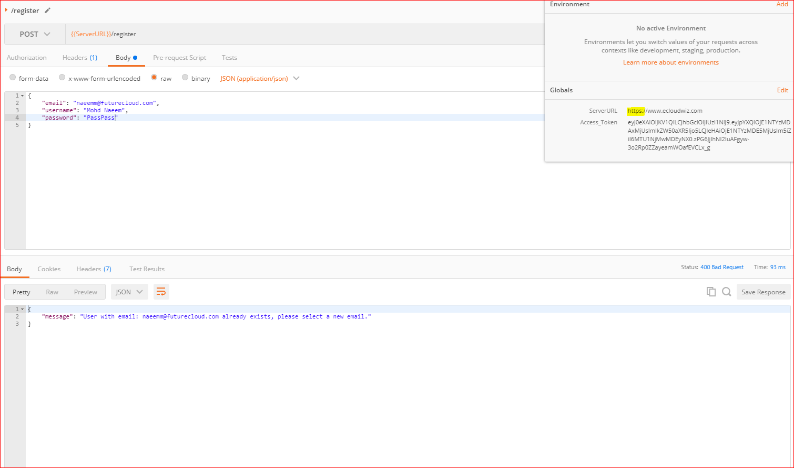
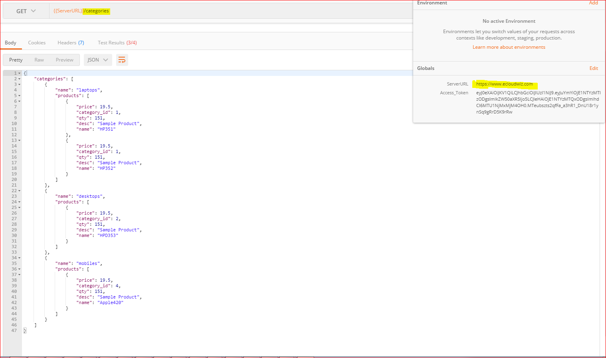

### How to secure and speed up your RESTful APIs:
  * ***Issues***: 
    * Till now we have deployed our RESTful API to Heroku as well as our own custom servers.
    * While during Heroku deployement we saw that the main control on how the it runs is dependent on Heroku
    * On the other side, when we deployed on our own servers, we had a better control on how to deploy and what feature to enable or disable.
    * But still in both case, there are few issues, which should be resolved to make our RESTful API perform better.
      * The HTTPS is still disabled, thus there is no SSL based security - we will install and configure ***SSL certificates*** for this purpose.
      * The RESTful API is still not effeciently cached on renowned CDN servers like ClocuFront, Clodflare etc - we will Configure ***Clodflare*** for this purpose.
      * It is still having a long and custom name as confifured by the cloud provider, no domain is registered - we will ***register a domain*** on GODaddy.com.
  * ***Solution***
    * Install and configure ***SSL certificates*** for security.
    * Configure ***Clodflare*** for caching, security, Denial of service attacks.
    * ***Register a domain*** for proper nomenclature.

### How does the DNS(Domain Naming System) works?:
  * DNS is a way to trnslate the string based domain name to the actual IP of the server.
  * This request is resolved with something called as DNS Query.
  * The snapshot below explain the flow:
    * First of all the client/browser sends a request to view a website e.g. "***www.mohdnaeem.com***"
      * ***Root Server*** - is manage by internet data providers as harcoded list of servers
        * Root servers returns with the info that it does not know the IP of "www.mohdnaeem.com" but knows the servers which maintain .com domains
        * The browser now requests the TLD server
      * ***TLD Server*** - manage a list of specific domain of servers maintained by specific organizations
        * TLD Server returns with the info that it does not know the IP of "www.mohdnaeem.com" but knows the servers which actually holds the address of your server
        * The browser now requests the Name server  
      * ***Name Server*** - is manage by domain registrars and other specific organizations
        * Name Servers now returns with the actual IP of "www.mohdnaeem.com" and that server is then requsted with the page
        * The browser then displays that page
    * 

### Using a ***Registered domain*** to access the RESTfulAPI(Configure GoDaddy and Clodflare): 
  * ClodFlare is is a renowned CDN service similar like CloudFront in AWS which helps caching data, pages, images etc,
  * In a Content Delivery Network(CDN), the data is pulled from the neearest edge location and cached till the TTL is exipred,
  * TTL is Time To Live, once this is expired, the fresh data is pushed from the origin location.
  * Here are the steps to setup and configure a registered domain and a CDN like ClodFlare:

    * Step 1 : ***Setup and Configure Clodflare***:
      * To register or login to Clodflare, please use link - ***https://dash.cloudflare.com/sign-up*** or ***https://dash.cloudflare.com/login***
      * Once registered and logged in, you will be prompted to add the website(the IP address or DNS name of the domain we purchased - e.g ***ecloudwiz.com***)
        
      * Clodflare then connects to check the details of the domain name and prompts with details about how to configure the name servers in the domain registrar(GoDaddy.com for me) to get connected to Clodflare:
      * Copy the names of the two name servers CloufFlare provides to be added to your registered domain's name servers.
        

    * Step 2 : ***Setup and Configure Domain***:  
      * Now go to the domain registrar page(For me ***www.godaddy.com***, you can try others too like ***namecheap.com*** etc) and select the domain we registered and then choose option "Manage Domain"
        
      * Now update the Nameserver 1 and 2 with the nameservers provided by Clodflare in the previous steps.
        

    * Step 3 : ***Setup DNS settings in Clodflare***: 
      * Now go to the CDN(Clodflare here) dashboard and select the website and then ***"DNS" settings***:
      * Enter a 'A' recrod and a CNAME record as shown in the snapshot and explained below
      * The DNS Listing contains a mapping on how to reach your website using A records and CNAME records
        * ***A*** Record - maps the your domians root DNS with the IP address of the server where your app is deployed.(We have deployed it in ***mnaeemsiddiqui3c.mylabserver.com***)
        * The Public IP of the server  - mnaeemsiddiqui3c.mylabserver.com is as in the snapshot(can change)
          
        * ***CNAME*** Record - maps an ALIAS e.g. if a user types "www.ecloudwiz.com" instead of "ecloudwiz.com"
        * ***AAAA*** Record(future) - maps the your domians root DNS with the DNS of the Named servers with IP6 protocol
        

### Configuring SSL Certificate to enhance security: 
  * You can add SSL certificate to enhance security. 
  * Please follow the steps below to configure SSL certificates:

    * Step 1 : ***Setup and Configure SSL om Clodflare***:
      * Go to the "***Crypto***"(Managea cryptography settings for your website) tab and the "***SSL***" section of the website's 
      * Select "Full" or Full(Strict)" certificate from the dropdown
        
      * Now go to "***Origin Certificates***" section underf the same "***Crypto***" tab of the website
      * Click on "***create certificate**" which prompts with a pop up windows asking you for:
        * who generates the ***private key***, 
        * the wildcards for domain name - eg. ****.ecloudwiz.com***(it is '*' prefixed to your domain name ) and ***ecloudwiz.com*** ( its is the domain name) for my website ***ecloudwiz.com***
        * duration of the certificate - normally ***15 years***
          
        * Click Next and you will be provided with 2 keys - 
          * The origin certificate - copy the contents of the origin certificate in a file some where
            
          * The private key - copy the contents of the private key in a file some where
            
    * Step 2 : ***Setup and Configure SSL on your own server***:
      * Login to your server and go to the web folder - ***/var/www**** in our case
      * create another folder named 'ssl' at the same level as 'html' - 
        ```
        cd /var/www
        mkdir ssl
        sudo touch /var/www/ssl/ecloudwiz.com.pem
        sudo touch /var/www/ssl/ecloudwiz.com.key
        sudo nano /var/www/ssl/ecloudwiz.com.pem
        ```
        
      * copy the content of the origin certificate into this file(***/var/www/ssl/ecloudwiz.com.pem***) and save
        
      * Then also copy the contents of the private key into the file and save ***/var/www/ssl/ecloudwiz.com.key***
        ```
        sudo touch /var/www/ssl/ecloudwiz.com.key
        ```
        
      * Now update the file - ***sudo nano /etc/nginx/sites-enabled/products-restful.conf*** to enable SSL by providing the path to .pem, .key files, hostname, port etc
        ```
        # for HTTPS -  this setting is for the HTTPS
        server {
        listen 443 default_server; # tells that 443 is the default 
        real_ip_header X-Forwarded-For;
        set_real_ip_from 127.0.0.1;
        server_name ecloudwiz.com; # now instead of localhost you now provide domain name
        ssl_on; # SSL is on now
        ssl_certificate /var/www/ssl/ecloudwiz.com.pem; # path to origib cert file
        ssl_certificate_key /var/www/ssl/ecloudwiz.com.key; # path to private key file

        location / {
        include uwsgi_params;
        uwsgi_pass unix:/var/www/html/products-restful/socket.sock;
        uwsgi_modifier1 30;
        }

        error_page 404 /404.html;
        location = /404.html {
        root /usr/share/nginx/html;
        }

        error_page 500 502 503 504 /50x.html;
        location = /50x.html {
        root /usr/share/nginx/html;
        }
        }

        # for HTTP this setting is for the HTTP
        server{
        listen 80;
        server_name ecloudwiz.com;
        rewrite ^/(.*) https://ecloudwiz.com/$1 permanent; # rewites all HTTP to HTTPs as permanent redirect for future
        }
        ```
        
      * Now **enable HTTPs** in the ***firewall***, restart ***uwsgi_products_restful service***, restart ***nginx*** ;
        ```
        sudo ufw allow https
        sudo ufw reload
        sudo systemctl reload  uwsgi_products_restful
        sudo systemctl restart  uwsgi_products_restful
        sudo systemctl reload nginx
        sudo systemctl restart nginx
        ```
### Testing the project (The Own Server End Point - ***ecloudwiz.com***):
  * Now the project is ready for testing, you can repeat all the operations you tested in previous Heroku related exercise like register, login, add a product, update a product, delete a product, get one product, get all products. 
  * Since we did not change the existing functionality and just changed the security through domain registration, certificate installation and HTTPs enabling.
  * The screenshot for register user below:
  
  ---------------------------------------------------------------------------------
  * The screenshot for login user below:
  
  ---------------------------------------------------------------------------------
  * The screenshot for products and categories below:
  
  ---------------------------------------------------------------------------------
  * The screenshot of the traffic through Cloudflare:
  
  ---------------------------------------------------------------------------------