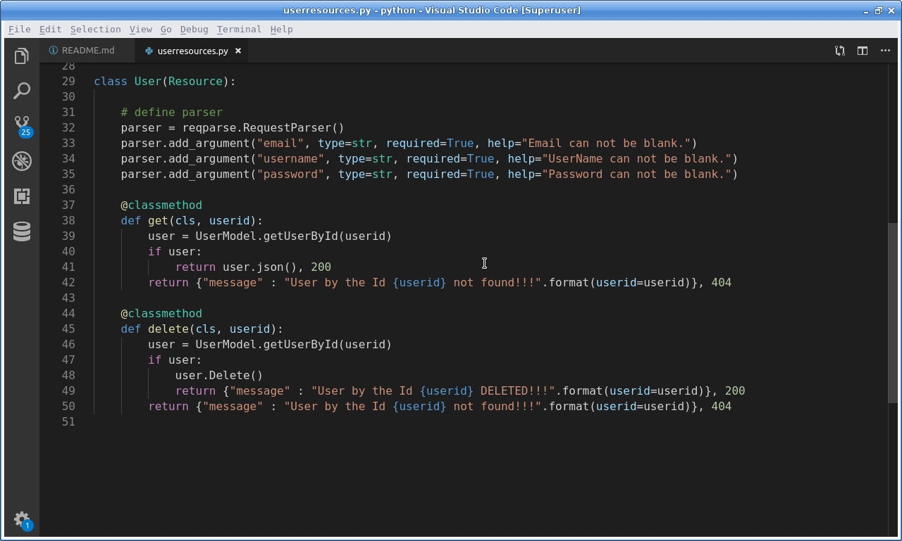
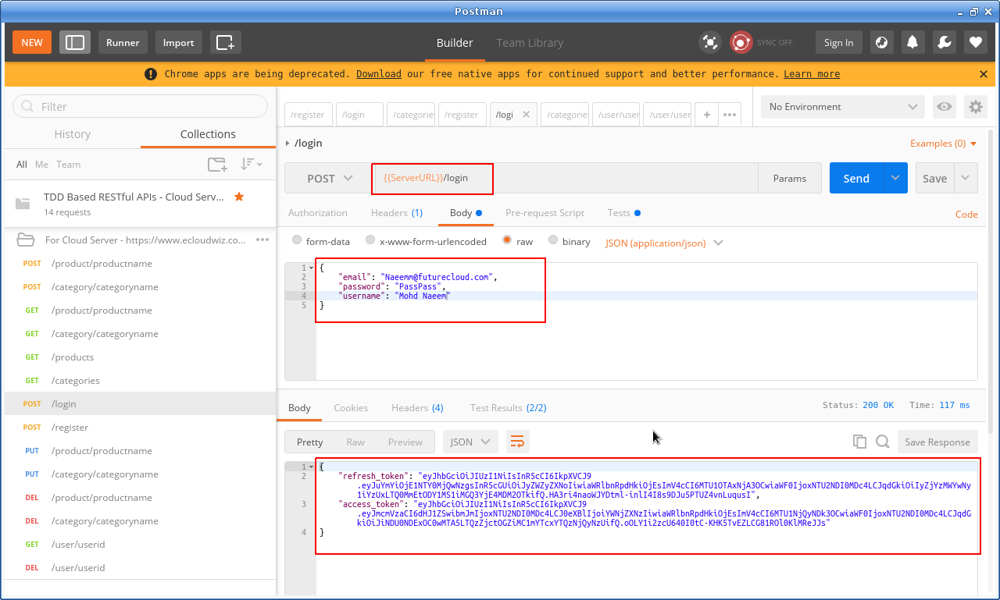
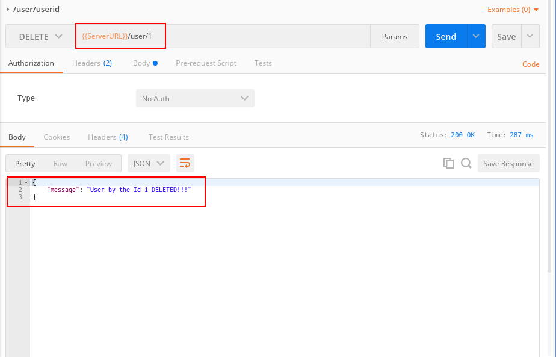
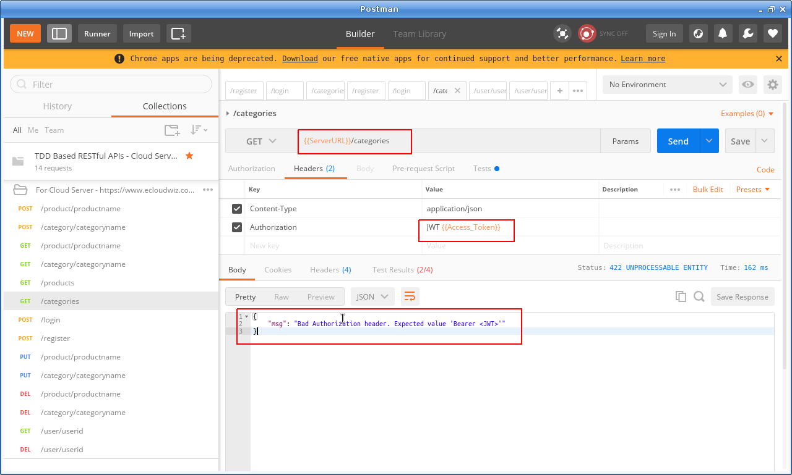
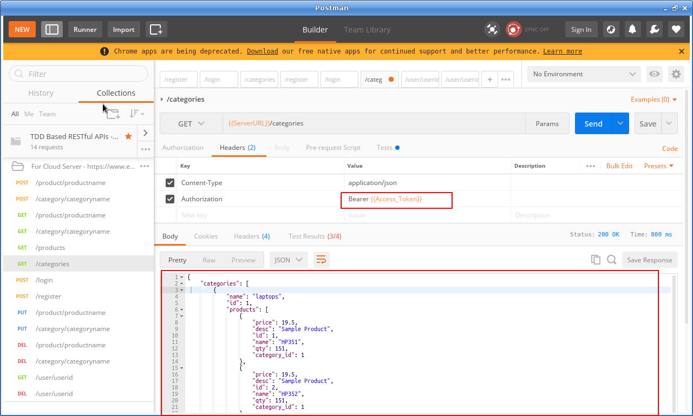

### How to extend security using Token Refreshing in RESTful APIs:
  * ***Flask-JWT*** Vs ***Flask-JWT-Extended***
  * While Flask-JWT used to automatically create an 'auth' endpoint for us.
  * 'Flask-JWT-Extended' does not automatically create any end point
  * But 'Flask-JWT-Extended' provides an extra capability of creating th access and refresh token explicitly by yourself.
  
### Adding a new resource ***User*** for getting user details and deleting users:
  * Before working on token refreshing, lets add a resource 'User'
  * So that we can find a user and delete if needed
  * Please see the new code snapshot for the resource 'User' in file 'userresources.py':
    ```
    class User(Resource):

    # define parser
    parser = reqparse.RequestParser()
    parser.add_argument("email", type=str, required=True, help="Email can not be blank.")
    parser.add_argument("username", type=str, required=True, help="UserName can not be blank.")
    parser.add_argument("password", type=str, required=True, help="Password can not be blank.")

    @classmethod
    def get(cls, userid):
        user = UserModel.getUserById(userid)
        if user:
            return user.json(), 200
        return {"message" : "User by the Id {userid} not found!!!".format(userid=userid)}, 404
    
    @classmethod
    def delete(cls, userid):
        user = UserModel.getUserById(userid)
        if user:
            user.Delete()
            return {"message" : "User by the Id {userid} DELETED!!!".format(userid=userid)}, 200
        return {"message" : "User by the Id {userid} not found!!!".format(userid=userid)}, 404
    ```
  * Here is the snapshot of the new code:
    

### How does the Token Refreshing works?:
  * The 'checkIdentity' and 'checkAuthenticity' methods will go away, We will delete the file 'securityutils.py'
  * Please follow the setps below:
    * Step 1 : Update 'userresources.py' to ***add another class for User Signin***
      * Instead of importing 'Flask-JWT' we will import 'Flask-JWT-Extended' like below
        * ***from flask_jwt_extended import create_access_token, create_refresh_token***
      * The new class UserSignIn will behave like our 'login' method
        * First process the parser and then search the user in the database
        * Define a post method for login to search the user in database
        * And create an access and refresh token if the user exists and the password matches
        ```
        from flask_restful import Resource, reqparse
        # flask_jwt_extended is imported for the two methods create_access_token and create_refresh_token
        from flask_jwt_extended import create_access_token, create_refresh_token
        from models.usermodel import UserModel
        from werkzeug.security import safe_str_cmp
        from 

        # define parser
        _parser = reqparse.RequestParser()
        _parser.add_argument("email", type=str, required=True, help="Email can not be blank.")
        _parser.add_argument("username", type=str, required=True, help="UserName can not be blank.")
        _parser.add_argument("password", type=str, required=True, help="Password can not be blank.")

        # class for User Sign Ons
        class UserSignOn(Resource):

            def post(self):
                data = _parser.parse_args()
                emailId = data['email']
                        
                # check if the user already exists
                if UserModel.getUserByEmail(emailId):
                    returnMessage = "User with email: {email} already exists, please select a new email.".format(email=emailId)
                    return {"message" : returnMessage }, 400
                
                # otherwise sign on the new user
                user = UserModel(**data)
                user.Save()

                returnMessage = "Congrats {usernm} !!!, Your have been successful registerted with email: {email}.".format(usernm=data['username'], email=emailId)
                return {"message" : returnMessage }, 201

        class User(Resource):

            @classmethod
            def get(cls, userid):
                user = UserModel.getUserById(userid)
                if user:
                    return user.json(), 200
                return {"message" : "User by the Id {userid} not found!!!".format(userid=userid)}, 404
            
            @classmethod
            def delete(cls, userid):
                user = UserModel.getUserById(userid)
                if user:
                    user.Delete()
                    return {"message" : "User by the Id {userid} DELETED!!!".format(userid=userid)}, 200
                return {"message" : "User by the Id {userid} not found!!!".format(userid=userid)}, 404

        #  class for User Sign Ins
        class UserSignIn(Resource):

            @classmethod
            def post(cls):
                # first get the data from the parser 
                data = _parser.parse_args()
                emailId = data['email']
                passwd = data['password']
                        
                # check if the user exists in database
                user = UserModel.getUserByEmail(emailId):

                # check and verify the password
                if user and safe_str_cmp(user.password, passwd):
                    # create an access token and refresh token
                    accessToken = create_access_token(identity=user.id, fresh=True)
                    refreshToken = create_refresh_token(user.id)
                    return{
                        'access_token' : accessToken,
                        'refresh_token' : refreshToken
                    }, 200

                returnInvalidCredentialsMessage = "Wrong credentials passed for user with email: {email}".format(email=emailId)
                return {
                    'message' : returnInvalidCredentialsMessage
                }, 401
        ```
    * Step 2 : Update 'app.py' -
        * Update the line  'from flask_jwt  import JWT' to ***from flask_jwt_extended  import JWTManager***
        * Update the line 'jwt=JWT(flaskApp, checkIdentity, checkAuthenticity)' to '***jwt = JWTManager(flaskApp)***'
        * Add line - ***flaskApp.config['JWT_SECRET_KEY'] = '@#!~%^&*()_#$%^%'*** # secret jey for JWT seperately 
        * Add line - ***restApi.add_resource(UserSignIn,'/login')***
        * Please see the code of app.py -
          ```
          import os
          from flask import Flask, jsonify
          from flask_restful import Api
          from flask_jwt_extended  import JWTManager
          from datetime import timedelta

          from securityutils import checkIdentity, checkAuthenticity
          from resources.userresources import User, UserSignOn, UserSignIn
          from resources.productresources import Product, Products
          from resources.categoryresources import Category, Categories

          flaskApp = Flask(__name__)
          flaskApp.config['PROPAGATE_EXCEPTIONS'] = True # to enforce propagate an exception even if debug is set to false
          flaskApp.config['JWT_AUTH_URL_RULE'] = '/login'  # to enforce /login as the auth page rather then /auth
          flaskApp.config['JWT_EXPIRATION_DELTA'] = timedelta(seconds=60) # to enforce JSON web token expiration to a custom value in seconds. Defaults to 300 seconds(5 minutes)
          flaskApp.config['JWT_AUTH_USERNAME_KEY'] = 'email' # to enforce AUTH key as email rather than default username

          # path of the databse - root of project - DATABASE_URL is a os level variable in Heroku after you have connected to Postgres
          flaskApp.config['SQLALCHEMY_DATABASE_URI'] = os.environ.get('DATABASE_URL', 'sqlite:///dbdata.db')

          flaskApp.config['SQLALCHEMY_TRACK_MODIFICATIONS'] = False # enforce using SQLAlchemy session tracking rather than Flask-SQLAlchemy
          flaskApp.config['JWT_SECRET_KEY'] = '@#!~%^&*()_#$%^%' # secret jey for JWT seperately 
          flaskApp.secret_key = "%!!#@#^*&^%$^#%@" # secret key of the flask app
          restApi = Api(flaskApp)

          # The JWT manager - does not create a auth end points, just lives under the app
          # jwt = JWT(flaskApp, checkAuthenticity, checkIdentity)
          jwt = JWTManager(flaskApp)

          @flaskApp.before_first_request
          def setupDatabase():
              db.create_all()

          # to return custom resposne in addition to just the token(here user id also)
          @jwt.auth_response_handler
          def custom_response_handler(access_token, identity):
              return jsonify({ 'access_token': access_token.decode('utf-8'), 'user_id': identity.id })

          # add resource to Api
          restApi.add_resource(Product,'/product/<string:name>')
          restApi.add_resource(Products,'/products')
          restApi.add_resource(Category,'/category/<string:name>')
          restApi.add_resource(Categories,'/categories')
          restApi.add_resource(UserSignOn,'/register')
          restApi.add_resource(User,'/user/<int:userid>')
          restApi.add_resource(UserSignIn,'/login')

          if __name__ == '__main__':
              # in the main app import the db SQLAlchemy object and initialize it using init_app(flaskApp)
              from dbutils import db
              db.init_app(flaskApp)
              flaskApp.run(port=5000, debug=True)

          ```
    * Step 3 :
        * Replace 'Flask-JWT' to '' in the requirements.txt
        * Also install 'Flask-JWT-Extended' and also install it on local - ***pip install Flask-JWT-Extended***
        * Please see the code below:
          ```
          Flask
          Flask-RESTful
          Flask-JWT-Extended
          Flask-SQLAlchemy
          uwsgi
          psycopg2
          ```
    * Step 4 : 
        * Replace 'from flask_jwt import jwt_required' with '***from flask_jwt_extended import jwt_required**' where ever it is found in the whole application
        * Also replace 'jwt_required()' with '***jwt_required***'

### Testing the project (The Own Server End Point - ***ecloudwiz.com***):
  * Now the project is ready for testing, you can repeat all the operations you tested in previous Heroku related exercise like register, login, add a product, update a product, delete a product, get one product, get all products. 
  * Since we did not change the existing functionality and just changed the security through token refreshing, so all the functionalities should work.
  * The screenshot for login user below:
  
  ---------------------------------------------------------------------------------
   * The screenshot for get a user below:
  
  ---------------------------------------------------------------------------------
   * The screenshot for delete user below:
  
  ---------------------------------------------------------------------------------
  * The screenshot for products and categories below( with error for New Authorization Header):
  
  ---------------------------------------------------------------------------------
  * The screenshot for products and categories below:
  
  ---------------------------------------------------------------------------------