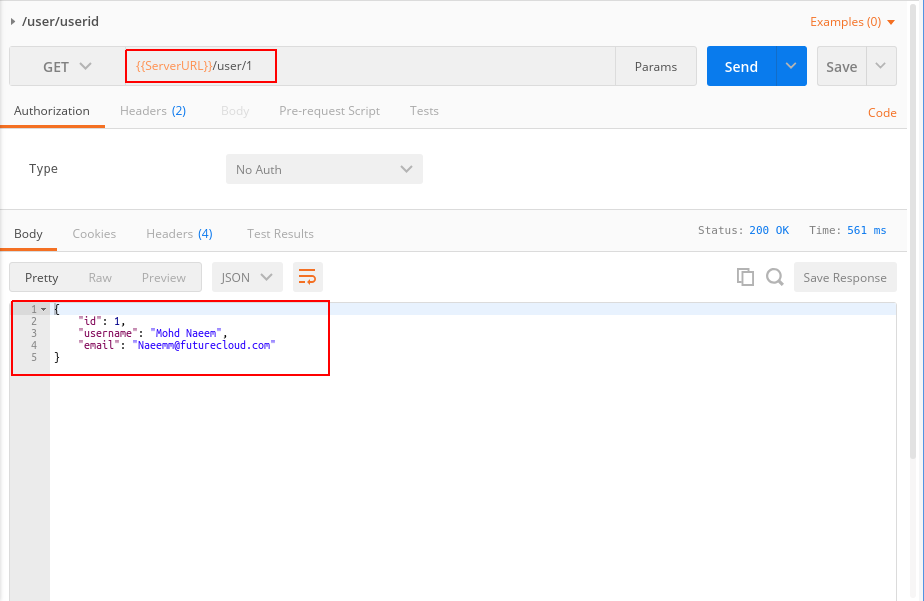

### How to extend security using Token Refreshing in RESTful APIs:
  * ***Flask-JWT*** Vs ***Flask-JWT-Extended***
  * While Flask-JWT used to automatically create an 'auth' endpoint for us.
  * 'Flask-JWT-Extended' does not automatically create any end point
  * But 'Flask-JWT-Extended' provides an extra capability of creating th access and refresh token explicitly by yourself.
  
### Adding a new resource ***User*** for getting user details and deleting users:
  * Before working on token refreshing, lets add a resource 'User'
  * So that we can find a user and delete if needed
  * Please see the new code snapshot for the resource 'User' in file 'userresources.py':
    ```
    class User(Resource):

    # define parser
    parser = reqparse.RequestParser()
    parser.add_argument("email", type=str, required=True, help="Email can not be blank.")
    parser.add_argument("username", type=str, required=True, help="UserName can not be blank.")
    parser.add_argument("password", type=str, required=True, help="Password can not be blank.")

    @classmethod
    def get(cls, userid):
        user = UserModel.getUserById(userid)
        if user:
            return user.json(), 200
        return {"message" : "User by the Id {userid} not found!!!".format(userid=userid)}, 404
    
    @classmethod
    def delete(cls, userid):
        user = UserModel.getUserById(userid)
        if user:
            user.Delete()
            return {"message" : "User by the Id {userid} DELETED!!!".format(userid=userid)}, 200
        return {"message" : "User by the Id {userid} not found!!!".format(userid=userid)}, 404
    ```
  * Here is the snapshot of the new code:
    

### How to add ***Claims*** to an Access Token?:
  * ***Claims*** are extra values passed along with an access token
  * Helps in an ***extra steps validation or verifications*** in addition to access token
  * In our current application, any authtneticated user can delete a product or category
  * What if we want that only an ***administator*** can delete a product or category
  * We can pass this extra value ***isadmin*** to the access token 
  * Please follow the steps below to introduce ***claims*** to the application:
    * Step 1: Update the UserModel to have a new field 'isadmin':
      * We will add a new field '***isadmin***' to the UserModel
      * While deleting a product or a category we will verify if the user is an admin or not
        ```
        # import the db SQLAlchemy object
        from dbutils import db

        # UserModel class will extend/inherit from db.Model class
        class UserModel(db.Model):

            # define the table name for OR mapping
            __tablename__= 'tblUsers'

            # define the table schema for the OR mapping
            id = db.Column(db.Integer, primary_key=True)
            email = db.Column(db.String(100))
            username = db.Column(db.String(100))
            password = db.Column(db.String(100))
            isadmin = db.Column(db.Integer)  #### added a new column 'isadmin'
            
            def __init__(self, email, username, password, isadmin):
                self.email= email
                self.username= username
                self.password= password
                self.isadmin= isadmin  #### populating 'isadmin'

            def json(self):
                return { 
                    "id" : self.id, 
                    "email" : self.email, 
                    "username" : self.username,
                    "isadmin" : self.isadmin  #### populating 'isadmin'
                    #,"password" : self.password 
                }


            @classmethod
            def getUserById(cls, _id):
                # cls.query returns all rows like Select * from tblUsers
                # cls.query.filter_by(id=_id) retuns the filtered rows like Select * from tblUsers where id = _id
                # cls.query.filter_by(id=_id).first() returns the top 1 row like Select * from tblUsers where id = _id LIMIT 1
                return cls.query.filter_by(id=_id).first()

            @classmethod
            def getUserByEmail(cls, email):
                return cls.query.filter_by(email=email).first()

            def Save(self):
                db.session.add(self)
                db.session.commit()
            
            def Delete(self):
                db.session.delete(self)
                db.session.commit()
        ```
    * Step 2: Update the App.py to add a ***claim***:
      * ***@jwt.user_claims_loader*** decorator is used to gerenate a claim
      * First of all we return the user from database based on the Identity(in our case id of the user) using ***user = UserModel.getUserById(identity)***
      * Then we check if user is an admin or not - ***if user.isadmin == 1***
      * Finally if the user is and admin then return 'isadmin' as True else False
        ```
        import os
        from flask import Flask, jsonify
        from flask_restful import Api
        from flask_jwt_extended  import JWTManager
        from datetime import timedelta

        from securityutils import checkIdentity, checkAuthenticity
        from resources.userresources import User, UserSignOn, UserSignIn
        from resources.productresources import Product, Products
        from resources.categoryresources import Category, Categories
        from models.usermodel import UserModel  ### importing the UserModel

        flaskApp = Flask(__name__)
        flaskApp.config['PROPAGATE_EXCEPTIONS'] = True # to enforce propagate an exception even if debug is set to false
        flaskApp.config['JWT_AUTH_URL_RULE'] = '/login'  # to enforce /login as the auth page rather then /auth
        flaskApp.config['JWT_EXPIRATION_DELTA'] = timedelta(seconds=60) # to enforce JSON web token expiration to a custom value in seconds. Defaults to 300 seconds(5 minutes)
        flaskApp.config['JWT_AUTH_USERNAME_KEY'] = 'email' # to enforce AUTH key as email rather than default username

        # path of the databse - root of project - DATABASE_URL is a os level variable in Heroku after you have connected to Postgres
        flaskApp.config['SQLALCHEMY_DATABASE_URI'] = os.environ.get('DATABASE_URL', 'sqlite:///dbdata.db')

        flaskApp.config['SQLALCHEMY_TRACK_MODIFICATIONS'] = False # enforce using SQLAlchemy session tracking rather than Flask-SQLAlchemy
        flaskApp.config['JWT_SECRET_KEY'] = '@#!~%^&*()_#$%^%' # secret jey for JWT seperately 
        flaskApp.secret_key = "%!!#@#^*&^%$^#%@" # secret key of the flask app
        restApi = Api(flaskApp)

        # The JWT manager - does not create a auth end points, just lives under the app
        # jwt = JWT(flaskApp, checkAuthenticity, checkIdentity)
        jwt = JWTManager(flaskApp)

        ############### Updated code for claims##############
        @jwt.user_claims_loader
        def addClaimsToJWT(identity):
            user = UserModel.getUserById(identity)
            if user.isadmin == 1:
                return {'isadmin' : True}
            return {'isadmin' : False}
        #######################################s##############

        @flaskApp.before_first_request
        def setupDatabase():
            db.create_all()

        # add resource to Api
        restApi.add_resource(Product,'/product/<string:name>')
        restApi.add_resource(Products,'/products')
        restApi.add_resource(Category,'/category/<string:name>')
        restApi.add_resource(Categories,'/categories')
        restApi.add_resource(UserSignOn,'/register')
        restApi.add_resource(User,'/user/<int:userid>')
        restApi.add_resource(UserSignIn,'/login')

        if __name__ == '__main__':
            # in the main app import the db SQLAlchemy object and initialize it using init_app(flaskApp)
            from dbutils import db
            db.init_app(flaskApp)
            flaskApp.run(port=5000, debug=True)

        ```
    * Step 3: Update the delete method of the Product resources:    
        ```
        from flask_restful import Resource, reqparse
        from flask_jwt_extended import jwt_required, get_jwt_claims #### import get_jwt_claims
        from models.productmodel import ProductModel

        #create a Product model class to represent a Product and its operations
        class Product(Resource):

            # define parser
            parser = reqparse.RequestParser()
            parser.add_argument("desc", type=str, required=True, help="Product Description can not be blank.")
            parser.add_argument("price", type=float, required=True, help="Product Price can not be blank.")
            parser.add_argument("qty", type=float, required=True, help="Product Quantity can not be blank.")
            parser.add_argument("category_id", type=int, required=True, help="Product Category Id can not be blank.")

            @jwt_required
            def get(self, name):
                product = ProductModel.getProductByName(name)
                if product:
                    return product.json()
                return {"message" : "Product by the name {name} not found!!!".format(name=name)}, 404

            @jwt_required
            def post(self, name):
                # check if the product exists
                if ProductModel.getProductByName(name):
                    return {"message" : "Product by the name {name} already exists, select a new name!!!".format(name=name)}, 400

                # otherwise insert the new product
                data = Product.parser.parse_args()
                
                new_product = ProductModel(name, **data)
                try:
                    new_product.Save()
                    returnMessage = "Congrats, Product by the name : {name} has been ADDED.".format(name=name)
                    return {"message" : returnMessage }
                except:
                    return {"message" : "Sorry!!!, The product by the name {name} could not be sucessfully ADDED!!!".format(name=name)}, 500 
                # return new_product.json(), 201

            @jwt_required
            def put(self, name):
                product = ProductModel.getProductByName(name)

                data = Product.parser.parse_args()
            
                if product:
                    try:
                        product.desc= data['desc']
                        product.price= data['price']
                        product.qty= data['qty']
                        product.category_id = data['category_id']
                        
                        product.Save()
                        returnMessage = "Congrats, Product by the name : {name} has been UPDATED.".format(name=name)
                        return {"message" : returnMessage }
                    except:
                        return {"message" : "Sorry!!!, The product by the name {name} could not be sucessfully UPDATED!!!".format(name=name)}, 500 
                else:
                    try:
                        product = ProductModel(name, **data)
                        product.Save()
                        returnMessage = "Congrats, Product by the name : {name} has been ADDED.".format(name=name)
                        return {"message" : returnMessage }
                    except:
                        return {"message" : "Sorry!!!, The product by the name {name} could not be sucessfully ADDED!!!".format(name=name)}, 500 
                
                # return product.json()
                
            @jwt_required
            def delete(self, name):
                ########################################### The New code for claims
                claims = get_jwt_claims()
                if not claims["isadmin"]:
                    return {'message' : 'Sorry, you need an administrator priviledge to delete a product.'}
                ###########################################

                tobedeleted_product = ProductModel.getProductByName(name)
                if tobedeleted_product:
                    tobedeleted_product.Delete()
                    return {"message" : "Product by the name {name} DELETED!!!".format(name=name)}, 200
                return {"message" : "Product by the name {name} can not be found!!!".format(name=name)}, 404


        #create a Products model class to represent list of Products and its operations
        class Products(Resource):
            @jwt_required
            def get(self):
                # using a map function with lambda
                # products = list(map(lambda product: product.json(), ProductModel.query.all()))
                products = list([x.json() for x in ProductModel.getAll()])
                # OR using a list comprehensions 
                # products = [product.json() for product in ProductModel.query.all()]
                return {"products" : products}, 200
   
        ```
    * Step 4: Update the delete method of the Category resources:    
        ```
        from flask_restful import Resource, reqparse
        from flask_jwt_extended import jwt_required, get_jwt_claims #### import get_jwt_claims
        from models.categorymodel import CategoryModel

        #create a Product model class to represent a Product and its operations
        class Category(Resource):

            @jwt_required
            def get(self, name):
                category = CategoryModel.getCategoryByName(name)
                if category:
                    return category.json()
                return {"message" : "Category by the name {name} not found!!!".format(name=name)}, 404

            @jwt_required
            def post(self, name):
                # check if the category exists
                if CategoryModel.getCategoryByName(name):
                    return {"message" : "Category by the name {name} already exists, select a new name!!!".format(name=name)}, 400

                # otherwise insert the new category
                category = CategoryModel(name)
                try:
                    category.Save()
                    returnMessage = "Congrats, Category by the name : {name} has been ADDED.".format(name=name)
                    return {"message" : returnMessage }
                except:
                    return {"message" : "Sorry!!!, The Category by the name {name} could not be sucessfully ADDED!!!".format(name=name)}, 500 
                # return category.json(), 201

            @jwt_required
            def put(self, name):
                category = CategoryModel.getCategoryByName(name)

                if category:
                    try:
                        category.name = name
                        category.Save()
                        returnMessage = "Congrats, Category by the name : {name} has been UPDATED.".format(name=name)
                        return {"message" : returnMessage }
                    except:
                        return {"message" : "Sorry!!!, The Category by the name {name} could not be sucessfully UPDATED!!!".format(name=name)}, 500 
                else:
                    try:
                        category = CategoryModel(name)
                        category.Save()
                        returnMessage = "Congrats, Category by the name : {name} has been ADDED.".format(name=name)
                        return {"message" : returnMessage }
                    except:
                        return {"message" : "Sorry!!!, The Category by the name {name} could not be sucessfully ADDED!!!".format(name=name)}, 500 
                
                # return category.json()
                
            @jwt_required
            def delete(self, name):
                #################################New Code for claims
                claims = get_jwt_claims()
                if not claims['isadmin']:
                    return {'message' : 'Sorry, you need an administrator priviledge to delete a category.'}
                #################################

                category = CategoryModel.getCategoryByName(name)
                if category:
                    category.Delete()
                    return {"message" : "Category by the name {name} DELETED!!!".format(name=name)}
                return {"message" : "Category by the name {name} can not be found!!!".format(name=name)}, 404


        #create a Categories model class to represent list of Categories and its operations
        class Categories(Resource):
            @jwt_required
            def get(self):
                # using a map function with lambda
                # categories = list(map(lambda category: category.json(), CategoryModel.query.all()))
                categories = list([x.json() for x in CategoryModel.getAll()])
                # OR using a list comprehensions 
                # categories = [category.json() for category in CategoryModel.query.all()]
                return {"categories" : categories}, 200

        ```

### How to use JWT Optional?:
  * ***@jwt_optional*** decorator is used to defined a method to conditionally uset the acces token
  * First of all import these two - ***jwt_optional, get_jwt_identity***
  * Then define the method as JWT optional.
  * ***userid = get_jwt_identity()*** is used to check the identity of the user
  * We are checking if the user is logged in then show full info else into productnames
    ```
    @jwt_optional
        def get(self):
            # using a map function with lambda
            # products = list(map(lambda product: product.json(), ProductModel.query.all()))
            userid = get_jwt_identity()
            products = list([x.json() for x in ProductModel.getAll()])
            if userid:
                return {
                    "products" : products
                }, 200
            products = list([x.name for x in ProductModel.getAll()])
            return {
                "products" : products,
                "message" : "Detailed info only after you login."
            }, 200
    ```

### How does the Token Refreshing works?:
  * The 'checkIdentity' and 'checkAuthenticity' methods will go away, We will delete the file 'securityutils.py'
  * Please follow the setps below:
    * Step 1 : Update 'userresources.py' to ***add another class for User Signin***
      * Instead of importing 'Flask-JWT' we will import 'Flask-JWT-Extended' like below
        * ***from flask_jwt_extended import create_access_token, create_refresh_token***
      * The new class UserSignIn will behave like our 'login' method
        * First process the parser and then search the user in the database
        * Define a post method for login to search the user in database
        * And create an access and refresh token if the user exists and the password matches
        ```
        from flask_restful import Resource, reqparse
        # flask_jwt_extended is imported for the two methods create_access_token and create_refresh_token
        from flask_jwt_extended import create_access_token, create_refresh_token
        from models.usermodel import UserModel
        from werkzeug.security import safe_str_cmp
        from 

        # define parser
        _parser = reqparse.RequestParser()
        _parser.add_argument("email", type=str, required=True, help="Email can not be blank.")
        _parser.add_argument("username", type=str, required=True, help="UserName can not be blank.")
        _parser.add_argument("password", type=str, required=True, help="Password can not be blank.")

        # class for User Sign Ons
        class UserSignOn(Resource):

            def post(self):
                data = _parser.parse_args()
                emailId = data['email']
                        
                # check if the user already exists
                if UserModel.getUserByEmail(emailId):
                    returnMessage = "User with email: {email} already exists, please select a new email.".format(email=emailId)
                    return {"message" : returnMessage }, 400
                
                # otherwise sign on the new user
                user = UserModel(**data)
                user.Save()

                returnMessage = "Congrats {usernm} !!!, Your have been successful registerted with email: {email}.".format(usernm=data['username'], email=emailId)
                return {"message" : returnMessage }, 201

        class User(Resource):

            @classmethod
            def get(cls, userid):
                user = UserModel.getUserById(userid)
                if user:
                    return user.json(), 200
                return {"message" : "User by the Id {userid} not found!!!".format(userid=userid)}, 404
            
            @classmethod
            def delete(cls, userid):
                user = UserModel.getUserById(userid)
                if user:
                    user.Delete()
                    return {"message" : "User by the Id {userid} DELETED!!!".format(userid=userid)}, 200
                return {"message" : "User by the Id {userid} not found!!!".format(userid=userid)}, 404

        #  class for User Sign Ins
        class UserSignIn(Resource):

            @classmethod
            def post(cls):
                # first get the data from the parser 
                data = _parser.parse_args()
                emailId = data['email']
                passwd = data['password']
                        
                # check if the user exists in database
                user = UserModel.getUserByEmail(emailId):

                # check and verify the password
                if user and safe_str_cmp(user.password, passwd):
                    # create an access token and refresh token
                    accessToken = create_access_token(identity=user.id, fresh=True)
                    refreshToken = create_refresh_token(user.id)
                    return{
                        'access_token' : accessToken,
                        'refresh_token' : refreshToken
                    }, 200

                returnInvalidCredentialsMessage = "Wrong credentials passed for user with email: {email}".format(email=emailId)
                return {
                    'message' : returnInvalidCredentialsMessage
                }, 401
        ```
    * Step 2 : Update 'app.py' -
        * Update the line  'from flask_jwt  import JWT' to ***from flask_jwt_extended  import JWTManager***
        * Update the line 'jwt=JWT(flaskApp, checkIdentity, checkAuthenticity)' to '***jwt = JWTManager(flaskApp)***'
        * Add line - ***flaskApp.config['JWT_SECRET_KEY'] = '@#!~%^&*()_#$%^%'*** # secret jey for JWT seperately 
        * Add line - ***restApi.add_resource(UserSignIn,'/login')***
        * Please see the code of app.py -
          ```
          import os
          from flask import Flask, jsonify
          from flask_restful import Api
          from flask_jwt_extended  import JWTManager
          from datetime import timedelta

          from securityutils import checkIdentity, checkAuthenticity
          from resources.userresources import User, UserSignOn, UserSignIn
          from resources.productresources import Product, Products
          from resources.categoryresources import Category, Categories

          flaskApp = Flask(__name__)
          flaskApp.config['PROPAGATE_EXCEPTIONS'] = True # to enforce propagate an exception even if debug is set to false
          flaskApp.config['JWT_AUTH_URL_RULE'] = '/login'  # to enforce /login as the auth page rather then /auth
          flaskApp.config['JWT_EXPIRATION_DELTA'] = timedelta(seconds=60) # to enforce JSON web token expiration to a custom value in seconds. Defaults to 300 seconds(5 minutes)
          flaskApp.config['JWT_AUTH_USERNAME_KEY'] = 'email' # to enforce AUTH key as email rather than default username

          # path of the databse - root of project - DATABASE_URL is a os level variable in Heroku after you have connected to Postgres
          flaskApp.config['SQLALCHEMY_DATABASE_URI'] = os.environ.get('DATABASE_URL', 'sqlite:///dbdata.db')

          flaskApp.config['SQLALCHEMY_TRACK_MODIFICATIONS'] = False # enforce using SQLAlchemy session tracking rather than Flask-SQLAlchemy
          flaskApp.config['JWT_SECRET_KEY'] = '@#!~%^&*()_#$%^%' # secret jey for JWT seperately 
          flaskApp.secret_key = "%!!#@#^*&^%$^#%@" # secret key of the flask app
          restApi = Api(flaskApp)

          # The JWT manager - does not create a auth end points, just lives under the app
          # jwt = JWT(flaskApp, checkAuthenticity, checkIdentity)
          jwt = JWTManager(flaskApp)

          @flaskApp.before_first_request
          def setupDatabase():
              db.create_all()

          # to return custom resposne in addition to just the token(here user id also)
          @jwt.auth_response_handler
          def custom_response_handler(access_token, identity):
              return jsonify({ 'access_token': access_token.decode('utf-8'), 'user_id': identity.id })

          # add resource to Api
          restApi.add_resource(Product,'/product/<string:name>')
          restApi.add_resource(Products,'/products')
          restApi.add_resource(Category,'/category/<string:name>')
          restApi.add_resource(Categories,'/categories')
          restApi.add_resource(UserSignOn,'/register')
          restApi.add_resource(User,'/user/<int:userid>')
          restApi.add_resource(UserSignIn,'/login')

          if __name__ == '__main__':
              # in the main app import the db SQLAlchemy object and initialize it using init_app(flaskApp)
              from dbutils import db
              db.init_app(flaskApp)
              flaskApp.run(port=5000, debug=True)

          ```
    * Step 3 :
        * Replace 'Flask-JWT' to '' in the requirements.txt
        * Also install 'Flask-JWT-Extended' and also install it on local - ***pip install Flask-JWT-Extended***
        * Please see the code below:
          ```
          Flask
          Flask-RESTful
          Flask-JWT-Extended
          Flask-SQLAlchemy
          uwsgi
          psycopg2
          ```
    * Step 4 : 
        * Replace 'from flask_jwt import jwt_required' with '***from flask_jwt_extended import jwt_required**' where ever it is found in the whole application
        * Also replace 'jwt_required()' with '***jwt_required***'

### Testing the project (The Own Server End Point - ***ecloudwiz.com***):
  * Now the project is ready for testing, you can repeat all the operations you tested in previous Heroku related exercise like register, login, add a product, update a product, delete a product, get one product, get all products. 
  * Since we did not change the existing functionality and just changed the security through token refreshing, so all the functionalities should work.
  * The screenshot for login user below:
  
  ---------------------------------------------------------------------------------
   * The screenshot for get a user below:
  
  ---------------------------------------------------------------------------------
   * The screenshot for delete user below:
  
  ---------------------------------------------------------------------------------
   * The screenshot for creating a nonadmin user below:
  
  ---------------------------------------------------------------------------------
   * The screenshot for login by a  nonadmin user below:
  
  ---------------------------------------------------------------------------------
   * The screenshot for deleteting a product by a non admin user below:
  
  ---------------------------------------------------------------------------------
   * The screenshot for deleteting a category by a non admin user below:
  
  ---------------------------------------------------------------------------------
   * The screenshot for usding JWT Optional(showing partial info if user not logged in):
  
  
  ---------------------------------------------------------------------------------
  * The screenshot for products and categories below( with error for New Authorization Header):
  
  ---------------------------------------------------------------------------------
  * The screenshot for products and categories below:
  
  ---------------------------------------------------------------------------------