### What is Python Django:

  * is a ***web*** application development ***framework***.
  * encourages clean and ***rapid development***
  * no need to re-invebt the wheel as many ***in-build features*** available
  * highly ***sclalable*** and flexible approach
  * encourages ***open source*** development 
  
### Python Django Setup(On Linux - Ubuntu):

  * Step 1 : Install ***Python tools***
    ```
    sudo apt-get -y update && sudo apt-get -y upgrade
    sudo apt-get -y install python3.6 python3-pip python3-virtualenv python3-setuptools python-dev build-essential
    ```
    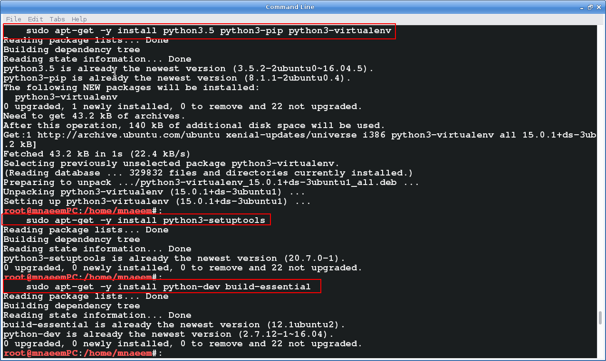

  * Step 2 : Install and Configure ***Virtual Evironment***
    ```
    sudo pip install virtualenv 
    mkdir ~/work && cd ~/work
    mkdir venv && cd venv
    virtualenv -p python3.6 .
    source bin/activate
    ```
    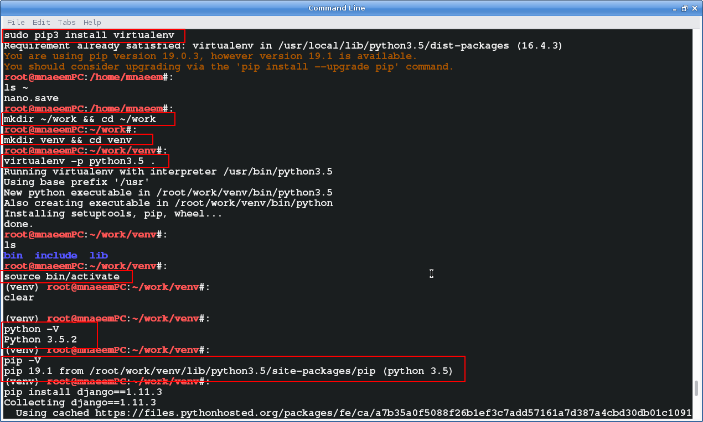

  * Step 3 : Install ***Django***and Configure a Project
    ```
    pip install django==1.11.3
    mkdir src && cd src
    django-admin.py startproject ecommhome .
    python manage.py migrate
    python manage.py createsuperuser
    python manage.py runserver
    ```
    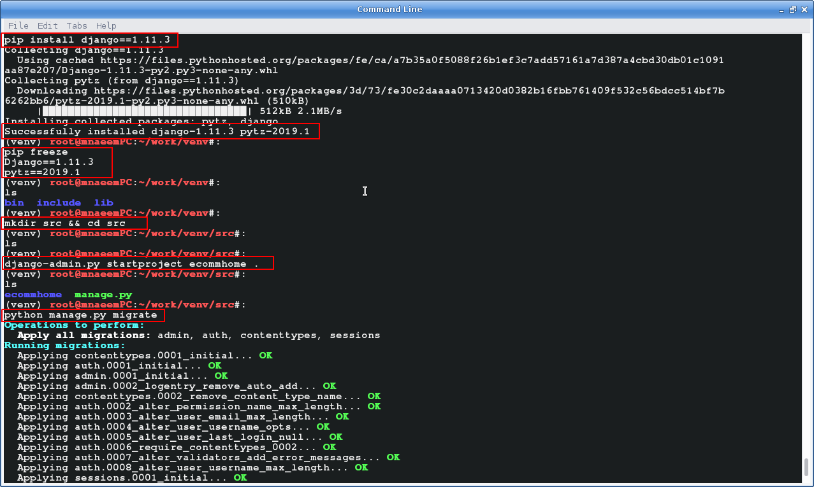
    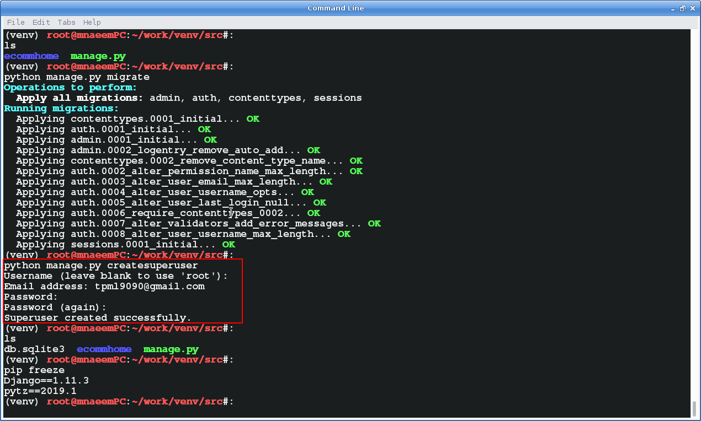
    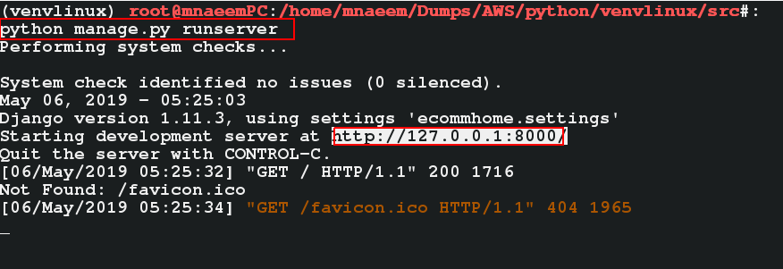
    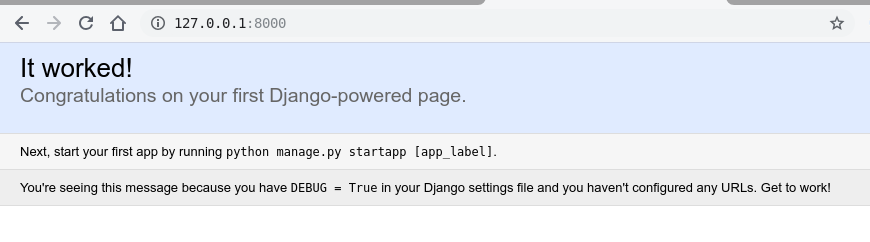
  

### Python Django Setup(On Linux - Windows using PowerShell):

  * Step 1 : Install ***Python 3.6.x*** from ***https://www.python.org/downloads/windows/***
      * Select a stable release and a x86 or 64 bit version based on your system
      * Run the Installer to pop open the installation wizard 
        * Select these options in step 1 - ***Add Python 3.7 to PATH*** ,  ***Install for all users***,***Customize Installation***
          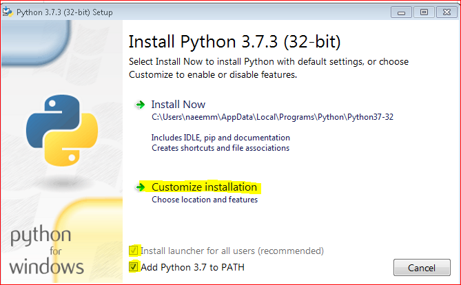
        * Select these option in step 2 - ***pip***
          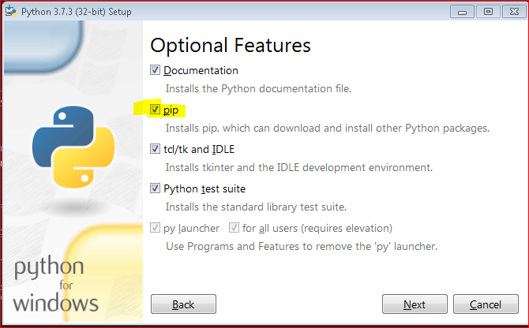
        * Select these option in step 3 - ***Install for all users***, ***Add Python to environment variables***, ***Create shortcuts for installed applications*** and ***Precomplie standard libary***
          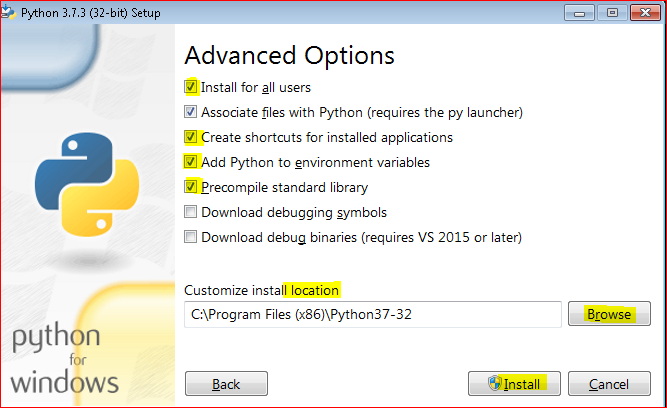
        * Verify Installation - Check python and pip version - execute -  ***python -V*** and ***pip -V***
          ```
          python -V
          pip -V
          ```
          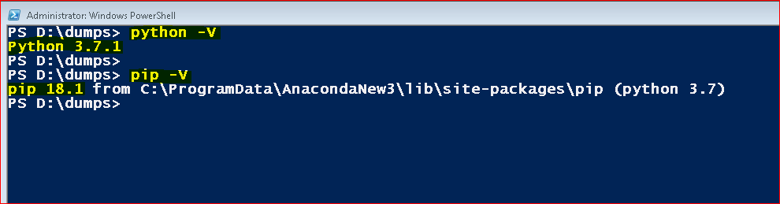

  * Step 2 : Install and Configure ***Virtual Evironment***
    * Install Virtual environment - ***pip install virtualenv***
      ```
      pip install virtualenv
      ```
    * Go to your work folder where you will keeep the ECommerce Website files ( Mine is ***D:\Dumps\python\Python 301***)
    * Create and go to a folder for virtual environment - ***mkdir venv ; cd venv***
    * Create the virtual environment - 
      * ***virtualenv .*** (if only one python environment on your machine) OR 
      * ***virtualenv -p python3.7 .***(if you have multiple python environments on your machine then specify which python needs to be installed)
    * Activate the virtual environment - ./Scripts/activate
      ```
      cd D:\Dumps\python\Python 301
      mkdir venv ; cd venv
      virtualenv -p python3.6 .
      ./Scripts/activate
      ```
      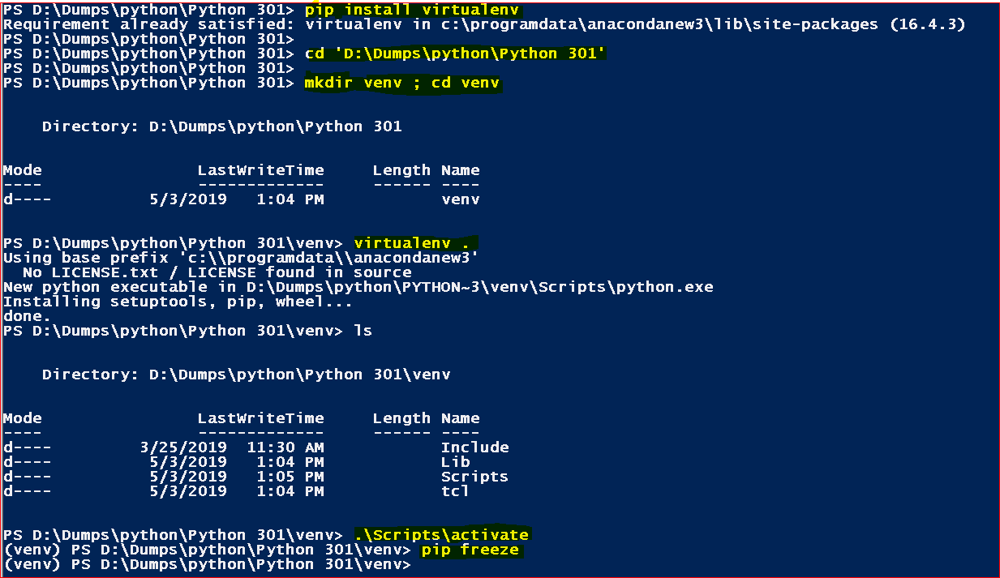

  * Step 3 : Install ***Django***and Configure a Project
    * Install Django - ***pip install django==1.11.5 --trusted-host pypi.org --trusted-host files.pythonhosted.org***
    * Create a source folder for the ECommerce project - ***mkdir src ; cd src***
    * Run Django admin file - ***django-admin startproject ecommhome .***
    * Run the server - ***python manage.py runserver***
    * If you get this error - ***\lib\site-packages\django\contrib\admin\widgets.py", line 152 , '%s=%s' % (k, v) for k, v in params.items(), SyntaxError: Generator expression must be parenthesized***
      * Then in file 'lib\site-packages\django\contrib\admin\widgets.py' update line 'related_url += '?' + '&amp;'.join('%s=%s' % (k, v) for k, v in params.items(),)' to 'related_url += '?' + '&amp;'.join('%s=%s' % (k, v) for k, v in params.items())'
      ```
      pip install django==1.11.5 --trusted-host pypi.org --trusted-host files.pythonhosted.org
      mkdir src ; cd src
      django-admin startproject ecommhome .
      python manage.py runserver
      ```
      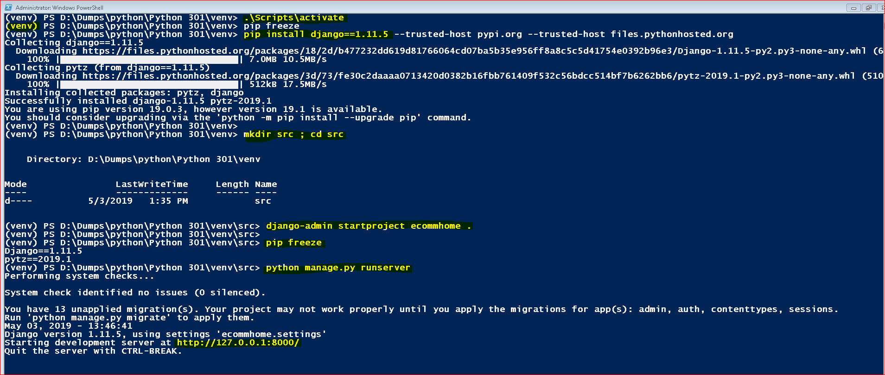
    
    
### Testing the Django App:
  * Check the URL  of the server where it is running after you executed this - python manage.py runserver 
  * Open and execute the URL in a browser. If you get a 'Congrats' window, it means that your Django is installed, configured properly and your first app is running
  * 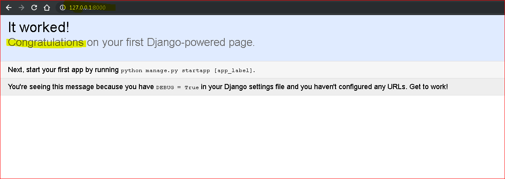

### Creating your first Django App(with a custom view):
  * Please follow the steps below to create your first Django app with a custom view 
    * Step 1: ***Create a view*** file - myviews.py - (this file will render some the content)
      * Import ***HttpResponse*** from django.http and ***render*** from django.shortcuts
      * Define the ***myhome*** view and return a HttpResponse
      ```
      from django.http import HttpResponse
      from django.shortcuts import render

      # to render your first view
      def myhome(request):
          content = "<html><head><title>My First Django Home</title></head><body><h1>My First Django Home</h1></body></html>"
          return HttpResponse(content)
      ```
    * Step 2: Update URL Patterns file - urls.py - (this file will have the route for myhome)
      * Import ***myhome*** from your myviews file 
      * Add ***url(r'^$', myhome)*** as a new pattern where pattern ***r'^$'*** refers to ***myhome***
      ```
      from django.conf.urls import url
      from django.contrib import admin

      from .myviews import myhome # importing myhome from myviews.py

      urlpatterns = [
          url(r'^$', myhome), # adding the myhome URL to the URL patterns
          url(r'^admin/', admin.site.urls),
      ])
      ```
    * Step 3: Execute the app - url
      * 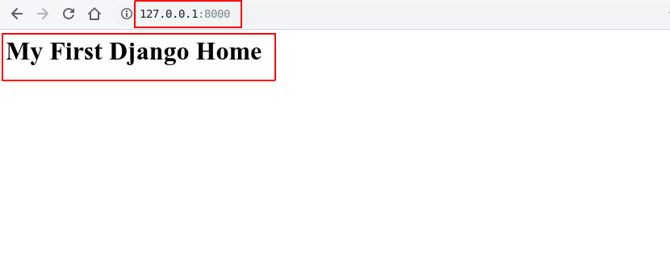
  
      
    

