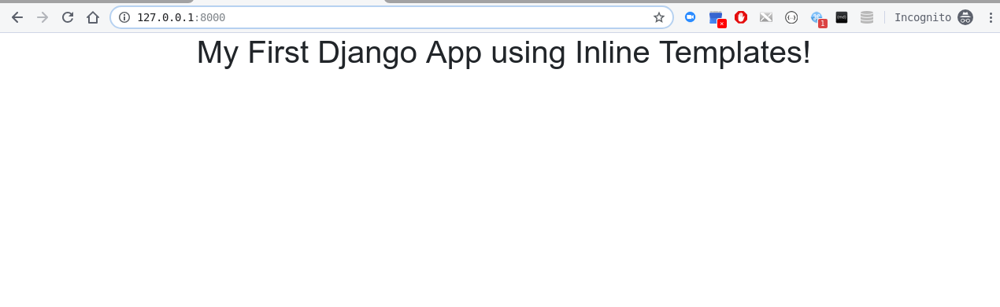
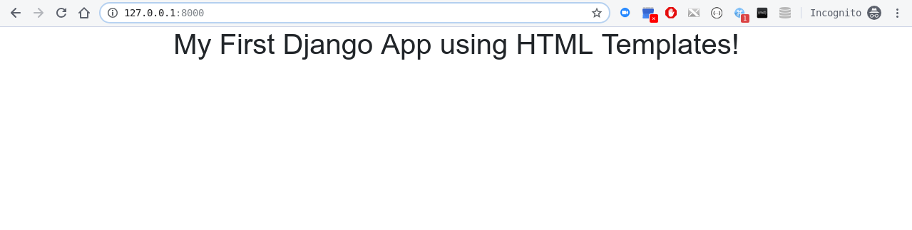
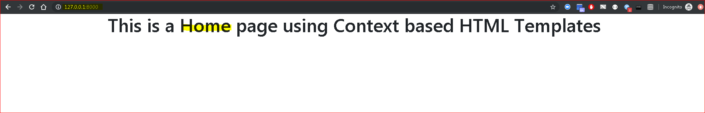
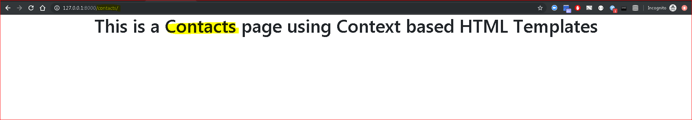

### How to use Templates in Django(Version 1 : Inline Template):

  * Step 1 : Copy the starter template from - ***https://getbootstrap.com/docs/4.3/getting-started/introduction/*** and replace with in existing content in variable - content in the file ***myviews.py***
    ```
    from django.http import HttpResponse
    from django.shortcuts import render

    # define the custom home page 
    def myhome(request):
        content = """
        <!doctype html>
        <html lang="en">
        <head>
            <!-- Required meta tags -->
            <meta charset="utf-8">
            <meta name="viewport" content="width=device-width, initial-scale=1, shrink-to-fit=no">

            <!-- Bootstrap CSS -->
            <link rel="stylesheet" href="https://stackpath.bootstrapcdn.com/bootstrap/4.3.1/css/bootstrap.min.css" integrity="sha384-ggOyR0iXCbMQv3Xipma34MD+dH/1fQ784/j6cY/iJTQUOhcWr7x9JvoRxT2MZw1T" crossorigin="anonymous">

            <title>My First Django App using Inline Templates!</title>
        </head>
        <body>
            <div class="text-center">
                <h1>My First Django App using Inline Templates!</h1>
            </div>
            <!-- Optional JavaScript -->
            <!-- jQuery first, then Popper.js, then Bootstrap JS -->
            <script src="https://code.jquery.com/jquery-3.3.1.slim.min.js" integrity="sha384-q8i/X+965DzO0rT7abK41JStQIAqVgRVzpbzo5smXKp4YfRvH+8abtTE1Pi6jizo" crossorigin="anonymous"></script>
            <script src="https://cdnjs.cloudflare.com/ajax/libs/popper.js/1.14.7/umd/popper.min.js" integrity="sha384-UO2eT0CpHqdSJQ6hJty5KVphtPhzWj9WO1clHTMGa3JDZwrnQq4sF86dIHNDz0W1" crossorigin="anonymous"></script>
            <script src="https://stackpath.bootstrapcdn.com/bootstrap/4.3.1/js/bootstrap.min.js" integrity="sha384-JjSmVgyd0p3pXB1rRibZUAYoIIy6OrQ6VrjIEaFf/nJGzIxFDsf4x0xIM+B07jRM" crossorigin="anonymous"></script>
        </body>
        </html>
        """
        return HttpResponse(content)

    ```
  * Step 2 : The above inline template HTML uses bootstrap and jquery to style and show the page in a better way
    


### How to use Templates in Django(Version 2 : HTML Template):

  * Step 1 : First of all in the ***settings.py*** in the ***TEMPLATES*** section, update the ***'DIRS'*** to define a template folder - ***'DIRS': [os.path.join(BASE_DIR, 'templates')]***
    ```
    TEMPLATES = [
      {
          'BACKEND': 'django.template.backends.django.DjangoTemplates',
          'DIRS': [os.path.join(BASE_DIR, 'templates')],
          'APP_DIRS': True,
          'OPTIONS': {
              'context_processors': [
                  'django.template.context_processors.debug',
                  'django.template.context_processors.request',
                  'django.contrib.auth.context_processors.auth',
                  'django.contrib.messages.context_processors.messages',
              ],
          },
      },
    ]
    ```
  * Step 2 : Create a folder  ***templates*** under ***src***, and create a file ***myhomepage.html*** and copy the HTML Content in that file
    ```
      <!doctype html>
        <html lang="en">
        <head>
            <!-- Required meta tags -->
            <meta charset="utf-8">
            <meta name="viewport" content="width=device-width, initial-scale=1, shrink-to-fit=no">

            <!-- Bootstrap CSS -->
            <link rel="stylesheet" href="https://stackpath.bootstrapcdn.com/bootstrap/4.3.1/css/bootstrap.min.css" integrity="sha384-ggOyR0iXCbMQv3Xipma34MD+dH/1fQ784/j6cY/iJTQUOhcWr7x9JvoRxT2MZw1T" crossorigin="anonymous">

            <title>My First Django App using HTML Templates!</title>
        </head>
        <body>
            <div class="text-center">
                <h1>My First Django App using HTML Templates!</h1>
            </div>
            <!-- Optional JavaScript -->
            <!-- jQuery first, then Popper.js, then Bootstrap JS -->
            <script src="https://code.jquery.com/jquery-3.3.1.slim.min.js" integrity="sha384-q8i/X+965DzO0rT7abK41JStQIAqVgRVzpbzo5smXKp4YfRvH+8abtTE1Pi6jizo" crossorigin="anonymous"></script>
            <script src="https://cdnjs.cloudflare.com/ajax/libs/popper.js/1.14.7/umd/popper.min.js" integrity="sha384-UO2eT0CpHqdSJQ6hJty5KVphtPhzWj9WO1clHTMGa3JDZwrnQq4sF86dIHNDz0W1" crossorigin="anonymous"></script>
            <script src="https://stackpath.bootstrapcdn.com/bootstrap/4.3.1/js/bootstrap.min.js" integrity="sha384-JjSmVgyd0p3pXB1rRibZUAYoIIy6OrQ6VrjIEaFf/nJGzIxFDsf4x0xIM+B07jRM" crossorigin="anonymous"></script>
        </body>
        </html>
    ```
  * Step 3 : Update the 'myhome' method to ***render the HTML file*** by using command - ***return render(request, "myhomepage.html", {})***
    ```
    # define the custom home page 
    def myhome(request):
        return render(request, "myhomepage.html", {})
    ```
    

### How to use Templates in Django(Version 3 : HTML Template using Context):
  * Django allows you to use '***Context***' to dynamically pass context information to different view and reuse the information
  * Step 1 : First of all in the ***myviews.py***, create 2 more views for ***contacts*** and ***aboutus***
    * Use the context object to pass different context information to each view e,g different ***title*** and **mainheader***
    * Use ***return render(request, "myhomepage.html", context)*** to pass that context to the view ***myhomepage.html***
    ```
    from django.http import HttpResponse
    from django.shortcuts import render

    # define the custom home page 
    def myhome(request):
        pageContext = {
            'title': 'My Home Page',
            'mainheader': 'This is a Home page using Context based HTML Templates'
        }
        return render(request, "myhomepage.html", pageContext)

    # define the custom contacts page 
    def mycontacts(request):
        pageContext = {
            'title': 'My Contacts Page',
            'mainheader': 'This is a Contacts page using Context based HTML Templates'
        }
        return render(request, "myhomepage.html", pageContext)

    # define the custom aboutus page 
    def myaboutus(request):
        pageContext = {
            'title': 'My About Us Page',
            'mainheader': 'This is a About Us page using Context based HTML Templates'
        }
        return render(request, "myhomepage.html", pageContext)
    ```
  * Step 2 : In the  ***urls.py*** file, and create a file 
    * Import the views for contacts and about us  - ***from .myviews import myhome, mycontacts, myaboutus***
    * also add the URL Pattern for contacts and about us - ***url(r'^contacts/$', mycontacts), url(r'^aboutus/$', myaboutus),***
    ```
    from django.conf.urls import url
    from django.contrib import admin

    # import the custom view 
    from .myviews import myhome, mycontacts, myaboutus

    urlpatterns = [
        url(r'^$', myhome),
        url(r'^contacts/$', mycontacts),
        url(r'^aboutus/$', myaboutus),
        url(r'^admin/', admin.site.urls),
    ]
    ```
  * Step 3 : In the view file  ***myhomepage.html***
    * Update the title tag as - ***<title>{{title}}</title>***
    * Update the h1 tag as - <h1>{{mainheader}}</h1>
    ```
    <!doctype html>
    <html lang="en">
    <head>
        <!-- Required meta tags -->
        <meta charset="utf-8">
        <meta name="viewport" content="width=device-width, initial-scale=1, shrink-to-fit=no">

        <!-- Bootstrap CSS -->
        <link rel="stylesheet" href="https://stackpath.bootstrapcdn.com/bootstrap/4.3.1/css/bootstrap.min.css" integrity="sha384-ggOyR0iXCbMQv3Xipma34MD+dH/1fQ784/j6cY/iJTQUOhcWr7x9JvoRxT2MZw1T" crossorigin="anonymous">

        <title>{{title}}</title>
    </head>
    <body>
        <div class="text-center">
            <h1>{{mainheader}}</h1>
        </div>
        <!-- Optional JavaScript -->
        <!-- jQuery first, then Popper.js, then Bootstrap JS -->
        <script src="https://code.jquery.com/jquery-3.3.1.slim.min.js" integrity="sha384-q8i/X+965DzO0rT7abK41JStQIAqVgRVzpbzo5smXKp4YfRvH+8abtTE1Pi6jizo" crossorigin="anonymous"></script>
        <script src="https://cdnjs.cloudflare.com/ajax/libs/popper.js/1.14.7/umd/popper.min.js" integrity="sha384-UO2eT0CpHqdSJQ6hJty5KVphtPhzWj9WO1clHTMGa3JDZwrnQq4sF86dIHNDz0W1" crossorigin="anonymous"></script>
        <script src="https://stackpath.bootstrapcdn.com/bootstrap/4.3.1/js/bootstrap.min.js" integrity="sha384-JjSmVgyd0p3pXB1rRibZUAYoIIy6OrQ6VrjIEaFf/nJGzIxFDsf4x0xIM+B07jRM" crossorigin="anonymous"></script>
    </body>
    </html>
    ```
  * Step 4 : Now test the home, contacts and about us pages as:
    * Home page - http://127.0.0.1:8000
    * Contacts page - http://127.0.0.1:8000/contacts
    * Home page - http://127.0.0.1:8000/aboutus
  
    
    ________________________________________________________________________________________________________________
    
    ________________________________________________________________________________________________________________
    
    ________________________________________________________________________________________________________________