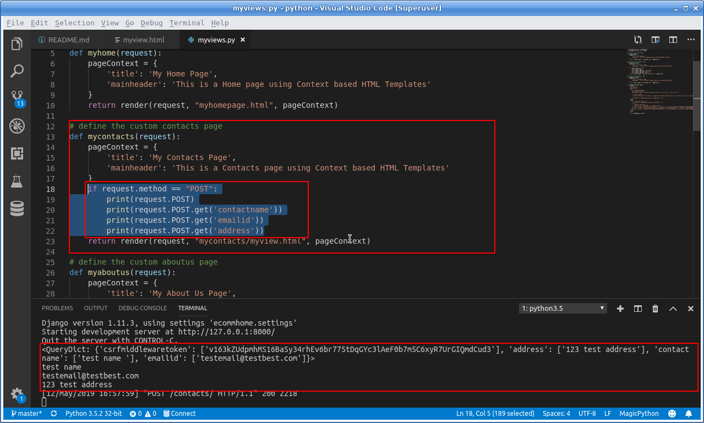
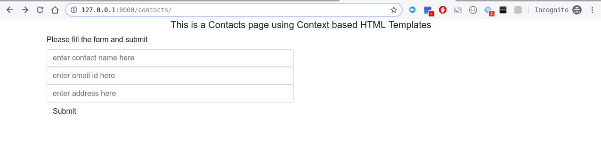
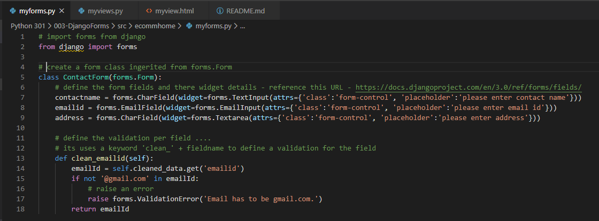
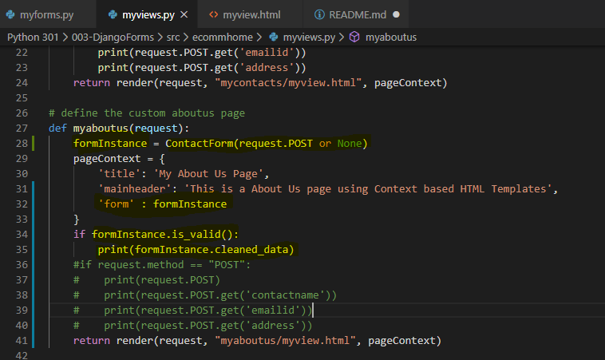
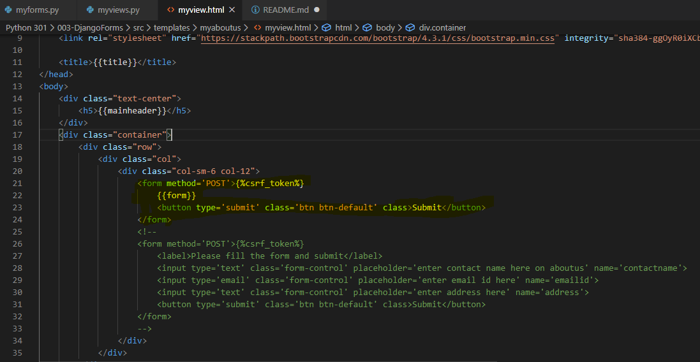
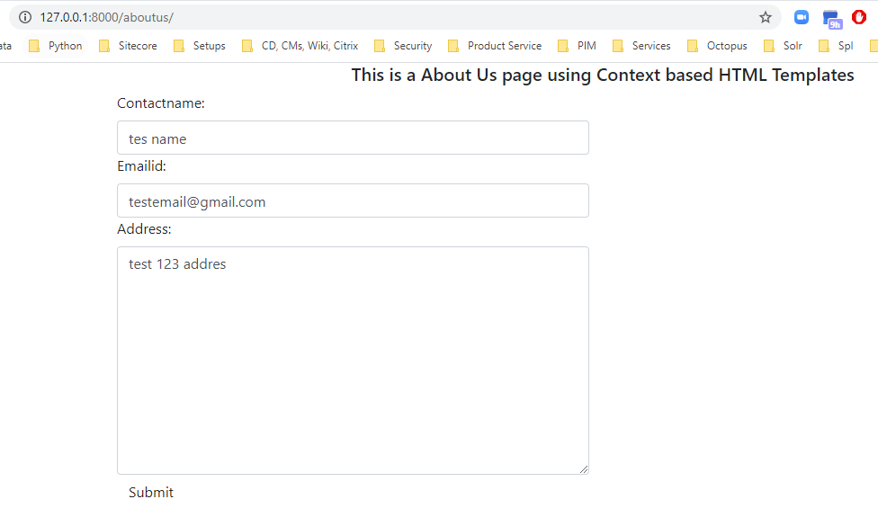

### How to use Forms in Django(Version 1 : Basic Forms):

  * Step 1 : Update ***mycontacts*** function in ***myviews.py***
    * Add a new view for contact us and also create the view under a 'mycontacts' folder under the main template folder.
    * See this line for reference to create veiw inside specific folder - return render(request, "***mycontacts/myview.html***", pageContext)
    * See the snapshot below on how to handle a POST request in code and how does the POST request shows in logs
    
    * Here is the full code for ***myviews.py***
    ```
    from django.http import HttpResponse
    from django.shortcuts import render

    # define the custom home page 
    def myhome(request):
        pageContext = {
            'title': 'My Home Page',
            'mainheader': 'This is a Home page using Context based HTML Templates'
        }
        return render(request, "myhomepage.html", pageContext)

    # define the custom contacts page 
    def mycontacts(request):
        pageContext = {
            'title': 'My Contacts Page',
            'mainheader': 'This is a Contacts page using Context based HTML Templates'
        }
        if request.method == "POST":
        print(request.POST)
        print(request.POST.get('contactname'))
        print(request.POST.get('emailid'))
        print(request.POST.get('address'))
        return render(request, "mycontacts/myview.html", pageContext)

    # define the custom aboutus page 
    def myaboutus(request):
        pageContext = {
            'title': 'My About Us Page',
            'mainheader': 'This is a About Us page using Context based HTML Templates'
        }
        return render(request, "myhomepage.html", pageContext)

    ```

  * Step 2 : Add a HTML form in the ***mycontacts/myview.html***
    * The important section of the HTML file is the HTML form which has a text input box, email input box, an address inout box and a button to submit the information.
    ```
    <div class="container">
        <div class="row">
            <div class="col">
                <div class="col-sm-6 col-12">
                    <form>
                        <label>Please fill the form and submit</label>
                        <input type='text' class='form-control' placeholder='enter contact name here' name='contactname'>
                        <input type='email' class='form-control' placeholder='enter email id here' name='emailid'>
                        <input type='text' class='form-control' placeholder='enter address here' name='address'>
                        <button type='submit' class='btn btn-default' class>Submit</button>
                    </form>
                </div>
            </div>
        </div>
    </div>
    ```
    * Below is the full code of the file - 
    ```
    <!doctype html>
    <html lang="en">
    <head>
        <!-- Required meta tags -->
        <meta charset="utf-8">
        <meta name="viewport" content="width=device-width, initial-scale=1, shrink-to-fit=no">

        <!-- Bootstrap CSS -->
        <link rel="stylesheet" href="https://stackpath.bootstrapcdn.com/bootstrap/4.3.1/css/bootstrap.min.css" integrity="sha384-ggOyR0iXCbMQv3Xipma34MD+dH/1fQ784/j6cY/iJTQUOhcWr7x9JvoRxT2MZw1T" crossorigin="anonymous">

        <title>{{title}}</title>
    </head>
    <body>
        <div class="text-center">
            <h5>{{mainheader}}</h5>
        </div>
        <div class="container">
            <div class="row">
                <div class="col">
                    <div class="col-sm-6 col-12">
                        <form>
                            <label>Please fill the form and submit</label>
                            <input type='text' class='form-control' placeholder='enter contact name here' name='contactname'>
                            <input type='email' class='form-control' placeholder='enter email id here' name='emailid'>
                            <input type='text' class='form-control' placeholder='enter address here' name='address'>
                            <button type='submit' class='btn btn-default' class>Submit</button>
                        </form>
                    </div>
                </div>
            </div>
        </div>

        <!-- Optional JavaScript -->
        <!-- jQuery first, then Popper.js, then Bootstrap JS -->
        <script src="https://code.jquery.com/jquery-3.3.1.slim.min.js" integrity="sha384-q8i/X+965DzO0rT7abK41JStQIAqVgRVzpbzo5smXKp4YfRvH+8abtTE1Pi6jizo" crossorigin="anonymous"></script>
        <script src="https://cdnjs.cloudflare.com/ajax/libs/popper.js/1.14.7/umd/popper.min.js" integrity="sha384-UO2eT0CpHqdSJQ6hJty5KVphtPhzWj9WO1clHTMGa3JDZwrnQq4sF86dIHNDz0W1" crossorigin="anonymous"></script>
        <script src="https://stackpath.bootstrapcdn.com/bootstrap/4.3.1/js/bootstrap.min.js" integrity="sha384-JjSmVgyd0p3pXB1rRibZUAYoIIy6OrQ6VrjIEaFf/nJGzIxFDsf4x0xIM+B07jRM" crossorigin="anonymous"></script>
    </body>
    </html>
    ```

  * Step 3 : Now test the new contacts page:
    * Contacts page - http://127.0.0.1:8000/contacts
    

### How to use Forms in Django(Version 2 : Django Forms):

  * Step 1 : Create a  ***Django Form class***
    * The Django form is an effecient way generate and validate forms
    * The form defines the fields and the widget details of the fields and also the validation.
    * Please use the link to check the field types and widget details of the form fields - ***https://docs.djangoproject.com/en/3.0/ref/forms/fields/***
    
    * Here is the full code for ***myviews.py***
    ```
    # import forms from django
    from django import forms

    # create a form class ingerited from forms.Form
    class ContactForm(forms.Form):
        # define the form fields and there widget details - reference this URL - https://docs.djangoproject.com/en/3.0/ref/forms/fields/
        contactname = forms.CharField(widget=forms.TextInput(attrs={'class':'form-control', 'placeholder':'please enter contact name'}))
        emailid = forms.EmailField(widget=forms.EmailInput(attrs={'class':'form-control', 'placeholder':'please enter email id'}))
        address = forms.CharField(widget=forms.Textarea(attrs={'class':'form-control', 'placeholder':'please enter address'}))

        # define the validation per field ....
        # its uses a keyword 'clean_' + fieldname to define a validation for the field
        def clean_emailid(self):
            emailId = self.cleaned_data.get('emailid')
            if not '@gmail.com' in emailId:
                # raise an error 
                raise forms.ValidationError('Email has to be gmail.com.')
            return emailId

    ```

  * Step 2 : ***Instantiate the form*** and add the form in the contect dictionary 
    * First of all a form instance is created using - ***formInstance = ContactForm(request.POST or None)***
    * Then, we pass this form to the Page Context, so that it can be used as a context variable
    * To check if the form is valid or not , we use - ***formInstance.is_valid()***
    * To get the valid posted data, we use - ***formInstance.cleaned_data***
    * Please see the code below:
    ```
    # define the custom aboutus page 
    def myaboutus(request):
    formInstance = ContactForm(request.POST or None)
    pageContext = {
        'title': 'My About Us Page',
        'mainheader': 'This is a About Us page using Context based HTML Templates',
        'form' : formInstance
    }
    if formInstance.is_valid():
        print(formInstance.cleaned_data)
    #if request.method == "POST":
    #    print(request.POST)
    #    print(request.POST.get('contactname'))
    #    print(request.POST.get('emailid'))
    #    print(request.POST.get('address'))
    return render(request, "myaboutus/myview.html", pageContext)

    ```
    

  * Step 3 : ***Use form context variable*** in the view
    * First of all a form instance is created using - ***formInstance = ContactForm(request.POST or None)***
    * Please see the code below:
    ```
    <form method='POST'>
        {{form}}
        <button type='submit' class='btn btn-default' class>Submit</button>
    </form>

    ```
    
  * Step 4 : Now test the new About Us page:
    * AboutUs page - http://127.0.0.1:8000/aboutus
    

