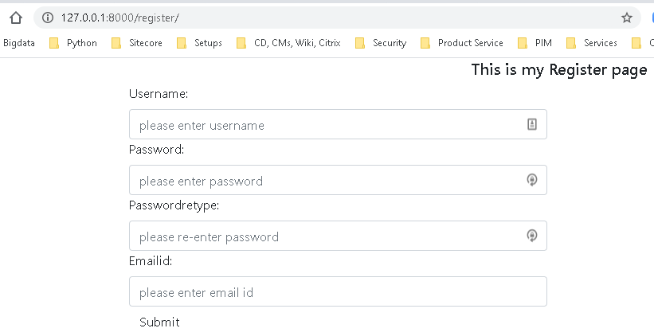

### How to use Login Form in Django: 

*** Note - The documentation for Login and Register user is given at - https://docs.djangoproject.com/en/3.0/topics/auth/default/#how-to-log-a-user-in ***

  * Step 1 : Create a ***Login Class***
    * Add a new view for contact us and also create the view under a 'mycontacts' folder under the main template folder.
    * Here is the code snippet for the ***LOginForm Class*** in file 'myforms.py':
    ```
    from django.contrib.auth import get_user_model

    User = get_user_model()    

    # create a form class ingerited from forms.Form for Login Form
    class LoginForm(forms.Form):
        username = forms.CharField(widget=forms.TextInput(attrs={'class':'form-control', 'placeholder':'please enter username'}))
        password = forms.CharField(widget=forms.PasswordInput(attrs={'class':'form-control', 'placeholder':'please enter password'}))
    ```

  * Step 2 : Define the handler method for the Login page in file 'myviews.py'
    * Here is the code snippet for the 'mylogin' method.
    * First create an instance of the LoginForm class - ***formInstance = LoginForm(request.POST or None)***
    * The method used to authenticate a user is - ***user = authenticate(request, username=username, password=password)***
    * The method to login a user - ***login(request, user)***
    ```
    from django.http import HttpResponse
    from django.shortcuts import render, redirect
    from .myforms import ContactForm, LoginForm, RegisterForm
    from django.contrib.auth.models import User

    # define the custom login page 
    def mylogin(request):
        formInstance = LoginForm(request.POST or None)
        pageContext = {
            'title': 'My Login Page',
            'mainheader': 'This is my Login page',
            'form' : formInstance
        }
        if formInstance.is_valid():
            #print(formInstance.cleaned_data)
            print("Is user logged in:" + str(request.user.is_authenticated()))
            print(formInstance.cleaned_data)

            username = formInstance.cleaned_data['username']
            password = formInstance.cleaned_data['password']
            user = authenticate(request, username=username, password=password)
            if user is not None: 
                login(request, user)
                pageContext= LoginForm(request.POST or None)
                print("Is user logged in:" + str(request.user.is_authenticated()))
                return redirect("/")
            else:
                print("Error: could not authenticate user")
        return render(request, "auth/mylogin.html", pageContext)
    ```
  * Step 3 : Create a view for Login **auth/mylogin.html***:
    * The code section handling the Login form is below:
    ```
    <form method='POST'>
        {{form}}
        <button type='submit' class='btn btn-default' class>Submit</button>
    </form>
    ```

  * Step 4 : Create a ***super user***:
    * A super user needs to be created to perform the admin tasks.
    * Command for creating a super user : ***python .\manage.py createsuperuser***
    

  * Step 5 : Now test the new login page:
    * Contacts page - http://127.0.0.1:8000/login
    


### How to use LRegister Form in Django: 

*** Note - The documentation for Login and Register user is given at - https://docs.djangoproject.com/en/3.0/topics/auth/default/#how-to-log-a-user-in ***

  * Step 1 : Create a ***Register Class***
    * Here is the code snippet for the ***RegisterForm Class*** in file 'myforms.py':
    ```
    from django.contrib.auth import get_user_model

    User = get_user_model()    

    # create a form class ingerited from forms.Form for Register Form
    class RegisterForm(forms.Form):
        username = forms.CharField(widget=forms.TextInput(attrs={'class':'form-control', 'placeholder':'please enter username'}))
        password = forms.CharField(widget=forms.PasswordInput(attrs={'class':'form-control', 'placeholder':'please enter password'}))
        passwordretype = forms.CharField(widget=forms.PasswordInput(attrs={'class':'form-control', 'placeholder':'please re-enter password'}))
        emailId = forms.CharField(widget=forms.EmailInput(attrs={'class':'form-control', 'placeholder':'please enter email id'}))

        def clean_username(self):
            username = self.cleaned_data.get('username')
            user = User.objects.filter(username=username)
            if user.exists():
                raise forms.ValidationError("User Name Already Exists.")
            return username

        def clean_emailId(self):
            emailid = self.cleaned_data.get('emailId')
            email = User.objects.filter(email=emailid)
            if email.exists():
                raise forms.ValidationError("Email ID Already Exists.")
            return emailid
        
        def clean(self):
            formmdata = self.cleaned_data
            password = self.cleaned_data.get('password')
            passwordretype = self.cleaned_data.get('passwordretype')
            if password != passwordretype :
                raise forms.ValidationError("Passwords don't match.")
            return formmdata
    ```

  * Step 2 : Define the handler method for the Register page in file 'myviews.py'
    * Here is the code snippet for the 'myregister' method.
    * First create an instance of the RegisterForm class - ***formInstance = LoginForm(request.POST or None)***
    * The method to register a user - *** created_user = User.objects.create_user(username, emailId, password)***
    ```
    from django.http import HttpResponse
    from django.shortcuts import render, redirect
    from .myforms import ContactForm, LoginForm, RegisterForm
    from django.contrib.auth.models import User
    
    # define the custom register page 
    def myregister(request):
        formInstance = RegisterForm(request.POST or None)
        pageContext = {
            'title': 'My Register Page',
            'mainheader': 'This is my Register page',
            'form' : formInstance
        }
        if formInstance.is_valid():
            username = formInstance.cleaned_data['username']
            password = formInstance.cleaned_data['password']
            passwordretype = formInstance.cleaned_data['passwordretype']
            emailId = formInstance.cleaned_data['emailId']
            created_user = User.objects.create_user(username, emailId, password)
            print(created_user)
        return render(request, "auth/myregister.html", pageContext)
    ```
  * Step 3 : Create a view for Login **auth/myregister.html***:
    * The code section handling the Login form is below:
    ```
    <form method='POST'>
        {{form}}
        <button type='submit' class='btn btn-default' class>Submit</button>
    </form>
    ```

  * Step 4 : Now test the new register page:
    * Contacts page - http://127.0.0.1:8000/register
    