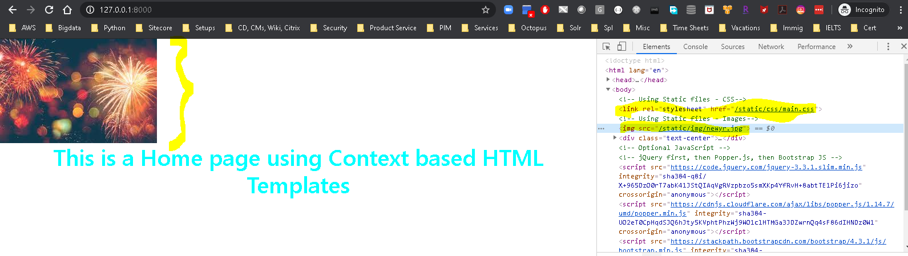

### How to use Local CDNs in Django: 
  * Step 1 : ***Update the configs*** ( settings.py and urls.py )
    * In ***Settings.py***:
      * Define static root and media root folders.
      * "Static_cdn" folder behave like a Static content server in development environment.
      * In prod environment, the files will be served from a CDN e.g. S3, CloudFront etc
      ```
      # Static files (CSS, JavaScript, Images)
      # https://docs.djangoproject.com/en/1.11/howto/static-files/

      STATIC_URL = '/static/'

      STATICFILES_DIRS = [
          os.path.join(BASE_DIR, "static_local"),
      ]

      STATIC_ROOT = os.path.join(os.path.dirname(BASE_DIR), "static_cdn", "static_root")

      MEDIA_URL = '/media/'
      MEDIA_ROOT = os.path.join(os.path.dirname(BASE_DIR), "static_cdn", "media_root")
      ```
    * In ***urls.py***:
      * Update urlpatterns to add static root and media root.
      * This setting should work only in development envs development environment as Debug=True
      * In prod environment since as Debug=False, This setting should not be enables
      ```
      if settings.DEBUG:
        urlpatterns = urlpatterns + static(settings.STATIC_URL, document_root=settings.STATIC_ROOT)
        urlpatterns = urlpatterns + static(settings.MEDIA_URL, document_root=settings.MEDIA_ROOT)
      ```

  * Step 2 : Use the static content in html:
    * In the top of the page use a template directive to load static content - ******
    * Use of static CSS - ***<link rel="stylesheet" href=''>***
    * Use of static images - ******
    ```
    <!-- Using Static files - CSS-->
    <link rel="stylesheet" href=''>
    <!-- Using Static files - Images-->
    
    ```

  * Step 3 : Genarete static content:
    * Now in the projects static folder ***static_local*** create respective folders for css, js, img etc and add required css, js, image files.
    * Command for generating/updating static content to the local CDN server ( ***static_cdn*** ) : ***python .\manage.py collectstatic***
    * It pulls all the staic content from the source static content folders into the local CDN folder

  * Step 4 : Now test the static files at work:
    * Contacts page - http://127.0.0.1:8000/
    