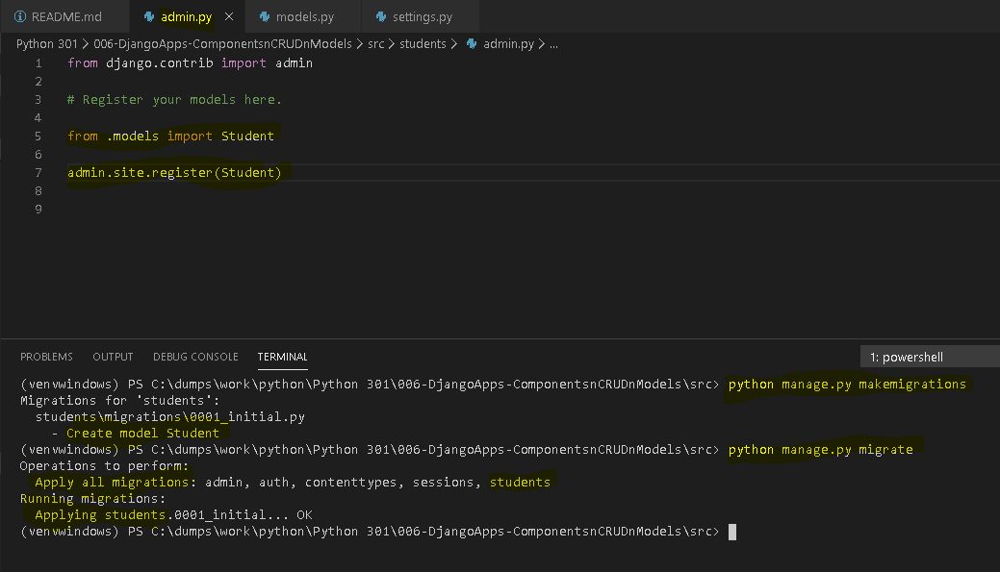
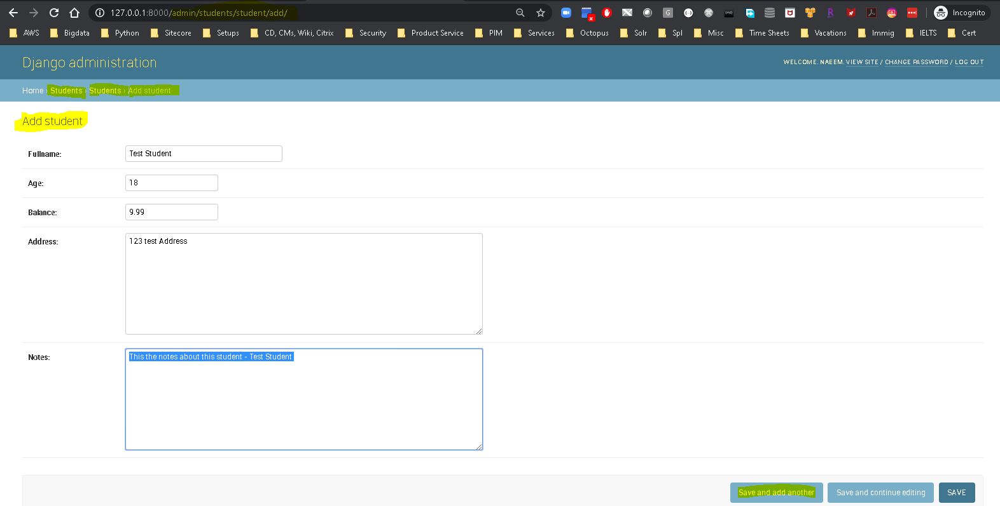

### How to use Django Apps: 
  * A web application/web site is made up of components. 
    * In Django, they are called ***Django Apps***
    * A default Django app is mde up of  some predifined apps e.g. ***admin and auth apps***
      * The ***INSTALLED_APPS*** section in "settings.py" provides a list of existing apps
    * To craete a new app by the name products - ***python manage.py startapp products***
      * Create a folder named 'products' and create all the config and other files
    * To craete a new app by the name movies - ***python manage.py startapp movies***


  * What is ***CRUD***:
    * CRUD stands for the below operations which are executed while interacting with a model and data from databases:
      * ***CREATE*** - POST  - creates a new object and saves to DB
      * ***RETRIEVE*** - GET ( Search or List) - searches the DB for specific or all objects 
      * ***UPDATE*** - PUT - updates an existing object into DB
      * ***DELETE*** - DELETE - deletes an object from the DB

  * Adding the custom app to the list of installed apps in ***Settings.py***:
    * Here is the code:
      ```
      # Application definition

      INSTALLED_APPS = [
          'django.contrib.admin',
          'django.contrib.auth',
          'django.contrib.contenttypes',
          'django.contrib.sessions',
          'django.contrib.messages',
          'django.contrib.staticfiles',

          # custom apps list goes here: ( the name of the app we created is "students")
          'students'  
      ]
      ```
  * What is a ***model***:
    * Just like Django form class where we used to define the fields. Models are used to defined the business object
    * Below is the code for a ***Student*** Model:
      ```
      from django.db import models

      # Create your custom models here.
      class Student(models.Model):
          
          # define the model fiellds
          fullname = models.CharField(max_length=100)
          age = models.DecimalField(max_digits=10, decimal_places=0)
          balance = models.DecimalField(max_digits=10, decimal_places=2, default=9.99)
          address = models.TextField()
          notes = models.TextField()

          # define the string constructor
          def __str__(self):
              return self.fullname
      ```
    * The Django field references can be found here - ***https://docs.djangoproject.com/en/3.0/ref/models/fields/***

   * Register ***model***:
    * ***Register the model*** so that it can be used 
      ```
      from django.contrib import admin

      # Register your models here.

      from .models import Student

      admin.sites.register(Student)
      ```

  * Genarete the migrated content:
    * Two commands are used to migrate content 
      * ***python manage.py makemigrations*** and
      * ***python manage.py migrate*** 
      

  * Now test the CRUD operations on the Student Model:
    * Contacts page - http://127.0.0.1:8000/admin
    
    
    