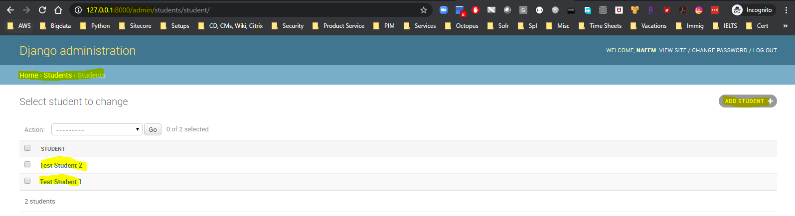
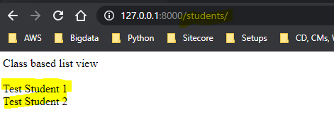
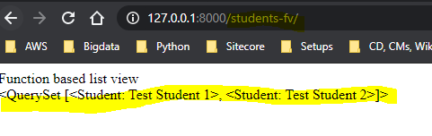
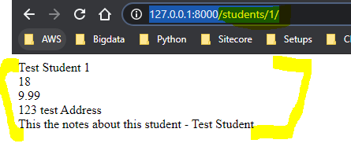
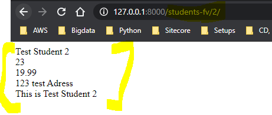

### How to use ListView and DetailView in Django: 
  * The ***ListView*** is used to  display list of objects
  * The ***DetailView*** is used to  display list of objects details based on an id or primary key
    * E.g. The use of ***ListView***  can be to show list of all students and that of ***DetailView*** can be to show details of each student when clicked
  * Lets setup a ListView and a DetailView:
  * Step 1 : ***Create a view class for Listview and DetailView***
    * First of all we need to import the ListView and DetailView - ***from django.views.generic import ListView, DetailView***
    * Then we will import the Student model too - ***from django.views.generic import ListView, DetailView***
    * Then create a class based view StudentListView inheriting from ListView- ***class StudentListView(ListView)***
    * Also create a functioned based view - ***Student_ListView***
    * Then create a class based view StudentListView inheriting from ListView- ***class StudentDetailView(DetailView)***
    * Also create a functioned based view - ***Student_DetailView***
    * To retrieve the context data in a class based view use a fucntion - ***def get_context_data(self, *args, **kwargs):*** 
    * In the function get the context by calling - ***context = super(StudentListView, self).get_context_data(*args, **kwargs)***
    * The function based view will be as usual as we did before
    ```
    from django.shortcuts import render, get_object_or_404

    # add reference for ListView and DetailView
    from django.views.generic import ListView, DetailView
    from .models import Student

    # Create your views here.
    # Please note that this one is the first "class" based view as until now we havd been creating function based views

    # class based view
    class StudentListView(ListView):
        # this is one liner which all you need
        #querySet = Student.objects.all()
        template_name= "student/student_listview.html"

        # Every Django view class will have this method to get the context data
        def get_context_data(self, *args, **kwargs):
            # function to get the contect data
            context = super(StudentListView, self).get_context_data(*args, **kwargs)
            print(context)
            # Incase you need to update the context by adding a few more keys
            context['vw_type'] = "Class based list view"
            return context
    
        # function to get the queryset
        def get_queryset(self):
            return Student.objects.all()

    #function based view

    # has you written a function based view it would have been something like below
    # The class based view above is 1 liner and the function based view below is 5 liner
    def Student_ListView(request):
        querySet = Student.objects.all()
        context = {
            'vw_type': "Function based list view",
            'qs' : querySet
        }
        return render(request, "student/student_listview.html", context)


    #class based view
    class StudentDetailView(DetailView):
        # this is one liner which all you need
        querySet = Student.objects.all()
        template_name= "student/student_detailview.html"

        # Every Django view class will have this method to get the context data
        def get_context_data(self,*args, **kwargs):
            context = super(StudentDetailView, self).get_context_data(*args, **kwargs)
            print(context)
            context['vw_type'] = "Class based detail view"
            return context
    
        def get_queryset(self):
            return Student.objects.all()


    # function based view
    def Student_DetailView(request, pk=None, *args, **kwargs):
        #objStud = Student.objects.get(id=pk)
        objStud = get_object_or_404(Student, pk=pk)
        context = {
            'vw_type': "Function based detailview",
            'object' : objStud
        }
        print(context)
        return render(request, "student/student_detailview.html", context)
    ```
  * Step 2 Update the URL patterns in ***urls.py*** :
    * Import the class and function based views 
    ```
    from students.views import StudentListView, Student_ListView, StudentDetailView, Student_DetailView
    ```
    * Add the below URL patterns - 
      * ***students*** is used for class based list view e.g. student/
      * ***students-fv*** is used for function based list view e.g. student-fv/
      * ***students/(?P<pk>\d+)/$*** is used for class based detail view e.g. student/1/
      * ***students-fv/(?P<pk>\d+)/$*** is used for class based detail view e.g. student-fv/1/

    ```
    # urls for list view
    url(r'^students/$', StudentListView.as_view()),
    url(r'^students-fv/$', Student_ListView),

    #urls for detail view ( use Regex so that for detailview we can pass id/primarykey)
    url(r'^students/(?P<pk>\d+)/$', StudentDetailView.as_view()),
    url(r'^students-fv/(?P<pk>\d+)/$', Student_DetailView),
    ```
  * Step 3 : Create views for the ListView and DetailView:
    * View for ListView - it will iterate through ***object_list*** context object
    ```
    {{vw_type}}<br/>
    {{qs}}<br/>

    <!--{{paginator}}-->
    <!--{{is_paginated}}-->
    <!--{{object_list}}-->

    
    
    {{stud.fullname}}<br/>
    
    ```
    * View for DetailView - it will show the details of the object whose ID/Primarykey was passed e.g. students/1, students/2
    ```
    {{object.fullname}}<br/>
    {{object.age}}<br/>
    {{object.balance}}<br/>
    {{object.address}}<br/>
    {{object.notes}}<br/>
    ```
  * Step 4 : Now test the ListView and detailsView pages at work:
    * Admin page - http://127.0.0.1:8000/admin - First go and create a couple of students from the admin page
      

    * Class based ListView page - http://127.0.0.1:8000/students/ - To list all students using Listview
      

    * Function based ListView page - http://127.0.0.1:8000/students-fv/ - To list all students using Listview
      

    * Class based DetialView page - http://127.0.0.1:8000/students/1/ - To list specifc student details using Detailview
      

    * Function based DetialView page - http://127.0.0.1:8000/students-fv/2/ - To list specifc student details using Detailview
      
 
    