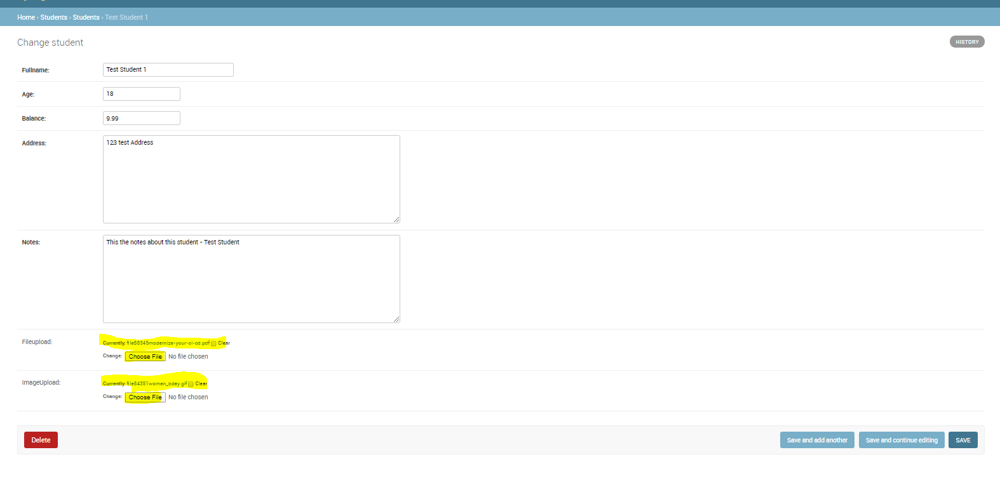

### How to use FileField and ImageField for file uploads in Django: 
  * The ***FileField*** is used to  upload media files
  * The ***ImageField*** is used to  upload only images
  * Refrence for File uploads - ***https://docs.djangoproject.com/en/3.0/topics/files/***
  * To ***upload*** file to mediaroot:
    ```
    * # file will be uploaded to MEDIA_ROOT/uploads
    upload = models.FileField(upload_to='uploads/')

    # file will be saved to MEDIA_ROOT/uploads/2020/01/10
    upload = models.FileField(upload_to='uploads/%Y/%m/%d/')

    # can also use a callable function 
    def getFormattedMediaFileandExtn(filepath):
        base_path = os.path.basename(filepath)
        fileName, fileExtn = os.path.splitext(base_path)
        return fileName, fileExtn

    def getFormattedMediaFileName(instance, filename):

        # file will be uploaded to MEDIA_ROOT/user_<id>/<filename>
        return 'user_{0}/{1}'.format(instance.user.id, filename)

    class MyModel(models.Model):
        upload = models.FileField(upload_to=getFormattedMediaFileName)
    ```
    
  * Please follow the below steps to setup file uploads:
  * Step 1 : ***Update the class based Model to add a File upload and Image Upload field***
    * For a FileUpload field use - ***fileUpload= models.FileField(upload_to=upload_file_path, null=True, blank=True)***
    * For a ImageUpload field use - ***imageUpload= models.ImageField(upload_to=upload_image_path, null=True, blank=True)***
    * Full code of the ***models.py*** file:
    ```
    from django.db import models
    import random, os


    def getFormattedMediaFileandExtn(filepath):
            base_path = os.path.basename(filepath)
            fileName, fileExtn = os.path.splitext(base_path)
            return fileName, fileExtn

    def getFormattedMediaFileName(instance, filename):
            fileName, fileExtn = getFormattedMediaFileandExtn(filename)

            return 'user_{0}/{1}{}'.format(instance.user.id, filename, fileExtn)


    # Create your custom models here.
    class Student(models.Model):
        
        # define the model fiellds
        fullname = models.CharField(max_length=100)
        age = models.DecimalField(max_digits=10, decimal_places=0)
        balance = models.DecimalField(max_digits=10, decimal_places=2, default=9.99)
        address = models.TextField()
        notes = models.TextField()

        # FileUpload and ImageUpload fields
        fileupload = models.FileField(upload_to=getFormattedMediaFileName, null=True, blank=True)
        imageUpload = models.ImageField(upload_to=getFormattedMediaFileName, null=True, blank=True) 


        # define the string constructor
        def __str__(self):
            return self.fullname
    ```
  
  * Step 2 : ***Update*** views handlers:
    * To filter objects you can try 2 ways:
      * Use ***get*** function - ***Student.objects.get(id=pk)***  OR
      * Use ***filter*** function - ***Student.objects.filter(id=pk)*** and use checks like ***objStud.exists()*** and ***objStud.count()***  OR
      * Use ***get_object_or_404*** function - ***get_object_or_404(Student, pk=pk)***  OR
      
    ```
    # function based view
    def Student_DetailView(request, pk=None, *args, **kwargs):
        #objStud = Student.objects.get(id=pk)
        #objStud = get_object_or_404(Student, pk=pk)
        objStud = Student.objects.filter(id=pk)
        print(objStud.count())
        if objStud.exists() and objStud.count() == 1:
            objStud = objStud.first()
            print(objStud)
        else:
            raise Http404("Product does not exist, please try another.")
        context = {
            'vw_type': "Function based detailview",
            'object' : objStud
        }
        print(context)
        return render(request, "student/student_detailview.html", context)
    ```

  * Step 3 : ***Update*** views to show uploaded media:
    ```
    {{object.fullname}}<br/>
    {{object.age}}<br/>
    {{object.balance}}<br/>
    {{object.address}}<br/>
    <br/>
    <br/>
    ```

  * Step 4 : Run following commands:
    * To list migrations - ***python manage.py makemigrations***
    * To run migrations - ***python manage.py migrate***
    * To installPython Image library - ***pip install pillow***
      

  * Step 5 : Now test the File Uploads at work:
    * Admin page - http://127.0.0.1:8000/admin - First go and update studnets with Image and file upload fields
      

    * Students page - http://127.0.0.1:8000/student/1/ - Shows the image also
      

    