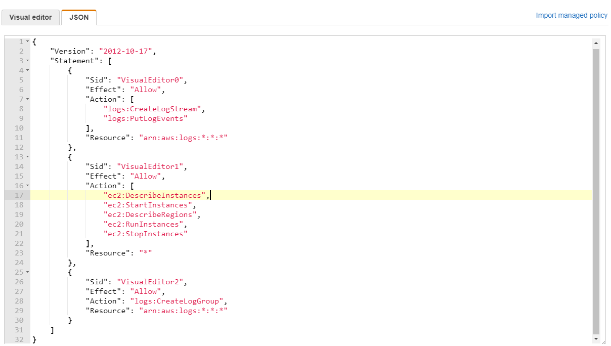
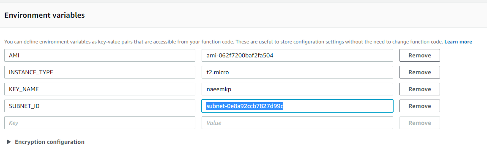
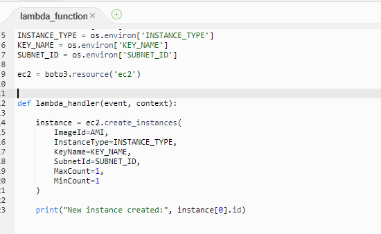
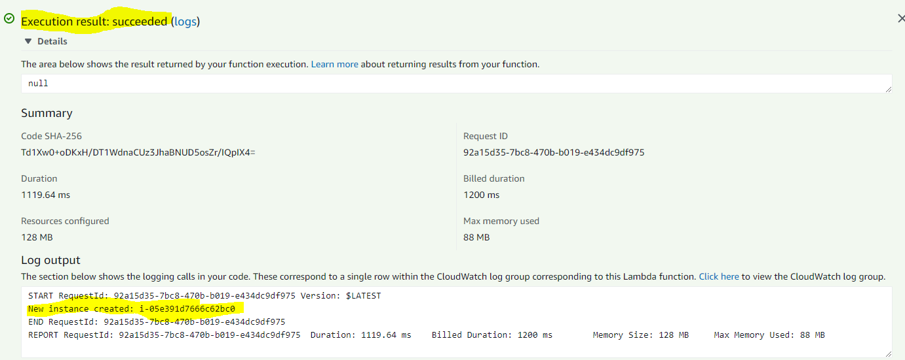
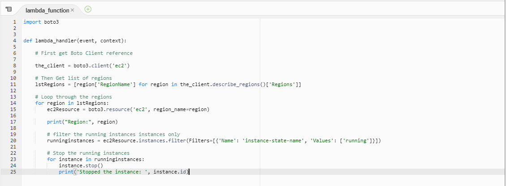
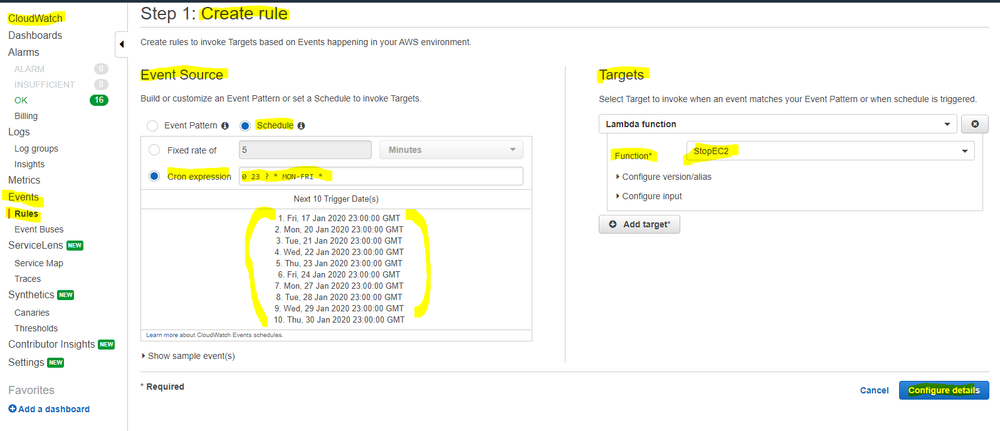
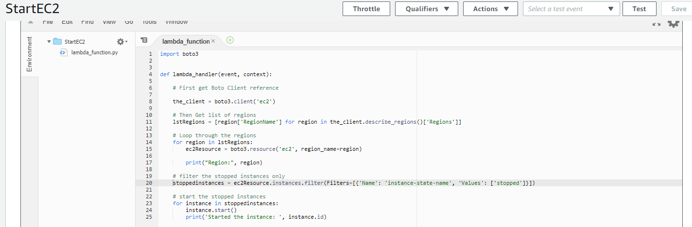

### How Create, Start and Stop EC2 Instances:

  * We will need the following for the automation
    * A lambda function which creates the EC2 instances
    * A Role which grants permissions to Lambda function to create, start and stop Ec2 instances and also CloudWatch for logs 
  
### A Role which grants permissions to Lambda function:

  * Step 1 : Create a role ***EC2StartStopRole*** with the below policy:
    * The below policy grants the following:
      * ***CreateLogStream*** access for Cloud Watch to create log streams
      * ***PutLogEvents*** access for Cloud Watch to write logs events
      * ***StartInstances*** access for EC2 for starting the instance
      * ***StopInstances*** access for EC2 for stopping the instance
      * ***RunInstances*** access for EC2 for running the instance
      * ***DescribeInstances*** access for EC2 for describing/listing the instances
      * ***DescribeRegions*** access for EC2 for describing/listing the regions
    ```
    {
        "Version": "2012-10-17",
        "Statement": [
            {
                "Sid": "VisualEditor0",
                "Effect": "Allow",
                "Action": [
                    "logs:CreateLogStream",
                    "logs:PutLogEvents"
                ],
                "Resource": "arn:aws:logs:*:*:*"
            },
            {
                "Sid": "VisualEditor1",
                "Effect": "Allow",
                "Action": [
                    "ec2:DescribeInstances",
                    "ec2:StartInstances",
                    "ec2:DescribeRegions",
                    "ec2:RunInstances",
                    "ec2:StopInstances"
                ],
                "Resource": "*"
            },
            {
                "Sid": "VisualEditor2",
                "Effect": "Allow",
                "Action": "logs:CreateLogGroup",
                "Resource": "arn:aws:logs:*:*:*"
            }
        ]
    }
    ```
    

### A lambda function which creates the EC2 instances:

  * Step 1 : Create a ***Lambda Function*** to create EC2 instances
      * From ***Services*** tab , select ***Lambda***:
        * Name of the function : ***CreateEC2***
        * Runtime - ***Python3.7***
        * Execution role : ***EC2StartStopRole***
        * Timeout: 3s (default)
        * ***Environment variables*** - since the script is using a few environment variables, please create the following under the 'Environment variables' section of the Lambda function:
          * AMI - The name of the AMI used for creating an instance - I used the Amazon Linux 2 AMI with AMI ID - ami-062f7200baf2fa504
          * INSTANCE_TYPE - The instance type of the created Ec2 instance - I used the smallest EC2 instance type - t2.micro
          * KEY_NAME - The name of the 'Key Pair' for creating an instance - I used the one I created - naeemkp
          * SUBNET_ID - The name of subnet ID inside a VPC where the instance will be created - I used a public subnet I created - subnet-0e8a92ccb7827d99c
          
 
      * Code for the Lambda function:
        * To retrive the ***Environmental variables*** use - ***os.environ['Variablename'] e.g os.environ['AMI']***
        * To create the ***EC2 instance*** use - ***instance = ec2.create_instances() function***
        ```
        import os
        import boto3

        # Environmental Variables to be read from the Environmental Variables section
        AMI = os.environ['AMI']
        INSTANCE_TYPE = os.environ['INSTANCE_TYPE']
        KEY_NAME = os.environ['KEY_NAME']
        SUBNET_ID = os.environ['SUBNET_ID']

        ec2 = boto3.resource('ec2')

        def lambda_handler(event, context):

            # create instance from the data provided above using the Environmental Variables with function ec2.create_instances
            instance = ec2.create_instances(
                ImageId=AMI,
                InstanceType=INSTANCE_TYPE,
                KeyName=KEY_NAME,
                SubnetId=SUBNET_ID,
                MaxCount=1,
                MinCount=1
            )

            print("New instance created:", instance[0].id)
        ```
        

  * Step 2 : Create a ***Lambda Testfunction*** to test EC2 instances creation 
    * Test Function Name: CreateEC2Test
    * Test Function Body: {} 
    


### A lambda function which Stopa running EC2 instances:

  * Step 1 : Create a ***Lambda Function*** to stop running EC2 instances
      * From ***Services*** tab , select ***Lambda***:
        * Name of the function : ***StopEC2***
        * Runtime - ***Python3.7***
        * Execution role : ***EC2StartStopRole***
        * Timeout: 1 m 3s (custom timeout as it will take more time to stop instanes accross regions)
  
      * Code for the Lambda function:
        * To Get list of regions, use - ***lstRegions = [region['RegionName'] for region in the_client.describe_regions()['Regions']]***
        * To get the EC2 resources, use  - ***ec2Resource = boto3.resource('ec2', region_name=region)***
        * To filter the running instances only, use - ***runninginstances = ec2Resource.instances.filter(Filters=[{'Name': 'instance-state-name', 'Values': ['running']}])***
        * To start the running instance - ***instance.stop()***
        ```
        import boto3


        def lambda_handler(event, context):

            # First get Boto Client reference 

            the_client = boto3.client('ec2')

            # Then Get list of regions
            lstRegions = [region['RegionName'] for region in the_client.describe_regions()['Regions']]

            # Loop through the regions
            for region in lstRegions:
                ec2Resource = boto3.resource('ec2', region_name=region)

                print("Region:", region)

                # filter the running instances instances only
                runninginstances = ec2Resource.instances.filter(Filters=[{'Name': 'instance-state-name', 'Values': ['running']}])

                # Stop the running instances
                for instance in runninginstances:
                    instance.stop()
                    print('Stopped the instance: ', instance.id)
        ```
        

  * Step 2A : For Manual Testing - Create a ***Lambda Testfunction*** to test EC2 instances stopping 
    * Test Function Name: StopEC2Test
    * Test Function Body: {} 
    
  
  * Step 2B : For Automated Testing - Create a ***Scheduling event - The CRON job*** on the CloudWatch 
  * Test Function Name: StopEC2CON
  * The CRON Expression ( For 23 am  is in UTC meaning 5 pm CST): 0 23 ? * MON-FRI *
  


### A lambda function which Starts  stopped EC2 instances:

  * Step 1 : Create a ***Lambda Function*** to start stopped EC2 instances
      * From ***Services*** tab , select ***Lambda***:
        * Name of the function : ***StartEC2***
        * Runtime - ***Python3.7***
        * Execution role : ***EC2StartStopRole***
        * Timeout: 1 m 3s (custom timeout as it will take more time to stop instanes accross regions)
  
      * Code for the Lambda function:
        * To Get list of regions, use - ***lstRegions = [region['RegionName'] for region in the_client.describe_regions()['Regions']]***
        * To get the EC2 resources, use  - ***ec2Resource = boto3.resource('ec2', region_name=region)***
        * To filter the running instances only, use - ***runninginstances = ec2Resource.instances.filter(Filters=[{'Name': 'instance-state-name', 'Values': ['running']}])***
        * To start the stopped instance - ***instance.start()***
        ```
        import boto3


        def lambda_handler(event, context):

            # First get Boto Client reference 

            the_client = boto3.client('ec2')

            # Then Get list of regions
            lstRegions = [region['RegionName'] for region in the_client.describe_regions()['Regions']]

            # Loop through the regions
            for region in lstRegions:
                ec2Resource = boto3.resource('ec2', region_name=region)

                print("Region:", region)

                # filter the stopped instances only
                stoppedinstances = ec2Resource.instances.filter(Filters=[{'Name': 'instance-state-name', 'Values': ['stopped']}])

                # start the stopped instances
                for instance in stoppedinstances:
                    instance.start()
                    print('Started the instance: ', instance.id)
        ```
        

  * Step 2A : For Manual Testing - Create a ***Lambda Testfunction*** to test EC2 instances starting 
    * Test Function Name: StartEC2Test
    * Test Function Body: {} 
  
  * Step 2B : For Automated Testing - Create a ***Scheduling event - The CRON job*** on the CloudWatch 
  * Test Function Name: StartEC2CON
  * The CRON Expression ( For 2 am is UTC meaning 8 am CST): 0 2 ? * MON-FRI *